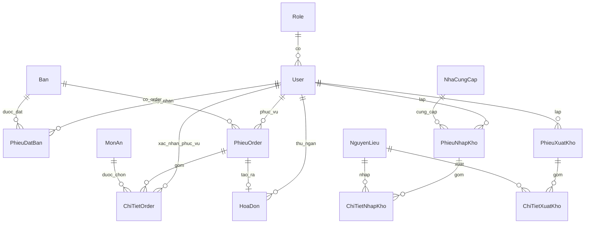

**HỆ THỐNG QUẢN LÝ NHÀ HÀNG**
**ĐẶC TẢ THIẾT KẾ CHI TIẾT**

> Tài liệu này là "blueprint" cho quy trình triển khai. Mọi quyết định nghiệp vụ tham chiếu về `DESCRIPTION.md` (đặc tả sơ khai). Mọi tên gọi (bảng, cột, endpoint, hàm xử lý) viết bằng **tiếng Việt không dấu**.

# 1. TỔNG QUAN KIẾN TRÚC {#tổng-quan-kiến-trúc}

## 1.1. Sơ đồ kiến trúc

```
┌──────────────────────────────────────────────────────────────────────┐
│  CLIENT — Trình duyệt (Chrome/Edge) trên máy bàn của từng vai trò    │
│  ─ Admin, Phục vụ, Bếp, Thu ngân, Kho                                │
│  ─ HTML5 + CSS3 + JavaScript thuần (vanilla)                         │
│  ─ Máy in nhiệt 80mm gắn vào máy Bếp (in PV_BM3, B_BM1)              │
│  ─ Máy in nhiệt 80mm + A4 gắn vào máy Thu ngân (in TN_BM3)           │
└──────────────────────────────────────────────────────────────────────┘
                              │  HTTPS — REST/JSON
                              │  Authorization: Bearer <JWT>
                              ▼
┌──────────────────────────────────────────────────────────────────────┐
│  BACKEND — Node.js + Express                                         │
│  ─ Tầng route (Express Router) ──────────────► §4 API                │
│  ─ Tầng controller — validate + middleware JWT/role                  │
│  ─ Tầng service — logic nghiệp vụ ──────────► §5 Pseudocode          │
│  ─ Tầng repository — truy vấn SQL (driver mssql)                     │
│  ─ Hằng số hệ thống: tệp config/constants.js (VAT, giờ HĐ, ...)      │
└──────────────────────────────────────────────────────────────────────┘
                              │  TCP/IP (mssql driver)
                              ▼
┌──────────────────────────────────────────────────────────────────────┐
│  CSDL — Microsoft SQL Server 2019+                                   │
│  ─ 13 bảng (§2)                                                      │
└──────────────────────────────────────────────────────────────────────┘
```

**Mô hình triển khai:** chạy trên 1 máy chủ trong mạng LAN của nhà hàng. Toàn bộ client là PC/laptop trong cùng mạng LAN. Sao lưu CSDL nằm ngoài phạm vi ứng dụng (việc của DBA, dùng tính năng backup của SQL Server).

## 1.2. Quy ước đặt tên

| Hạng mục | Quy ước | Ví dụ |
|---|---|---|
| Bảng CSDL | PascalCase tiếng Việt không dấu | `Ban`, `PhieuDatBan`, `ChiTietOrder` |
| Cột CSDL | snake_case tiếng Việt không dấu | `ten_khach`, `tong_thanh_toan` |
| Khóa chính | `ma_<viết_tắt_thực_thể>` | `ma_ban`, `ma_dat_ban`, `ma_order` |
| Khóa ngoại | Cùng tên với khóa chính được tham chiếu | `ma_ban` ở `PhieuDatBan` trỏ về `Ban.ma_ban` |
| Trường thời gian | `thoi_gian_<sự_kiện>` | `thoi_gian_tao`, `thoi_gian_xong` |
| Trường boolean | `dang_<trạng_thái>` | `dang_su_dung` |
| Trường enum/trạng thái | `NVARCHAR(20)` + CHECK constraint, giá trị PascalCase TV không dấu | `'Trong'`, `'DaDat'`, `'CoKhach'` |
| API endpoint | kebab-case TV không dấu, dưới prefix `/api/v1` | `/api/v1/dat-ban`, `/api/v1/thanh-toan` |
| Trường JSON request/response | snake_case TV không dấu, đồng nhất cột DB | `{"ten_khach": "Nguyen Van A"}` |
| Hàm xử lý (pseudocode) | PascalCase TV không dấu | `XuLyDatBan(...)`, `XuLyThanhToan(...)` |
| Biến cục bộ (pseudocode) | camelCase TV không dấu | `danhSachBanTrong`, `tongTienMon` |

**Ngoại lệ — thực thể hệ thống dùng tiếng Anh:** Hai thực thể thuần hệ thống (không phải nghiệp vụ nhà hàng) là **`User`** (tài khoản) và **`Role`** (phân quyền) dùng **tiếng Anh** cho bảng, cột, endpoint và trường JSON, vì rõ nghĩa hơn (vd `/auth/login`, `/users`, `user_id`, `password_hash`). Mọi thực thể nghiệp vụ còn lại giữ tiếng Việt như bảng trên.

- **Giá trị enum** của `User`/`Role` vẫn giữ tiếng Việt để đồng nhất dữ liệu (vai trò `Admin`/`PhucVu`/`Bep`/`ThuNgan`/`Kho`; trạng thái `HoatDong`/`DaKhoa`).
- **Ngoại lệ FK giáp ranh:** 6 cột khóa ngoại nằm trong bảng nghiệp vụ (TV) nhưng trỏ tới `User.user_id` giữ tên tiếng Việt (`nv_tiep_nhan`, `nv_phuc_vu`, `nv_phuc_vu_xac_nhan`, `nv_thu_ngan`, `nv_lap`) — chúng là trường của bảng nghiệp vụ. Đây là ngoại lệ có chủ đích của quy tắc "khóa ngoại cùng tên với khóa chính".

## 1.3. Quy ước trạng thái và mã liệt kê

| Đối tượng | Mã trạng thái | Ý nghĩa |
|---|---|---|
| **Bàn** (`Ban.trang_thai`) | `Trong` / `DaDat` / `CoKhach` | Trống / Có phiếu đặt chưa nhận / Đang phục vụ |
| **Phiếu đặt bàn** (`PhieuDatBan.trang_thai`) | `DaDat` / `DaNhanBan` / `DaHuy` | Đã ghi nhận / Khách đến / Hủy |
| **Dòng món** (`ChiTietOrder.trang_thai`) | `ChuaChot` / `ChoCheBien` / `DangCheBien` / `DaXong` / `DaPhucVu` / `DaHuy` | — |
| **Phiếu order** (`PhieuOrder.trang_thai`) | `DangPhucVu` / `DaThanhToan` / `DaHuy` | — |
| **Hình thức thanh toán** (`HoaDon.hinh_thuc_tt`) | `TienMat` / `ChuyenKhoan` | — |
| **Tài khoản** (`User.status`) | `HoatDong` / `DaKhoa` | — |
| **Vai trò** (`Role.role_id`) | `Admin` / `PhucVu` / `Bep` / `ThuNgan` / `Kho` | — |
| **Loại món** (`MonAn.loai_mon`) | `MonAn` / `DoUong` | Cũng chính là bộ phận xử lý (Món ăn → Bếp; Đồ uống → Quầy pha chế) |
| **Trạng thái món** (`MonAn.trang_thai`) | `ConHang` / `HetHang` | — |
| **Bộ phận nhận xuất kho** (`PhieuXuatKho.bo_phan_nhan`) | `Bep` / `QuayPhaChe` | — |

## 1.4. Phân chia module (chia việc theo nhóm)

Hệ thống chia thành **8 module gần như độc lập**. Mỗi module có ranh giới rõ ràng về bảng/endpoint/màn hình, cho phép các thành viên trong nhóm phụ trách độc lập từ thiết kế chi tiết đến triển khai.

| Module | Vai trò chính | Bảng sở hữu (R/W) | Bảng đọc từ module khác | Endpoint prefix |
|---|---|---|---|---|
| **M1. Xác thực + Tài khoản** | Đăng nhập/đăng xuất, quản lý tài khoản, middleware kiểm tra quyền | `Role` (R), `User` (R/W) | (không) | `/auth/*`, `/users/*` |
| **M2. Quản lý bàn** | CRUD bàn | `Ban` (R/W) | (không) | `/ban/*` |
| **M3. Thực đơn** | CRUD món | `MonAn` (R/W) | (không) | `/mon-an/*` |
| **M4. Đặt bàn** | Tạo, hủy, đánh dấu nhận bàn | `PhieuDatBan` (R/W) | `Ban` (R/W trạng thái) | `/dat-ban/*` |
| **M5. Order + Bếp** | Gọi món, chốt bếp, cập nhật trạng thái món, phục vụ ra bàn | `PhieuOrder` (R/W), `ChiTietOrder` (R/W) | `Ban` (R/W trạng thái), `MonAn` (R) | `/order/*` |
| **M6. Thanh toán** | Thanh toán, in lại hóa đơn, báo cáo doanh thu | `HoaDon` (R/W) | `PhieuOrder` (R/W trạng thái), `ChiTietOrder` (R) | `/thanh-toan/*`, `/hoa-don/*`, `/bao-cao/doanh-thu` |
| **M7. Kho** | NCC, NVL, nhập/xuất kho, báo cáo kho | `NhaCungCap` (R/W), `NguyenLieu` (R/W), `PhieuNhapKho` + `ChiTietNhapKho` (R/W), `PhieuXuatKho` + `ChiTietXuatKho` (R/W) | (không) | `/kho/*` |
| **M8. Báo cáo tổng hợp** | Dashboard Admin | Đọc cross-module | Tất cả | `/bao-cao/tong-hop` |

**Coupling thực tế giữa module:**
- M4 ↔ M2: cập nhật `Ban.trang_thai` khi đặt bàn / nhận bàn
- M5 ↔ M2: cập nhật `Ban.trang_thai` khi mở/đóng order
- M5 ↔ M3: đọc `MonAn` để hiện thực đơn + snapshot đơn giá
- M6 ↔ M5: đọc `PhieuOrder` + `ChiTietOrder` để tính tiền; ghi `PhieuOrder.trang_thai = 'DaThanhToan'`
- M8 đọc cross-module nhưng chỉ đọc

→ Mỗi cặp giao tiếp chỉ qua **trường FK + cột trạng thái cố định**. Hợp đồng giữa các module = §2 (schema CSDL) + §4 (API). Sau khi 2 file này được duyệt, các thành viên code song song được.

# 2. THIẾT KẾ CƠ SỞ DỮ LIỆU {#thiết-kế-cơ-sở-dữ-liệu}

## 2.1. Sơ đồ ERD



## 2.2. Danh sách bảng (tổng quan)

| # | Tên bảng | Module | Vai trò chính | DFD tham chiếu |
|---|---|---|---|---|
| 1 | `Role` | M1 | Danh mục 5 vai trò người dùng | §7.5.3, §7.6.1 |
| 2 | `User` | M1 | Tài khoản nhân viên | §7.5.3, §7.6.1 |
| 3 | `Ban` | M2 | Danh sách bàn ăn | §7.1.x, §7.5.2 |
| 4 | `MonAn` | M3 | Thực đơn | §7.1.2, §7.5.1 |
| 5 | `PhieuDatBan` | M4 | Phiếu đặt bàn | §7.1.1 |
| 6 | `PhieuOrder` | M5 | Phiếu order theo bàn | §7.1.2, §7.2.1 |
| 7 | `ChiTietOrder` | M5 | Các dòng món trong order | §7.1.2, §7.1.3, §7.1.4, §7.3.x |
| 8 | `HoaDon` | M6 | Hóa đơn thanh toán | §7.2.1, §7.2.2, §7.2.3 |
| 9 | `NhaCungCap` | M7 | Nhà cung cấp NVL | §7.4.1 |
| 10 | `NguyenLieu` | M7 | Danh mục NVL + tồn kho hiện tại | §7.4.x |
| 11 | `PhieuNhapKho` | M7 | Phiếu nhập kho (header) | §7.4.1, §7.4.4 |
| 12 | `ChiTietNhapKho` | M7 | Dòng NVL trong phiếu nhập | §7.4.1, §7.4.4 |
| 13 | `PhieuXuatKho` | M7 | Phiếu xuất kho (header) | §7.4.3, §7.4.5 |
| 14 | `ChiTietXuatKho` | M7 | Dòng NVL trong phiếu xuất | §7.4.3, §7.4.5 |

(Đếm = 14 bảng vì NhapKho và XuatKho mỗi cái có thêm 1 bảng chi tiết; nhưng ở góc nhìn "thực thể nghiệp vụ", vẫn coi như 13 thực thể.)

## 2.3. Chi tiết từng bảng

### 2.3.1. `Role` (thực thể hệ thống — tên tiếng Anh)

| Tên trường | Kiểu dữ liệu | Ràng buộc | Mô tả |
|---|---|---|---|
| `role_id` | NVARCHAR(10) | **PK** | `Admin` / `PhucVu` / `Bep` / `ThuNgan` / `Kho` (giá trị giữ TV) |
| `role_name` | NVARCHAR(50) | NOT NULL | Tên hiển thị (Vd "Quản lý") |
| `description` | NVARCHAR(200) | NULL | Mô tả vai trò |

Bảng tĩnh, 5 dòng, seed sẵn.

### 2.3.2. `User` (thực thể hệ thống — tên tiếng Anh)

| Tên trường | Kiểu dữ liệu | Ràng buộc | Mô tả |
|---|---|---|---|
| `user_id` | INT IDENTITY(1,1) | **PK** | Mã NV tự sinh |
| `username` | NVARCHAR(50) | UNIQUE, NOT NULL | Tên đăng nhập (không dấu, không khoảng trắng) |
| `password_hash` | NVARCHAR(255) | NOT NULL | Hash bcrypt mật khẩu |
| `full_name` | NVARCHAR(100) | NOT NULL | Họ và tên NV |
| `role_id` | NVARCHAR(10) | FK → `Role.role_id`, NOT NULL | Vai trò gắn |
| `status` | NVARCHAR(20) | NOT NULL, CHECK IN (`'HoatDong'`,`'DaKhoa'`), DEFAULT `'HoatDong'` | Giá trị giữ TV |
| `failed_login_count` | TINYINT | NOT NULL, DEFAULT 0 | Tăng khi sai; reset khi đúng; ≥ 5 → khóa |
| `last_login_at` | DATETIME2 | NULL | Lúc đăng nhập thành công gần nhất |
| `created_at` | DATETIME2 | NOT NULL, DEFAULT SYSDATETIME() | |
| `updated_at` | DATETIME2 | NULL | |

**Index:** `IX_User_role (role_id)`.

> `User` là từ khóa SQL Server → trong câu lệnh SQL phải bao `[User]` (xem seed §2.5).

### 2.3.3. `Ban`

| Tên trường | Kiểu dữ liệu | Ràng buộc | Mô tả |
|---|---|---|---|
| `ma_ban` | INT IDENTITY(1,1) | **PK** | |
| `so_ban` | NVARCHAR(10) | UNIQUE, NOT NULL | Mã hiển thị (Vd `B01`) |
| `khu_vuc` | NVARCHAR(50) | NOT NULL | `Tầng 1`, `Sân vườn`… |
| `suc_chua` | INT | NOT NULL, CHECK (`suc_chua > 0`) | Số người tối đa |
| `trang_thai` | NVARCHAR(20) | NOT NULL, CHECK IN (`'Trong'`,`'DaDat'`,`'CoKhach'`), DEFAULT `'Trong'` | |
| `ghi_chu` | NVARCHAR(200) | NULL | |
| `dang_su_dung` | BIT | NOT NULL, DEFAULT 1 | Soft delete |

### 2.3.4. `MonAn`

| Tên trường | Kiểu dữ liệu | Ràng buộc | Mô tả |
|---|---|---|---|
| `ma_mon` | INT IDENTITY(1,1) | **PK** | |
| `ten_mon` | NVARCHAR(100) | UNIQUE, NOT NULL | |
| `loai_mon` | NVARCHAR(10) | NOT NULL, CHECK IN (`'MonAn'`,`'DoUong'`) | Đồng thời là phân luồng Bếp/Pha chế |
| `don_gia` | DECIMAL(15,0) | NOT NULL, CHECK (`don_gia >= 0`) | VND (không phần thập phân) |
| `trang_thai` | NVARCHAR(10) | NOT NULL, CHECK IN (`'ConHang'`,`'HetHang'`), DEFAULT `'ConHang'` | |
| `mo_ta` | NVARCHAR(500) | NULL | |
| `dang_su_dung` | BIT | NOT NULL, DEFAULT 1 | Soft delete |

### 2.3.5. `PhieuDatBan`

| Tên trường | Kiểu dữ liệu | Ràng buộc | Mô tả |
|---|---|---|---|
| `ma_dat_ban` | INT IDENTITY(1,1) | **PK** | Đây cũng là "Mã đặt bàn" in trên PV_BM1 |
| `ma_ban` | INT | FK → `Ban.ma_ban`, NOT NULL | |
| `ten_khach` | NVARCHAR(100) | NOT NULL | |
| `so_dien_thoai` | NVARCHAR(15) | NOT NULL | |
| `so_nguoi` | INT | NOT NULL, CHECK (`so_nguoi > 0`) | Kiểm tra ≤ `Ban.suc_chua` ở service |
| `thoi_gian_dat` | DATETIME2 | NOT NULL | Khung giờ khách hẹn |
| `hinh_thuc_dat` | NVARCHAR(20) | NOT NULL, CHECK IN (`'TrucTiep'`,`'QuaDienThoai'`) | |
| `ghi_chu` | NVARCHAR(500) | NULL | |
| `nv_tiep_nhan` | INT | FK → `User.user_id`, NOT NULL | |
| `trang_thai` | NVARCHAR(20) | NOT NULL, CHECK IN (`'DaDat'`,`'DaNhanBan'`,`'DaHuy'`), DEFAULT `'DaDat'` | |
| `thoi_gian_tao` | DATETIME2 | NOT NULL, DEFAULT SYSDATETIME() | |
| `thoi_gian_nhan_ban` | DATETIME2 | NULL | Lúc Phục vụ bấm "Đã nhận bàn" |
| `thoi_gian_huy` | DATETIME2 | NULL | |

**Index:** `IX_PhieuDatBan_ban_thoigian (ma_ban, thoi_gian_dat)`.

### 2.3.6. `PhieuOrder`

| Tên trường | Kiểu dữ liệu | Ràng buộc | Mô tả |
|---|---|---|---|
| `ma_order` | INT IDENTITY(1,1) | **PK** | |
| `ma_ban` | INT | FK → `Ban.ma_ban`, NOT NULL | |
| `nv_phuc_vu` | INT | FK → `User.user_id`, NOT NULL | NV mở order |
| `thoi_gian_tao` | DATETIME2 | NOT NULL, DEFAULT SYSDATETIME() | |
| `trang_thai` | NVARCHAR(20) | NOT NULL, CHECK IN (`'DangPhucVu'`,`'DaThanhToan'`,`'DaHuy'`), DEFAULT `'DangPhucVu'` | |
| `tong_tam_tinh` | DECIMAL(15,0) | NOT NULL, DEFAULT 0 | Cập nhật khi thêm/sửa/hủy dòng |

**Index:** `IX_PhieuOrder_ban_trangthai (ma_ban, trang_thai)`.

### 2.3.7. `ChiTietOrder`

| Tên trường | Kiểu dữ liệu | Ràng buộc | Mô tả |
|---|---|---|---|
| `ma_chi_tiet` | BIGINT IDENTITY(1,1) | **PK** | |
| `ma_order` | INT | FK → `PhieuOrder.ma_order`, NOT NULL | |
| `ma_mon` | INT | FK → `MonAn.ma_mon`, NOT NULL | |
| `so_luong` | INT | NOT NULL, CHECK (`so_luong > 0`) | |
| `don_gia` | DECIMAL(15,0) | NOT NULL | **Snapshot** giá tại thời điểm gọi |
| `thanh_tien` | DECIMAL(15,0) | NOT NULL, AS (`so_luong * don_gia`) PERSISTED | Cột tính, lưu vật lý |
| `ghi_chu` | NVARCHAR(200) | NULL | |
| `trang_thai` | NVARCHAR(20) | NOT NULL, CHECK IN (`'ChuaChot'`,`'ChoCheBien'`,`'DangCheBien'`,`'DaXong'`,`'DaPhucVu'`,`'DaHuy'`), DEFAULT `'ChuaChot'` | |
| `thoi_gian_tao` | DATETIME2 | NOT NULL, DEFAULT SYSDATETIME() | |
| `thoi_gian_chot` | DATETIME2 | NULL | Lúc chuyển `ChuaChot` → `ChoCheBien` (chốt sang bếp) |
| `thoi_gian_xong` | DATETIME2 | NULL | Lúc chuyển → `DaXong` |
| `thoi_gian_phuc_vu` | DATETIME2 | NULL | Lúc chuyển → `DaPhucVu` |
| `nv_phuc_vu_xac_nhan` | INT | FK → `User.user_id`, NULL | NV xác nhận đã đem ra bàn |

**Index:**
- `IX_ChiTietOrder_order (ma_order)`
- `IX_ChiTietOrder_trangthai_chot (trang_thai, thoi_gian_chot)` — FIFO Bếp

**Ghi chú:** Không có bảng `PhieuChuyenBep` riêng. "Phiếu chuyển bếp" PV_BM3 là document sinh trên-bay từ:
```sql
SELECT * FROM ChiTietOrder ct JOIN MonAn m ON ct.ma_mon = m.ma_mon
WHERE ct.ma_order = @order AND ct.trang_thai = 'ChoCheBien'
  AND m.loai_mon = @bo_phan  -- 'MonAn' → Bếp; 'DoUong' → Quầy pha chế
ORDER BY ct.thoi_gian_chot;
```

### 2.3.8. `HoaDon`

| Tên trường | Kiểu dữ liệu | Ràng buộc | Mô tả |
|---|---|---|---|
| `ma_hoa_don` | INT IDENTITY(1,1) | **PK** | |
| `so_hoa_don` | NVARCHAR(20) | UNIQUE, NOT NULL | Vd `HD20260529-00001` (sinh ở service) |
| `ma_order` | INT | FK → `PhieuOrder.ma_order`, UNIQUE, NOT NULL | 1 order ↔ 1 hóa đơn |
| `so_ban_snapshot` | NVARCHAR(10) | NOT NULL | Snapshot `Ban.so_ban` |
| `nv_thu_ngan` | INT | FK → `User.user_id`, NOT NULL | |
| `tong_tien_mon` | DECIMAL(15,0) | NOT NULL | ∑(SL × đơn giá) |
| `ty_le_vat` | DECIMAL(5,4) | NOT NULL, DEFAULT 0.1 | Snapshot (mặc định 0.1 = 10%) |
| `tien_vat` | DECIMAL(15,0) | NOT NULL, DEFAULT 0 | ROUND(`tong_tien_mon * ty_le_vat`, 0) |
| `tong_thanh_toan` | DECIMAL(15,0) | NOT NULL | `tong_tien_mon + tien_vat` |
| `hinh_thuc_tt` | NVARCHAR(20) | NOT NULL, CHECK IN (`'TienMat'`,`'ChuyenKhoan'`) | |
| `tien_khach_dua` | DECIMAL(15,0) | NULL | NULL khi `ChuyenKhoan` |
| `tien_thua` | DECIMAL(15,0) | NOT NULL, DEFAULT 0 | 0 khi `ChuyenKhoan` |
| `ma_giao_dich` | NVARCHAR(100) | NULL | Mã/đường dẫn ảnh giao dịch CK (tùy chọn) |
| `thoi_gian_tao` | DATETIME2 | NOT NULL, DEFAULT SYSDATETIME() | |
| `so_lan_in` | INT | NOT NULL, DEFAULT 0 | ≥ 2 → đánh dấu "BẢN SAO" trên bản in |

**Index:** `IX_HoaDon_thoigian (thoi_gian_tao DESC)`.

### 2.3.9. `NhaCungCap`

| Tên trường | Kiểu dữ liệu | Ràng buộc | Mô tả |
|---|---|---|---|
| `ma_ncc` | INT IDENTITY(1,1) | **PK** | |
| `ten_ncc` | NVARCHAR(150) | UNIQUE, NOT NULL | |
| `so_dien_thoai` | NVARCHAR(15) | NULL | |
| `dia_chi` | NVARCHAR(300) | NULL | |
| `dang_su_dung` | BIT | NOT NULL, DEFAULT 1 | |

### 2.3.10. `NguyenLieu`

| Tên trường | Kiểu dữ liệu | Ràng buộc | Mô tả |
|---|---|---|---|
| `ma_nvl` | INT IDENTITY(1,1) | **PK** | |
| `ten_nvl` | NVARCHAR(100) | UNIQUE, NOT NULL | |
| `don_vi_tinh` | NVARCHAR(20) | NOT NULL | `kg`, `lit`, `goi`, `chai`… |
| `ton_hien_tai` | DECIMAL(15,3) | NOT NULL, DEFAULT 0, CHECK (`ton_hien_tai >= 0`) | Tồn real-time, cập nhật trong transaction nhập/xuất |
| `dinh_muc_toi_thieu` | DECIMAL(15,3) | NOT NULL, DEFAULT 0, CHECK (`dinh_muc_toi_thieu >= 0`) | Ngưỡng cảnh báo tồn thấp theo từng NVL (K_QĐ1; dùng ở §7.4.3, §7.5.4 / QL_BM4-C) |
| `thoi_gian_cap_nhat_ton` | DATETIME2 | NULL | Lần tồn thay đổi gần nhất |
| `dang_su_dung` | BIT | NOT NULL, DEFAULT 1 | |

### 2.3.11. `PhieuNhapKho`

| Tên trường | Kiểu dữ liệu | Ràng buộc | Mô tả |
|---|---|---|---|
| `ma_phieu_nhap` | INT IDENTITY(1,1) | **PK** | |
| `so_phieu` | NVARCHAR(20) | UNIQUE, NOT NULL | Vd `PN20260529-001` |
| `ma_ncc` | INT | FK → `NhaCungCap.ma_ncc`, NOT NULL | |
| `nv_lap` | INT | FK → `User.user_id`, NOT NULL | |
| `ngay_nhap` | DATE | NOT NULL | |
| `tong_gia_tri` | DECIMAL(15,0) | NOT NULL | ∑(SL × đơn giá) |
| `ghi_chu` | NVARCHAR(500) | NULL | |
| `thoi_gian_tao` | DATETIME2 | NOT NULL, DEFAULT SYSDATETIME() | |

**Index:** `IX_PhieuNhapKho_ngay (ngay_nhap)`.

### 2.3.12. `ChiTietNhapKho`

| Tên trường | Kiểu dữ liệu | Ràng buộc | Mô tả |
|---|---|---|---|
| `ma_chi_tiet` | BIGINT IDENTITY(1,1) | **PK** | |
| `ma_phieu_nhap` | INT | FK → `PhieuNhapKho.ma_phieu_nhap`, NOT NULL, ON DELETE CASCADE | |
| `ma_nvl` | INT | FK → `NguyenLieu.ma_nvl`, NOT NULL | |
| `so_luong` | DECIMAL(15,3) | NOT NULL, CHECK (`so_luong > 0`) | |
| `don_gia` | DECIMAL(15,0) | NOT NULL, CHECK (`don_gia > 0`) | |
| `thanh_tien` | DECIMAL(15,0) | NOT NULL, AS (`so_luong * don_gia`) PERSISTED | |
| `ghi_chu` | NVARCHAR(200) | NULL | |

### 2.3.13. `PhieuXuatKho`

| Tên trường | Kiểu dữ liệu | Ràng buộc | Mô tả |
|---|---|---|---|
| `ma_phieu_xuat` | INT IDENTITY(1,1) | **PK** | |
| `so_phieu` | NVARCHAR(20) | UNIQUE, NOT NULL | Vd `PX20260529-001` |
| `bo_phan_nhan` | NVARCHAR(20) | NOT NULL, CHECK IN (`'Bep'`,`'QuayPhaChe'`) | |
| `nv_lap` | INT | FK → `User.user_id`, NOT NULL | |
| `ngay_xuat` | DATE | NOT NULL | |
| `tong_gia_tri` | DECIMAL(15,0) | NOT NULL | |
| `ghi_chu` | NVARCHAR(500) | NULL | |
| `thoi_gian_tao` | DATETIME2 | NOT NULL, DEFAULT SYSDATETIME() | |

**Index:** `IX_PhieuXuatKho_ngay (ngay_xuat)`.

### 2.3.14. `ChiTietXuatKho`

| Tên trường | Kiểu dữ liệu | Ràng buộc | Mô tả |
|---|---|---|---|
| `ma_chi_tiet` | BIGINT IDENTITY(1,1) | **PK** | |
| `ma_phieu_xuat` | INT | FK → `PhieuXuatKho.ma_phieu_xuat`, NOT NULL, ON DELETE CASCADE | |
| `ma_nvl` | INT | FK → `NguyenLieu.ma_nvl`, NOT NULL | |
| `so_luong` | DECIMAL(15,3) | NOT NULL, CHECK (`so_luong > 0`) | |
| `don_gia` | DECIMAL(15,0) | NOT NULL, CHECK (`don_gia > 0`) | |
| `thanh_tien` | DECIMAL(15,0) | NOT NULL, AS (`so_luong * don_gia`) PERSISTED | |
| `ghi_chu` | NVARCHAR(200) | NULL | |

## 2.4. Ràng buộc cấp ứng dụng

| # | Ràng buộc | Module | Cách xử lý |
|---|---|---|---|
| 1 | `PhieuDatBan.so_nguoi ≤ Ban.suc_chua` | M4 | Kiểm tra trước INSERT |
| 2 | Chỉ tạo `PhieuOrder` mới khi `Ban.trang_thai IN ('Trong','CoKhach')`. Nếu `DaDat` → yêu cầu Phục vụ bấm "Đã nhận bàn" trước | M5 | Kiểm tra trước INSERT |
| 3 | `ChiTietXuatKho.so_luong ≤ NguyenLieu.ton_hien_tai` tại thời điểm lưu | M7 | Transaction + check trước UPDATE tồn |
| 4 | Chỉ cho thanh toán `PhieuOrder` khi mọi `ChiTietOrder.trang_thai IN ('DaPhucVu','DaHuy')` | M6 | SQL check trước INSERT `HoaDon` |
| 5 | Chuyển trạng thái `ChiTietOrder` tuần tự (`ChoCheBien → DangCheBien → DaXong → DaPhucVu`), không bỏ bước | M5 | State machine ở tầng service |
| 6 | Cập nhật `NguyenLieu.ton_hien_tai` và INSERT phiếu kho trong CÙNG transaction | M7 | `BEGIN TRAN` … `COMMIT` |
| 7 | Khóa tài khoản khi `User.failed_login_count ≥ 5` | M1 | Sau mỗi lần sai |
| 8 | Đặt bàn / nhận bàn / thanh toán: đồng bộ `Ban.trang_thai` trong cùng transaction với phiếu | M2 (cross-call) | Hàm dùng chung |

## 2.5. Dữ liệu seed mẫu

```sql
-- 1. Role (cố định)
INSERT INTO Role (role_id, role_name, description) VALUES
('Admin',   N'Quản lý',       N'Quản lý toàn hệ thống'),
('PhucVu',  N'Phục vụ',       N'Tiếp nhận đặt bàn, gọi món, phục vụ'),
('Bep',     N'Bộ phận Bếp',   N'Chế biến món ăn / đồ uống'),
('ThuNgan', N'Thu ngân',      N'Thanh toán, xuất hóa đơn'),
('Kho',     N'Bộ phận Kho',   N'Nhập / xuất / báo cáo kho');

-- 2. User (mật khẩu mặc định = 'matkhau123', đã hash bcrypt cost 10)
INSERT INTO [User] (username, password_hash, full_name, role_id) VALUES
('admin',    '$2b$10$EXAMPLEHASHADMIN........................', N'Quản trị viên', 'Admin'),
('phucvu1',  '$2b$10$EXAMPLEHASHPHUCVU.......................', N'Nguyễn Văn A',   'PhucVu'),
('bep1',     '$2b$10$EXAMPLEHASHBEP..........................', N'Trần Thị B',     'Bep'),
('thungan1', '$2b$10$EXAMPLEHASHTHUNGAN......................', N'Lê Văn C',       'ThuNgan'),
('kho1',     '$2b$10$EXAMPLEHASHKHO..........................', N'Phạm Thị D',     'Kho');

-- 3. Ban
INSERT INTO Ban (so_ban, khu_vuc, suc_chua) VALUES
(N'B01',   N'Tầng 1',     4),
(N'B02',   N'Tầng 1',     6),
(N'B03',   N'Tầng 2',     4),
(N'B04',   N'Tầng 2',     6),
(N'SV01',  N'Sân vườn',   8),
(N'VIP01', N'Phòng VIP', 10);

-- 4. MonAn
INSERT INTO MonAn (ten_mon, loai_mon, don_gia, mo_ta) VALUES
(N'Phở bò',          'MonAn',  60000, N'Phở bò tái nạm'),
(N'Bún chả',         'MonAn',  55000, N'Bún chả Hà Nội'),
(N'Cơm gà xối mỡ',   'MonAn',  50000, N''),
(N'Lẩu thái',        'MonAn', 250000, N'Phục vụ 4 người'),
(N'Trà đá',          'DoUong',  5000, N''),
(N'Cà phê đen đá',   'DoUong', 25000, N''),
(N'Nước cam tươi',   'DoUong', 30000, N''),
(N'Bia Heineken',    'DoUong', 35000, N'Chai 330ml');

-- 5. NhaCungCap & NguyenLieu (chỉ phục vụ cho M7 demo)
INSERT INTO NhaCungCap (ten_ncc, so_dien_thoai, dia_chi) VALUES
(N'Cty Thực phẩm An Bình',  N'0901234567', N'Quận 1, TP.HCM'),
(N'Đồ uống Sài Gòn',         N'0907654321', N'Quận 3, TP.HCM');

INSERT INTO NguyenLieu (ten_nvl, don_vi_tinh, ton_hien_tai, dinh_muc_toi_thieu) VALUES
(N'Thịt bò',      N'kg',    20.0,  5.0),
(N'Bún tươi',     N'kg',    15.0,  5.0),
(N'Gạo tẻ',       N'kg',   100.0, 20.0),
(N'Cà phê hạt',   N'kg',    10.0,  3.0),
(N'Bia Heineken', N'thùng',  5.0,  2.0);
```

## 2.6. Hằng số hệ thống (tệp `config/constants.js`)

Thay cho bảng `CauHinh` đã loại bỏ:

```javascript
module.exports = {
  // Thông tin nhà hàng (in trên hóa đơn TN_BM3 — thay cho bảng CauHinh đã cắt)
  NHA_HANG: {
    ten: 'Nhà hàng ABC',
    dia_chi: '123 Đường XYZ, Quận 1, TP.HCM',
    so_dien_thoai: '028 1234 5678',
    ma_so_thue: '0312345678',
  },

  // Thanh toán
  VAT_TY_LE: 0.10,            // 10%

  // Phiên đăng nhập
  PHIEN_DANG_NHAP_PHUT: 30,   // JWT hết hạn sau 30 phút không dùng
  SO_LAN_SAI_TOI_DA: 5,       // Khóa tài khoản sau 5 lần sai

  // Giờ hoạt động (kiểm tra khi đặt bàn / gọi món)
  GIO_MO: '08:00',
  GIO_DONG: '22:00',

  // Báo cáo
  TOP_N_BAO_CAO: 10,          // Số món bán chạy trong dashboard
};
```

---

> **Kết thúc Đợt D1.** Schema 13 thực thể (14 bảng) chia 8 module gần như độc lập.

# 4. THIẾT KẾ API {#thiết-kế-api}

> Đợt D3 (UI mockup) sẽ chèn vào **§3** sau. API đặt ở **§4** để khớp tham chiếu trong sơ đồ kiến trúc §1.1.
>
> Mỗi endpoint ghi rõ **vai trò** được phép và **DFD tham chiếu** (§7 trong `DESCRIPTION.md`) để chứng minh không phát sinh chức năng ngoài đặc tả. Phần này là **D2a** (module M1–M4); M5–M8 ở D2b.

## 4.0. Quy ước chung cho mọi API

**Prefix:** mọi endpoint nằm dưới `/api/v1`. Ví dụ `/api/v1/auth/login`. Bên dưới viết tắt bỏ prefix.

**Xác thực:** trừ `POST /auth/login`, mọi endpoint yêu cầu header `Authorization: Bearer <JWT>`. Middleware `authenticate` giải mã token, kiểm tra `User.status = 'HoatDong'` mỗi request (cơ chế thu hồi sớm, xem §7.6.1 ghi chú). Middleware `authorize(...roles)` chặn vai trò không hợp lệ. (Hai middleware này thuộc thực thể hệ thống nên đặt tên tiếng Anh; các hàm nghiệp vụ vẫn PascalCase TV như `CapNhatTrangThaiBan`.)

**Định dạng response (envelope thống nhất):**
```jsonc
// Thành công
{ "success": true, "data": <object | array>, "message": "Mô tả ngắn (tùy chọn)" }
// Thất bại
{ "success": false, "error": { "code": "MA_LOI", "message": "Mô tả lỗi cho người dùng" } }
```

**Mã HTTP dùng trong hệ thống:**

| Mã | Khi nào |
|---|---|
| `200 OK` | Đọc / cập nhật thành công |
| `201 Created` | Tạo mới thành công (trả bản ghi vừa tạo) |
| `400 Bad Request` | Sai/thiếu dữ liệu đầu vào, vi phạm quy định nghiệp vụ (vd số người > sức chứa) |
| `401 Unauthorized` | Thiếu/sai/hết hạn JWT |
| `403 Forbidden` | Vai trò không có quyền với chức năng |
| `404 Not Found` | Không tìm thấy bản ghi |
| `409 Conflict` | Trùng dữ liệu duy nhất (vd tên đăng nhập, số bàn) hoặc xung đột trạng thái (vd thanh toán bàn chưa phục vụ xong) |

**Mã lỗi nghiệp vụ (`error.code`)** dùng chung:

| `code` | Ý nghĩa |
|---|---|
| `VALIDATION` | Dữ liệu đầu vào không hợp lệ |
| `NOT_FOUND` | Không tìm thấy |
| `DUPLICATE` | Trùng trường duy nhất |
| `CONFLICT_STATE` | Sai trạng thái cho thao tác |
| `UNAUTHORIZED` / `FORBIDDEN` | Lỗi xác thực / phân quyền |
| `RULE_VIOLATION` | Vi phạm quy định nghiệp vụ (PV_QĐ1, TN_QĐ1, B_QĐ1, K_QĐ1, QL_QĐ1) |

**Danh sách:** các endpoint `GET` trả danh sách trả thẳng mảng trong `data`, **không phân trang** (quy mô 1 nhà hàng, đủ dùng). Lọc qua query string.

**Trường JSON:** trùng tên cột DB (snake_case TV). Thời gian trả ISO-8601.

---

## 4.1. Module M1 — Xác thực + Tài khoản

Base: `/auth/*`, `/users/*`. Bảng: `User` (R/W), `Role` (R). DFD: §7.6.1 (đăng nhập), §7.5.3 (quản lý tài khoản). Đây là thực thể hệ thống → endpoint, trường JSON dùng **tiếng Anh** (giá trị enum vai trò/trạng thái giữ TV).

### 4.1.1. Đăng nhập / Đăng xuất (DFD §7.6.1)

| Method | Endpoint | Vai trò | Mô tả |
|---|---|---|---|
| POST | `/auth/login` | Công khai | Đăng nhập, trả JWT |
| GET | `/auth/me` | Mọi vai trò | Lấy thông tin user hiện tại từ token |
| POST | `/auth/logout` | Mọi vai trò | Vô hiệu phía client (xóa token). Server stateless, chỉ trả 200 |

**`POST /auth/login`** — Request:
```json
{ "username": "phucvu1", "password": "matkhau123" }
```
Xử lý (theo §7.6.1 Bước 2–6): tìm user theo `username`; nếu không tồn tại / `status='DaKhoa'` → `401`. So khớp bcrypt; sai → `failed_login_count++`, nếu ≥ `SO_LAN_SAI_TOI_DA` thì khóa, trả `401`. Đúng → reset số lần sai, cập nhật `last_login_at`, ký JWT (payload `user_id`, `role_id`; hạn `now + PHIEN_DANG_NHAP_PHUT` phút).

Response `200`:
```json
{ "success": true, "data": {
  "token": "<JWT>",
  "user": { "user_id": 2, "full_name": "Nguyễn Văn A", "username": "phucvu1", "role_id": "PhucVu" }
}}
```
Lỗi: sai tài khoản/mật khẩu → `401 UNAUTHORIZED` ("Tên đăng nhập hoặc mật khẩu không đúng"); bị khóa → `401 UNAUTHORIZED` ("Tài khoản đã bị khóa, liên hệ Admin").

### 4.1.2. Quản lý tài khoản — Admin (DFD §7.5.3, QL_BM3)

Tất cả yêu cầu vai trò **Admin**. Tuân QL_QĐ1.

| Method | Endpoint | Mô tả |
|---|---|---|
| GET | `/users` | Danh sách tài khoản. Query lọc: `?role_id=&status=&q=` (`q` tìm theo họ tên/tên đăng nhập) |
| GET | `/users/:id` | Chi tiết 1 tài khoản (không trả `password_hash`) |
| POST | `/users` | Tạo tài khoản mới |
| PUT | `/users/:id` | Sửa họ tên / vai trò |
| PATCH | `/users/:id/lock` | Khóa (`status='DaKhoa'`) |
| PATCH | `/users/:id/unlock` | Mở khóa (`status='HoatDong'`, reset `failed_login_count=0`) |
| PATCH | `/users/:id/reset-password` | Đặt lại mật khẩu |

**`POST /users`** — Request:
```json
{ "username": "phucvu2", "password": "matkhau123", "full_name": "Trần Văn E", "role_id": "PhucVu" }
```
Kiểm tra (QL_QĐ1, §7.5.3 Bước 4): `username` không trùng (→ `409 DUPLICATE`); `password` ≥ 8 ký tự, có cả chữ và số (→ `400 RULE_VIOLATION`); `role_id` ∈ 5 vai trò. Băm bcrypt cost 10 trước khi lưu. Trả `201` bản ghi (ẩn hash).

**`PATCH /users/:id/lock`** — chặn Admin tự khóa chính mình (`id === token.user_id` → `400 RULE_VIOLATION`).

**`PATCH /users/:id/reset-password`** — Request `{ "new_password": "..." }`, cùng quy tắc độ mạnh; băm và lưu, reset `failed_login_count=0`.

> Không có endpoint tự đổi mật khẩu cho vai trò khác (ngoài phạm vi — chỉ Admin quản lý theo §7.5.3). Không có chức năng "Quên mật khẩu" tự động (nút trong SYS_BM1 chỉ hiển thị hướng dẫn liên hệ Admin).

---

## 4.2. Module M2 — Quản lý bàn

Base: `/ban/*`. Bảng: `Ban` (R/W). DFD: §7.5.2 (QL_BM2). CRUD do **Admin**; danh sách bàn được **Phục vụ/Thu ngân đọc** (chọn bàn khi đặt/gọi món/thanh toán).

| Method | Endpoint | Vai trò | Mô tả |
|---|---|---|---|
| GET | `/ban` | Admin, PhucVu, ThuNgan | Danh sách bàn `dang_su_dung=1`. Query: `?trang_thai=&khu_vuc=` |
| GET | `/ban/:id` | Admin, PhucVu, ThuNgan | Chi tiết bàn |
| POST | `/ban` | Admin | Thêm bàn |
| PUT | `/ban/:id` | Admin | Sửa số bàn / khu vực / sức chứa / ghi chú |
| DELETE | `/ban/:id` | Admin | Xóa mềm (`dang_su_dung=0`) |

**`POST /ban`** — Request `{ "so_ban": "B07", "khu_vuc": "Tầng 2", "suc_chua": 4, "ghi_chu": "" }`. Kiểm tra (§7.5.2 Bước 4): `so_ban` không trùng (→ `409`); `suc_chua > 0`. Trạng thái khởi tạo `'Trong'`.

**`DELETE /ban/:id`** — chỉ cho xóa khi `trang_thai='Trong'` (§7.5.2 Bước 4: bàn đang `DaDat`/`CoKhach` → `409 CONFLICT_STATE`). Xóa mềm để giữ toàn vẹn FK với phiếu cũ.

> `Ban.trang_thai` **không** đổi qua endpoint M2; nó do M4 (đặt/nhận bàn) và M5/M6 (mở order/thanh toán) đổi qua hàm dùng chung `CapNhatTrangThaiBan` (pseudocode ở D4). M2 chỉ quản trị danh mục bàn.

---

## 4.3. Module M3 — Thực đơn

Base: `/mon-an/*`. Bảng: `MonAn` (R/W). DFD: §7.5.1 (QL_BM1). CRUD do **Admin**; danh sách món được **Phục vụ đọc** (màn gọi món).

| Method | Endpoint | Vai trò | Mô tả |
|---|---|---|---|
| GET | `/mon-an` | Admin, PhucVu | Danh sách món `dang_su_dung=1`. Query: `?loai_mon=&trang_thai=&tu_khoa=` |
| GET | `/mon-an/:id` | Admin, PhucVu | Chi tiết món |
| POST | `/mon-an` | Admin | Thêm món |
| PUT | `/mon-an/:id` | Admin | Sửa tên / loại / đơn giá / mô tả |
| PATCH | `/mon-an/:id/trang-thai` | Admin | Đổi `ConHang`↔`HetHang` |
| DELETE | `/mon-an/:id` | Admin | Xóa mềm (`dang_su_dung=0`) |

**`POST /mon-an`** — Request `{ "ten_mon": "Gỏi cuốn", "loai_mon": "MonAn", "don_gia": 40000, "mo_ta": "" }`. Kiểm tra (§7.5.1 Bước 4): `ten_mon` không trùng (→ `409`); `don_gia >= 0`; `loai_mon ∈ ('MonAn','DoUong')`. Trạng thái khởi tạo `'ConHang'`.

**`PATCH /mon-an/:id/trang-thai`** — Request `{ "trang_thai": "HetHang" }`. Phục vụ khi gọi món chỉ thấy món `ConHang` (lọc ở M5).

> Đơn giá sửa ở đây **không hồi tố** order cũ — M5 đã snapshot `don_gia` vào `ChiTietOrder` (xem §2 quyết định kỹ thuật). Đổi giá chỉ ảnh hưởng order tạo về sau.

---

## 4.4. Module M4 — Đặt bàn

Base: `/dat-ban/*`. Bảng: `PhieuDatBan` (R/W), `Ban` (R + đổi trạng thái). DFD: §7.1.1 (tiếp nhận đặt bàn, PV_BM1) + ghi chú "nhận bàn" (§7.1.1, §7.1.2). Vai trò **PhucVu** (Admin xem được).

| Method | Endpoint | Vai trò | Mô tả |
|---|---|---|---|
| GET | `/dat-ban` | PhucVu, Admin | Danh sách phiếu đặt. Query: `?trang_thai=&ngay=&tu_khoa=` (SĐT/tên/mã đặt) |
| GET | `/dat-ban/:id` | PhucVu, Admin | Chi tiết phiếu đặt (theo PV_BM1) |
| POST | `/dat-ban` | PhucVu | Tiếp nhận đặt bàn mới |
| POST | `/dat-ban/:id/nhan-ban` | PhucVu | Đánh dấu khách đến (check-in thủ công) |
| POST | `/dat-ban/:id/huy` | PhucVu | Hủy phiếu đặt |

**`POST /dat-ban`** (DFD §7.1.1 Bước 3–7) — Request:
```json
{ "ma_ban": 3, "ten_khach": "Nguyễn Văn A", "so_dien_thoai": "0901234567",
  "so_nguoi": 4, "thoi_gian_dat": "2026-05-29T18:30:00", "hinh_thuc_dat": "QuaDienThoai", "ghi_chu": "" }
```
Kiểm tra (PV_QĐ1): bàn tồn tại & `trang_thai='Trong'` (→ `409 CONFLICT_STATE` nếu `DaDat`/`CoKhach`); `so_nguoi > 0` và `≤ Ban.suc_chua` (→ `400 RULE_VIOLATION`); `thoi_gian_dat` trong `[GIO_MO, GIO_DONG]` (→ `400 RULE_VIOLATION`); `hinh_thuc_dat ∈ ('TrucTiep','QuaDienThoai')`. **Transaction**: INSERT `PhieuDatBan` (`trang_thai='DaDat'`, `nv_tiep_nhan` = user token) + `Ban.trang_thai='DaDat'`. Trả `201` kèm `ma_dat_ban` (chính là "Mã đặt bàn" trên PV_BM1).

**`POST /dat-ban/:id/nhan-ban`** (ghi chú §7.1.1 — khách đến) — không cần body. Điều kiện: phiếu `trang_thai='DaDat'` (→ `409` nếu khác). **Transaction**: `PhieuDatBan.trang_thai='DaNhanBan'` + `thoi_gian_nhan_ban=now` + `Ban.trang_thai='CoKhach'`. Sau bước này Phục vụ mới gọi món được (M5 yêu cầu bàn `Trong`/`CoKhach`).

**`POST /dat-ban/:id/huy`** — điều kiện phiếu `trang_thai='DaDat'`. **Transaction**: `PhieuDatBan.trang_thai='DaHuy'` + `thoi_gian_huy=now` + trả `Ban.trang_thai='Trong'`. Không hủy phiếu `DaNhanBan` (khách đã tới — đã chuyển sang luồng order).

> Đồng bộ `Ban.trang_thai` luôn nằm **cùng transaction** với thay đổi phiếu (ràng buộc §2.4 #8), qua hàm dùng chung `CapNhatTrangThaiBan`. Không có hủy tự động sau 15 phút (yêu cầu Tiến hóa §6 — ngoài phạm vi).

---

> **Kết thúc D2a (M1–M4).**

## 4.5. Module M5 — Order + Bếp

Base: `/order/*`. Bảng: `PhieuOrder` (R/W), `ChiTietOrder` (R/W); đọc `MonAn` (snapshot đơn giá), đổi trạng thái `Ban`. DFD: §7.1.2 (gọi món), §7.1.3 (chốt bếp), §7.1.4 (phục vụ), §7.3.1 (Bếp nhận phiếu), §7.3.2 (cập nhật trạng thái món).

**Vòng đời dòng món** (ràng buộc §2.4 #5, B_QĐ1): `ChuaChot` → `ChoCheBien` → `DangCheBien` → `DaXong` → `DaPhucVu`; nhánh phụ → `DaHuy`. `tong_tam_tinh` của order = `SUM(thanh_tien)` các dòng `trang_thai <> 'DaHuy'`, tính lại sau mỗi lần thêm/sửa/xóa/hủy dòng.

### 4.5.1. Ghi nhận gọi món — PhucVu (DFD §7.1.2, PV_BM2)

| Method | Endpoint | Vai trò | Mô tả |
|---|---|---|---|
| GET | `/order` | PhucVu, ThuNgan | DS order. Query `?trang_thai=&ma_ban=` |
| GET | `/order/:id` | PhucVu, ThuNgan, Bep | Chi tiết order + các dòng món |
| GET | `/order/dang-phuc-vu/:ma_ban` | PhucVu, ThuNgan | Order `DangPhucVu` hiện tại của 1 bàn (tiện màn gọi món / thanh toán) |
| POST | `/order` | PhucVu | Mở order mới cho bàn + dòng món đầu |
| POST | `/order/:id/mon` | PhucVu | Thêm dòng món vào order `DangPhucVu` |
| PUT | `/order/:id/mon/:ma_chi_tiet` | PhucVu | Sửa SL/ghi chú — chỉ khi dòng `ChuaChot` |
| DELETE | `/order/:id/mon/:ma_chi_tiet` | PhucVu | Xóa dòng — chỉ khi `ChuaChot` (chưa gửi bếp) |

**`POST /order`** — Request:
```json
{ "ma_ban": 1, "chi_tiet": [ { "ma_mon": 1, "so_luong": 2, "ghi_chu": "ít cay" }, { "ma_mon": 5, "so_luong": 2, "ghi_chu": "" } ] }
```
Xử lý (§7.1.2 Bước 4–9): kiểm `Ban.trang_thai ∈ ('Trong','CoKhach')` — nếu `'DaDat'` → `409 CONFLICT_STATE` ("Bàn đang giữ chỗ — vui lòng nhận bàn trước"); mỗi món tồn tại, `trang_thai='ConHang'`, `so_luong>0` (vi phạm → `400 RULE_VIOLATION`). Nếu bàn đã có order `DangPhucVu` → trả `409` (dùng `POST /order/:id/mon` thay thế). **Transaction**: INSERT `PhieuOrder` (`DangPhucVu`, `nv_phuc_vu`=token) + INSERT các `ChiTietOrder` (`trang_thai='ChuaChot'`, **snapshot `don_gia` từ `MonAn`**) + nếu bàn `'Trong'` → `Ban.trang_thai='CoKhach'` + cập nhật `tong_tam_tinh`. Trả `201` order kèm dòng món.

**`POST /order/:id/mon`** — thêm dòng vào order đang phục vụ; cùng kiểm tra món như trên; dòng mới `ChuaChot`, snapshot đơn giá; cập nhật `tong_tam_tinh`.

> Sửa/xóa dòng chỉ cho phép khi `ChuaChot` (chưa chuyển bếp). Dòng đã chốt muốn bỏ → dùng "hủy món" §4.5.4.

### 4.5.2. Chốt order xuống bếp / pha chế — PhucVu (DFD §7.1.3, PV_BM3)

| Method | Endpoint | Vai trò | Mô tả |
|---|---|---|---|
| POST | `/order/:id/chot` | PhucVu | Chốt: mọi dòng `ChuaChot` → `ChoCheBien` |
| GET | `/order/:id/phieu-bep` | PhucVu | Phiếu chuyển bếp/pha chế (PV_BM3) sinh trên-bay. Query `?bo_phan=Bep\|QuayPhaChe` |

**`POST /order/:id/chot`** (§7.1.3 Bước 2–5): lấy các dòng `ChuaChot` của order; nếu không có → `409`. **Transaction**: mỗi dòng `trang_thai='ChoCheBien'` + `thoi_gian_chot=now`. Bộ phận xử lý **derive** từ `MonAn.loai_mon` (`MonAn`→Bếp, `DoUong`→Quầy pha chế), không lưu cột riêng. Trả số dòng đã chuyển theo từng bộ phận.

**`GET /order/:id/phieu-bep?bo_phan=Bep`** — trả data PV_BM3 (lọc `ChiTietOrder` của order, `trang_thai='ChoCheBien'`, JOIN `MonAn` theo `loai_mon` khớp `bo_phan`, ORDER BY `thoi_gian_chot`). Client tự gửi lệnh in (D5 tùy chọn). Đây là **tra cứu thuần** — không ghi CSDL.

### 4.5.3. Bếp nhận phiếu & cập nhật trạng thái món — Bep (DFD §7.3.1, §7.3.2; B_BM1, B_BM2)

| Method | Endpoint | Vai trò | Mô tả |
|---|---|---|---|
| GET | `/order/bep/hang-cho` | Bep | DS dòng món `ChoCheBien`/`DangCheBien` theo FIFO `thoi_gian_chot`. Query `?bo_phan=Bep\|QuayPhaChe` (B_BM2) |
| PATCH | `/order/mon/:ma_chi_tiet/trang-thai` | Bep | Chuyển trạng thái chế biến tuần tự |

**`GET /order/bep/hang-cho`** (§7.3.1) — tra cứu thuần (D4 = không có). Trả các dòng kèm bàn (`so_ban`), tên món, SL, ghi chú, `thoi_gian_chot`, `trang_thai`. Lọc theo `bo_phan` qua `loai_mon`. Là nguồn cho cả màn "nhận phiếu" (B_BM1) lẫn kitchen display (B_BM2). Client poll mỗi 5–10s.

**`PATCH /order/mon/:ma_chi_tiet/trang-thai`** (§7.3.2, B_QĐ1) — Request `{ "trang_thai": "DangCheBien" }` hoặc `{ "trang_thai": "DaXong" }`. Kiểm **state machine tuần tự**: chỉ cho `ChoCheBien→DangCheBien` hoặc `DangCheBien→DaXong` (bỏ bước → `409 CONFLICT_STATE`). Khi `DaXong` → ghi `thoi_gian_xong=now` (Phục vụ thấy ở §4.5.4 nhờ polling — "thông báo tự động" theo cơ chế poll, không Socket.IO).

### 4.5.4. Phục vụ món ra bàn & hủy món — PhucVu (DFD §7.1.4, PV_BM4)

| Method | Endpoint | Vai trò | Mô tả |
|---|---|---|---|
| GET | `/order/phuc-vu/san-sang` | PhucVu | DS dòng món `DaXong` chưa phục vụ (PV_BM4). Poll 5–10s |
| PATCH | `/order/mon/:ma_chi_tiet/phuc-vu` | PhucVu | `DaXong` → `DaPhucVu` |
| PATCH | `/order/mon/:ma_chi_tiet/huy` | PhucVu | Hủy dòng món → `DaHuy` |
| POST | `/order/:id/huy` | PhucVu, Admin | Hủy cả order (khi chưa dòng nào chốt) → `DaHuy`, trả bàn `Trong` |

**`PATCH /order/mon/:ma_chi_tiet/phuc-vu`** (§7.1.4 Bước 4–5): kiểm dòng đang `DaXong` (tránh cập nhật trùng → `409`). Ghi `trang_thai='DaPhucVu'`, `thoi_gian_phuc_vu=now`, `nv_phuc_vu_xac_nhan`=token.

**`PATCH /order/mon/:ma_chi_tiet/huy`** — chuyển dòng → `DaHuy` (phục vụ TN_QĐ1: thanh toán cần mọi dòng `DaPhucVu`/`DaHuy`). Chỉ cho hủy khi **chưa `DaPhucVu`** (món đã ra bàn không hủy được). Cập nhật `tong_tam_tinh`. *(Endpoint này không từ DFD riêng — thêm tối thiểu để trạng thái `DaHuy` đã chốt trong schema khả dụng và TN_QĐ1 thực thi được.)*

**`POST /order/:id/huy`** — hủy nhầm/khách bỏ về khi **mọi dòng còn `ChuaChot`** (chưa gửi bếp). **Transaction**: `PhieuOrder.trang_thai='DaHuy'`, các dòng → `DaHuy`, `Ban.trang_thai='Trong'`.

---

## 4.6. Module M6 — Thanh toán

Base: `/thanh-toan/*`, `/hoa-don/*`, `/bao-cao/doanh-thu`. Bảng: `HoaDon` (R/W); đọc `PhieuOrder`+`ChiTietOrder`, ghi `PhieuOrder.trang_thai='DaThanhToan'`, đổi `Ban.trang_thai='Trong'`. DFD: §7.2.1 (thanh toán), §7.2.2 (báo cáo doanh thu), §7.2.3 (in lại HĐ). Vai trò **ThuNgan** (Admin xem báo cáo/HĐ).

### 4.6.1. Xử lý thanh toán (DFD §7.2.1, TN_QĐ1, TN_BM2/TN_BM3)

| Method | Endpoint | Vai trò | Mô tả |
|---|---|---|---|
| GET | `/thanh-toan/xem-truoc/:ma_order` | ThuNgan | Tính trước hóa đơn (TN_BM2), kiểm TN_QĐ1 |
| POST | `/thanh-toan` | ThuNgan | Thực hiện thanh toán (transaction) |

**`GET /thanh-toan/xem-truoc/:ma_order`** (§7.2.1 Bước 2–6): đọc order + dòng món. Kiểm **TN_QĐ1**: mọi dòng `∈ ('DaPhucVu','DaHuy')` — nếu còn dòng khác → `409 CONFLICT_STATE` ("Còn món chưa phục vụ xong"). Tính: `tong_tien_mon = SUM(thanh_tien)` dòng `<>'DaHuy'`; `ty_le_vat = VAT_TY_LE`; `tien_vat = ROUND(tong_tien_mon * ty_le_vat, 0)`; `tong_thanh_toan = tong_tien_mon + tien_vat`. Trả các con số + danh sách món (chưa ghi gì).

**`POST /thanh-toan`** — Request:
```json
{ "ma_order": 10, "hinh_thuc_tt": "TienMat", "tien_khach_dua": 500000, "ma_giao_dich": null }
```
Xử lý (§7.2.1 Bước 8–11): kiểm lại TN_QĐ1 + order `DangPhucVu` (chống thanh toán 2 lần → `409`). Phân nhánh:
- **`TienMat`**: bắt buộc `tien_khach_dua ≥ tong_thanh_toan` (thiếu → `400 RULE_VIOLATION`); `tien_thua = tien_khach_dua − tong_thanh_toan`.
- **`ChuyenKhoan`**: `tien_khach_dua=NULL`, `tien_thua=0`, `ma_giao_dich` tùy chọn.

Sinh `so_hoa_don = 'HD' + yyyymmdd + '-' + STT5` (STT theo ngày). **Transaction**: INSERT `HoaDon` (snapshot `so_ban_snapshot`, `ty_le_vat`, `nv_thu_ngan`=token, `so_lan_in=0`) + `PhieuOrder.trang_thai='DaThanhToan'` + `Ban.trang_thai='Trong'`. Trả `201` hóa đơn. (In hóa đơn = gọi tiếp §4.6.2.)

### 4.6.2. Xuất / in lại hóa đơn (DFD §7.2.3, TN_BM3)

| Method | Endpoint | Vai trò | Mô tả |
|---|---|---|---|
| GET | `/hoa-don` | ThuNgan, Admin | DS hóa đơn. Query `?tu_ngay=&den_ngay=&so_hoa_don=&ma_ban=` |
| GET | `/hoa-don/:id` | ThuNgan, Admin | Chi tiết HĐ (TN_BM3): HĐ + dòng món (JOIN qua `ma_order`) + thông tin nhà hàng từ `constants.NHA_HANG` |
| POST | `/hoa-don/:id/in` | ThuNgan | Ghi nhận in: `so_lan_in++`; trả cờ `ban_sao = (so_lan_in ≥ 2)` |

**`POST /hoa-don/:id/in`** (§7.2.3 Bước 5–7): tăng `so_lan_in`; nếu `≥ 2` đánh dấu "BẢN SAO" trên bản in. **Không sửa nội dung HĐ gốc**. Không có bảng/endpoint audit (đã cắt — `so_lan_in` thay thế việc theo dõi in lại).

### 4.6.3. Báo cáo doanh thu (DFD §7.2.2, TN_BM1)

| Method | Endpoint | Vai trò | Mô tả |
|---|---|---|---|
| GET | `/bao-cao/doanh-thu` | ThuNgan, Admin | TN_BM1. Query `?tu_ngay=&den_ngay=` |

Kiểm `tu_ngay ≤ den_ngay` (→ `400`). Trả `{ danh_sach: [ {so_hoa_don, thoi_gian_tao, so_ban_snapshot, tong_thanh_toan, hinh_thuc_tt} ], tong_doanh_thu }` (`tong_doanh_thu = SUM(tong_thanh_toan)` HĐ trong kỳ). Chỉ đọc.

---

## 4.7. Module M7 — Kho

Base: `/kho/*`. Bảng: `NhaCungCap`, `NguyenLieu`, `PhieuNhapKho`+`ChiTietNhapKho`, `PhieuXuatKho`+`ChiTietXuatKho` (R/W). DFD: §7.4.1 (nhập), §7.4.3 (xuất), §7.4.2/§7.4.4/§7.4.5 (báo cáo). Vai trò **Kho** (Admin xem báo cáo). Theo **K_QĐ1**: phiếu đã lưu **không sửa/xóa** (chỉ tạo phiếu điều chỉnh) → không có PUT/DELETE trên phiếu nhập/xuất.

### 4.7.1. Danh mục NCC & NVL

| Method | Endpoint | Vai trò | Mô tả |
|---|---|---|---|
| GET | `/kho/ncc` | Kho, Admin | DS nhà cung cấp `dang_su_dung=1` |
| POST | `/kho/ncc` | Kho | Thêm NCC (`ten_ncc` không trùng → `409`) |
| PUT | `/kho/ncc/:id` | Kho | Sửa NCC |
| DELETE | `/kho/ncc/:id` | Kho | Xóa mềm (`dang_su_dung=0`) |
| GET | `/kho/nguyen-lieu` | Kho, Admin | DS NVL + `ton_hien_tai` + `dinh_muc_toi_thieu`. Query `?tu_khoa=` |
| POST | `/kho/nguyen-lieu` | Kho | Thêm NVL (`ten_nvl`, `don_vi_tinh`, `dinh_muc_toi_thieu`; `ton_hien_tai=0`) |
| PUT | `/kho/nguyen-lieu/:id` | Kho | Sửa tên/ĐVT/định mức (**không** sửa `ton_hien_tai` trực tiếp) |
| DELETE | `/kho/nguyen-lieu/:id` | Kho | Xóa mềm |

> `NguyenLieu.ton_hien_tai` chỉ thay đổi qua phiếu nhập/xuất (transaction). NVL mới có tồn = 0, phải lập phiếu nhập để tăng.

### 4.7.2. Lập phiếu nhập kho (DFD §7.4.1, K_QĐ1, K_BM1)

| Method | Endpoint | Vai trò | Mô tả |
|---|---|---|---|
| GET | `/kho/nhap` | Kho, Admin | DS phiếu nhập. Query `?tu_ngay=&den_ngay=&ma_ncc=` |
| GET | `/kho/nhap/:id` | Kho, Admin | Chi tiết phiếu nhập (K_BM1) |
| POST | `/kho/nhap` | Kho | Lập phiếu nhập (transaction) |

**`POST /kho/nhap`** — Request:
```json
{ "ma_ncc": 1, "ngay_nhap": "2026-05-29", "ghi_chu": "",
  "chi_tiet": [ { "ma_nvl": 1, "so_luong": 10, "don_gia": 250000, "ghi_chu": "" } ] }
```
Kiểm (K_QĐ1, §7.4.1 Bước 4): `ma_ncc` tồn tại; mỗi dòng `ma_nvl` trong danh mục, `so_luong>0`, `don_gia>0` (vi phạm → `400 RULE_VIOLATION`). `tong_gia_tri = SUM(so_luong*don_gia)`. Sinh `so_phieu = 'PN'+yyyymmdd+'-'+STT3`. **Transaction** (ràng buộc §2.4 #6): INSERT `PhieuNhapKho` (`nv_lap`=token) + `ChiTietNhapKho` + mỗi NVL `ton_hien_tai += so_luong`, `thoi_gian_cap_nhat_ton=now`. Trả `201`.

### 4.7.3. Lập phiếu xuất kho (DFD §7.4.3, K_QĐ1, K_BM2)

| Method | Endpoint | Vai trò | Mô tả |
|---|---|---|---|
| GET | `/kho/xuat` | Kho, Admin | DS phiếu xuất. Query `?tu_ngay=&den_ngay=&bo_phan_nhan=` |
| GET | `/kho/xuat/:id` | Kho, Admin | Chi tiết phiếu xuất (K_BM2) |
| POST | `/kho/xuat` | Kho | Lập phiếu xuất (transaction) |

**`POST /kho/xuat`** — Request:
```json
{ "bo_phan_nhan": "Bep", "ngay_xuat": "2026-05-29", "ghi_chu": "",
  "chi_tiet": [ { "ma_nvl": 1, "so_luong": 3, "don_gia": 250000, "ghi_chu": "" } ] }
```
Kiểm (K_QĐ1, §7.4.3 Bước 4): `bo_phan_nhan ∈ ('Bep','QuayPhaChe')`; mỗi dòng `so_luong>0`, `don_gia>0`, và **`so_luong ≤ ton_hien_tai`** (ràng buộc §2.4 #3 — vượt tồn → `409 CONFLICT_STATE`). **Transaction**: INSERT phiếu + chi tiết + `UPDATE NguyenLieu SET ton_hien_tai = ton_hien_tai - so_luong WHERE ma_nvl=? AND ton_hien_tai >= so_luong` (kiểm tra lại trong UPDATE chống tranh chấp; nếu `@@ROWCOUNT=0` → rollback). Trả `201` kèm cờ cảnh báo NVL có `ton_hien_tai ≤ dinh_muc_toi_thieu` (§7.4.3 Bước 8).

### 4.7.4. Báo cáo tồn / nhập / xuất (DFD §7.4.2/§7.4.4/§7.4.5; K_BM3/4/5)

| Method | Endpoint | Vai trò | Mô tả |
|---|---|---|---|
| GET | `/kho/bao-cao/ton` | Kho, Admin | K_BM3. Query `?tu_ngay=&den_ngay=` |
| GET | `/kho/bao-cao/nhap` | Kho, Admin | K_BM4. Query `?tu_ngay=&den_ngay=&ma_ncc=` |
| GET | `/kho/bao-cao/xuat` | Kho, Admin | K_BM5. Query `?tu_ngay=&den_ngay=&bo_phan_nhan=` |

**Báo cáo tồn (K_BM3)** — không lưu lịch sử tồn, nên suy ra từ `ton_hien_tai` + lịch sử phiếu (§7.4.2 Bước 3–4):
- `nhap_trong_ky` = ∑ `ChiTietNhapKho.so_luong` (phiếu `ngay_nhap ∈ [tu,den]`); `xuat_trong_ky` tương tự.
- `ton_cuoi` (cuối kỳ) = `ton_hien_tai − ∑nhập(ngay>den) + ∑xuất(ngay>den)`.
- `ton_dau` (đầu kỳ) = `ton_cuoi − nhap_trong_ky + xuat_trong_ky`.

**Báo cáo nhập (K_BM4)** / **xuất (K_BM5)**: tổng hợp theo NVL trong kỳ (tổng SL, tổng giá trị, NCC/bộ phận nhận), kèm tổng giá trị kỳ. Tất cả chỉ đọc; kiểm `tu_ngay ≤ den_ngay`.

---

## 4.8. Module M8 — Báo cáo tổng hợp (Dashboard Admin)

Base: `/bao-cao/tong-hop`. Read-only cross-module. DFD: §7.5.4, QL_BM4. Vai trò **Admin**.

| Method | Endpoint | Vai trò | Mô tả |
|---|---|---|---|
| GET | `/bao-cao/tong-hop` | Admin | Query `?tu_ngay=&den_ngay=` |

Kiểm `tu_ngay ≤ den_ngay`. Trả 3 phần đúng QL_BM4 (§7.5.4 Bước 3–5):
```jsonc
{ "success": true, "data": {
  "doanh_thu": {                 // A — gộp HoaDon theo ngày
    "theo_ngay": [ { "ngay": "2026-05-29", "so_hoa_don": 12, "tong": 5400000, "tien_mat": 3000000, "chuyen_khoan": 2400000 } ],
    "tong_doanh_thu_ky": 5400000
  },
  "top_mon": [                   // B — TOP_N_BAO_CAO món bán chạy (đơn đã thanh toán, dòng <> DaHuy)
    { "ma_mon": 1, "ten_mon": "Phở bò", "so_luong_ban": 40, "doanh_thu": 2400000 }
  ],
  "canh_bao_ton": [              // C — NVL có ton_hien_tai <= dinh_muc_toi_thieu
    { "ma_nvl": 4, "ten_nvl": "Cà phê hạt", "don_vi_tinh": "kg", "ton_hien_tai": 2.0, "dinh_muc_toi_thieu": 3.0 }
  ]
}}
```
- **A** từ `HoaDon` (`thoi_gian_tao ∈ kỳ`), gộp theo `CAST(thoi_gian_tao AS DATE)` và `hinh_thuc_tt`.
- **B** JOIN `HoaDon → PhieuOrder → ChiTietOrder → MonAn` (order `DaThanhToan` trong kỳ, dòng `<> 'DaHuy'`), `SUM(so_luong)`/`SUM(thanh_tien)` theo món, ORDER giảm dần, `TOP TOP_N_BAO_CAO`.
- **C** `NguyenLieu` `dang_su_dung=1` và `ton_hien_tai ≤ dinh_muc_toi_thieu`.

---

> **Kết thúc Đợt D2 (API).** §4.0 quy ước + 8 module (M1–M8), mỗi endpoint gắn vai trò + DFD tham chiếu; cột `nv_*` trỏ `User.user_id` theo ngoại lệ đặt tên đã chốt. Lưu ý phát sinh trong D2b: (1) đã thêm cột `NguyenLieu.dinh_muc_toi_thieu` (spec K_QĐ1/§7.5.4 yêu cầu nhưng D1 thiếu); (2) endpoint hủy dòng món `PATCH /order/mon/:id/huy` thêm tối thiểu để thực thi TN_QĐ1 (đánh dấu rõ không từ DFD riêng). Sau khi review, đợt kế là **D3 (UI mockup, §3)** rồi **D4 (pseudocode, §5)**.
