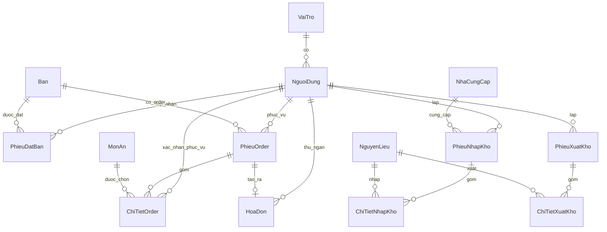

**HỆ THỐNG QUẢN LÝ NHÀ HÀNG**
**ĐẶC TẢ THIẾT KẾ CHI TIẾT**

> Tài liệu này là "blueprint" cho quy trình triển khai. Mọi quyết định nghiệp vụ tham chiếu về `DESCRIPTION.md` (đặc tả sơ khai). Mọi tên gọi (bảng, cột, endpoint, hàm xử lý) viết bằng **tiếng Việt không dấu**.

# 1. TỔNG QUAN KIẾN TRÚC {#tổng-quan-kiến-trúc}

## 1.1. Sơ đồ kiến trúc

```
┌──────────────────────────────────────────────────────────────────────┐
│  CLIENT — Trình duyệt (Chrome/Edge) trên máy bàn của từng vai trò    │
│  ─ Admin, Phục vụ, Bếp, Thu ngân, Kho                                │
│  ─ HTML5 + CSS3 + JavaScript thuần (vanilla)                         │
│  ─ Máy in nhiệt 80mm gắn vào máy Bếp (in PV_BM3, B_BM1)              │
│  ─ Máy in nhiệt 80mm + A4 gắn vào máy Thu ngân (in TN_BM3)           │
└──────────────────────────────────────────────────────────────────────┘
                              │  HTTPS — REST/JSON
                              │  Authorization: Bearer <JWT>
                              ▼
┌──────────────────────────────────────────────────────────────────────┐
│  BACKEND — Node.js + Express                                         │
│  ─ Tầng route (Express Router) ──────────────► §4 API                │
│  ─ Tầng controller — validate + middleware JWT/role                  │
│  ─ Tầng service — logic nghiệp vụ ──────────► §5 Pseudocode          │
│  ─ Tầng repository — truy vấn SQL (driver mssql)                     │
│  ─ Hằng số hệ thống: tệp config/constants.js (VAT, giờ HĐ, ...)      │
└──────────────────────────────────────────────────────────────────────┘
                              │  TCP/IP (mssql driver)
                              ▼
┌──────────────────────────────────────────────────────────────────────┐
│  CSDL — Microsoft SQL Server 2019+                                   │
│  ─ 13 bảng (§2)                                                      │
└──────────────────────────────────────────────────────────────────────┘
```

**Mô hình triển khai:** chạy trên 1 máy chủ trong mạng LAN của nhà hàng. Toàn bộ client là PC/laptop trong cùng mạng LAN. Sao lưu CSDL nằm ngoài phạm vi ứng dụng (việc của DBA, dùng tính năng backup của SQL Server).

## 1.2. Quy ước đặt tên

| Hạng mục | Quy ước | Ví dụ |
|---|---|---|
| Bảng CSDL | PascalCase tiếng Việt không dấu | `NguoiDung`, `PhieuDatBan`, `ChiTietOrder` |
| Cột CSDL | snake_case tiếng Việt không dấu | `ten_dang_nhap`, `tong_thanh_toan` |
| Khóa chính | `ma_<viết_tắt_thực_thể>` | `ma_nguoi_dung`, `ma_dat_ban`, `ma_order` |
| Khóa ngoại | Cùng tên với khóa chính được tham chiếu | `ma_ban` ở `PhieuDatBan` trỏ về `Ban.ma_ban` |
| Trường thời gian | `thoi_gian_<sự_kiện>` | `thoi_gian_tao`, `thoi_gian_xong` |
| Trường boolean | `dang_<trạng_thái>` | `dang_su_dung` |
| Trường enum/trạng thái | `NVARCHAR(20)` + CHECK constraint, giá trị PascalCase TV không dấu | `'Trong'`, `'DaDat'`, `'CoKhach'` |
| API endpoint | kebab-case TV không dấu, dưới prefix `/api/v1` | `/api/v1/dat-ban`, `/api/v1/thanh-toan` |
| Trường JSON request/response | snake_case TV không dấu, đồng nhất cột DB | `{"ten_khach": "Nguyen Van A"}` |
| Hàm xử lý (pseudocode) | PascalCase TV không dấu | `XuLyDatBan(...)`, `XuLyThanhToan(...)` |
| Biến cục bộ (pseudocode) | camelCase TV không dấu | `danhSachBanTrong`, `tongTienMon` |

## 1.3. Quy ước trạng thái và mã liệt kê

| Đối tượng | Mã trạng thái | Ý nghĩa |
|---|---|---|
| **Bàn** (`Ban.trang_thai`) | `Trong` / `DaDat` / `CoKhach` | Trống / Có phiếu đặt chưa nhận / Đang phục vụ |
| **Phiếu đặt bàn** (`PhieuDatBan.trang_thai`) | `DaDat` / `DaNhanBan` / `DaHuy` | Đã ghi nhận / Khách đến / Hủy |
| **Dòng món** (`ChiTietOrder.trang_thai`) | `ChuaChot` / `ChoCheBien` / `DangCheBien` / `DaXong` / `DaPhucVu` / `DaHuy` | — |
| **Phiếu order** (`PhieuOrder.trang_thai`) | `DangPhucVu` / `DaThanhToan` / `DaHuy` | — |
| **Hình thức thanh toán** (`HoaDon.hinh_thuc_tt`) | `TienMat` / `ChuyenKhoan` | — |
| **Tài khoản** (`NguoiDung.trang_thai`) | `HoatDong` / `DaKhoa` | — |
| **Vai trò** (`VaiTro.ma_vai_tro`) | `Admin` / `PhucVu` / `Bep` / `ThuNgan` / `Kho` | — |
| **Loại món** (`MonAn.loai_mon`) | `MonAn` / `DoUong` | Cũng chính là bộ phận xử lý (Món ăn → Bếp; Đồ uống → Quầy pha chế) |
| **Trạng thái món** (`MonAn.trang_thai`) | `ConHang` / `HetHang` | — |
| **Bộ phận nhận xuất kho** (`PhieuXuatKho.bo_phan_nhan`) | `Bep` / `QuayPhaChe` | — |

## 1.4. Phân chia module (chia việc theo nhóm)

Hệ thống chia thành **8 module gần như độc lập**. Mỗi module có ranh giới rõ ràng về bảng/endpoint/màn hình, cho phép các thành viên trong nhóm phụ trách độc lập từ thiết kế chi tiết đến triển khai.

| Module | Vai trò chính | Bảng sở hữu (R/W) | Bảng đọc từ module khác | Endpoint prefix |
|---|---|---|---|---|
| **M1. Xác thực + Tài khoản** | Đăng nhập/đăng xuất, quản lý tài khoản, middleware kiểm tra quyền | `VaiTro` (R), `NguoiDung` (R/W) | (không) | `/auth/*`, `/nguoi-dung/*` |
| **M2. Quản lý bàn** | CRUD bàn | `Ban` (R/W) | (không) | `/ban/*` |
| **M3. Thực đơn** | CRUD món | `MonAn` (R/W) | (không) | `/mon-an/*` |
| **M4. Đặt bàn** | Tạo, hủy, đánh dấu nhận bàn | `PhieuDatBan` (R/W) | `Ban` (R/W trạng thái) | `/dat-ban/*` |
| **M5. Order + Bếp** | Gọi món, chốt bếp, cập nhật trạng thái món, phục vụ ra bàn | `PhieuOrder` (R/W), `ChiTietOrder` (R/W) | `Ban` (R/W trạng thái), `MonAn` (R) | `/order/*` |
| **M6. Thanh toán** | Thanh toán, in lại hóa đơn, báo cáo doanh thu | `HoaDon` (R/W) | `PhieuOrder` (R/W trạng thái), `ChiTietOrder` (R) | `/thanh-toan/*`, `/hoa-don/*`, `/bao-cao/doanh-thu` |
| **M7. Kho** | NCC, NVL, nhập/xuất kho, báo cáo kho | `NhaCungCap` (R/W), `NguyenLieu` (R/W), `PhieuNhapKho` + `ChiTietNhapKho` (R/W), `PhieuXuatKho` + `ChiTietXuatKho` (R/W) | (không) | `/kho/*` |
| **M8. Báo cáo tổng hợp** | Dashboard Admin | Đọc cross-module | Tất cả | `/bao-cao/tong-hop` |

**Coupling thực tế giữa module:**
- M4 ↔ M2: cập nhật `Ban.trang_thai` khi đặt bàn / nhận bàn
- M5 ↔ M2: cập nhật `Ban.trang_thai` khi mở/đóng order
- M5 ↔ M3: đọc `MonAn` để hiện thực đơn + snapshot đơn giá
- M6 ↔ M5: đọc `PhieuOrder` + `ChiTietOrder` để tính tiền; ghi `PhieuOrder.trang_thai = 'DaThanhToan'`
- M8 đọc cross-module nhưng chỉ đọc

→ Mỗi cặp giao tiếp chỉ qua **trường FK + cột trạng thái cố định**. Hợp đồng giữa các module = §2 (schema CSDL) + §4 (API). Sau khi 2 file này được duyệt, các thành viên code song song được.

# 2. THIẾT KẾ CƠ SỞ DỮ LIỆU {#thiết-kế-cơ-sở-dữ-liệu}

## 2.1. Sơ đồ ERD



## 2.2. Danh sách bảng (tổng quan)

| # | Tên bảng | Module | Vai trò chính | DFD tham chiếu |
|---|---|---|---|---|
| 1 | `VaiTro` | M1 | Danh mục 5 vai trò người dùng | §7.5.3, §7.6.1 |
| 2 | `NguoiDung` | M1 | Tài khoản nhân viên | §7.5.3, §7.6.1 |
| 3 | `Ban` | M2 | Danh sách bàn ăn | §7.1.x, §7.5.2 |
| 4 | `MonAn` | M3 | Thực đơn | §7.1.2, §7.5.1 |
| 5 | `PhieuDatBan` | M4 | Phiếu đặt bàn | §7.1.1 |
| 6 | `PhieuOrder` | M5 | Phiếu order theo bàn | §7.1.2, §7.2.1 |
| 7 | `ChiTietOrder` | M5 | Các dòng món trong order | §7.1.2, §7.1.3, §7.1.4, §7.3.x |
| 8 | `HoaDon` | M6 | Hóa đơn thanh toán | §7.2.1, §7.2.2, §7.2.3 |
| 9 | `NhaCungCap` | M7 | Nhà cung cấp NVL | §7.4.1 |
| 10 | `NguyenLieu` | M7 | Danh mục NVL + tồn kho hiện tại | §7.4.x |
| 11 | `PhieuNhapKho` | M7 | Phiếu nhập kho (header) | §7.4.1, §7.4.4 |
| 12 | `ChiTietNhapKho` | M7 | Dòng NVL trong phiếu nhập | §7.4.1, §7.4.4 |
| 13 | `PhieuXuatKho` | M7 | Phiếu xuất kho (header) | §7.4.3, §7.4.5 |
| 14 | `ChiTietXuatKho` | M7 | Dòng NVL trong phiếu xuất | §7.4.3, §7.4.5 |

(Đếm = 14 bảng vì NhapKho và XuatKho mỗi cái có thêm 1 bảng chi tiết; nhưng ở góc nhìn "thực thể nghiệp vụ", vẫn coi như 13 thực thể.)

## 2.3. Chi tiết từng bảng

### 2.3.1. `VaiTro`

| Tên trường | Kiểu dữ liệu | Ràng buộc | Mô tả |
|---|---|---|---|
| `ma_vai_tro` | NVARCHAR(10) | **PK** | `Admin` / `PhucVu` / `Bep` / `ThuNgan` / `Kho` |
| `ten_vai_tro` | NVARCHAR(50) | NOT NULL | Tên hiển thị (Vd "Quản lý") |
| `mo_ta` | NVARCHAR(200) | NULL | Mô tả vai trò |

Bảng tĩnh, 5 dòng, seed sẵn.

### 2.3.2. `NguoiDung`

| Tên trường | Kiểu dữ liệu | Ràng buộc | Mô tả |
|---|---|---|---|
| `ma_nguoi_dung` | INT IDENTITY(1,1) | **PK** | Mã NV tự sinh |
| `ten_dang_nhap` | NVARCHAR(50) | UNIQUE, NOT NULL | Tên đăng nhập (không dấu, không khoảng trắng) |
| `mat_khau_hash` | NVARCHAR(255) | NOT NULL | Hash bcrypt mật khẩu |
| `ho_ten` | NVARCHAR(100) | NOT NULL | Họ và tên NV |
| `ma_vai_tro` | NVARCHAR(10) | FK → `VaiTro.ma_vai_tro`, NOT NULL | Vai trò gắn |
| `trang_thai` | NVARCHAR(20) | NOT NULL, CHECK IN (`'HoatDong'`,`'DaKhoa'`), DEFAULT `'HoatDong'` | |
| `so_lan_sai_lien_tiep` | TINYINT | NOT NULL, DEFAULT 0 | Tăng khi sai; reset khi đúng; ≥ 5 → khóa |
| `thoi_gian_dang_nhap_cuoi` | DATETIME2 | NULL | Lúc đăng nhập thành công gần nhất |
| `thoi_gian_tao` | DATETIME2 | NOT NULL, DEFAULT SYSDATETIME() | |
| `thoi_gian_cap_nhat` | DATETIME2 | NULL | |

**Index:** `IX_NguoiDung_vaitro (ma_vai_tro)`.

### 2.3.3. `Ban`

| Tên trường | Kiểu dữ liệu | Ràng buộc | Mô tả |
|---|---|---|---|
| `ma_ban` | INT IDENTITY(1,1) | **PK** | |
| `so_ban` | NVARCHAR(10) | UNIQUE, NOT NULL | Mã hiển thị (Vd `B01`) |
| `khu_vuc` | NVARCHAR(50) | NOT NULL | `Tầng 1`, `Sân vườn`… |
| `suc_chua` | INT | NOT NULL, CHECK (`suc_chua > 0`) | Số người tối đa |
| `trang_thai` | NVARCHAR(20) | NOT NULL, CHECK IN (`'Trong'`,`'DaDat'`,`'CoKhach'`), DEFAULT `'Trong'` | |
| `ghi_chu` | NVARCHAR(200) | NULL | |
| `dang_su_dung` | BIT | NOT NULL, DEFAULT 1 | Soft delete |

### 2.3.4. `MonAn`

| Tên trường | Kiểu dữ liệu | Ràng buộc | Mô tả |
|---|---|---|---|
| `ma_mon` | INT IDENTITY(1,1) | **PK** | |
| `ten_mon` | NVARCHAR(100) | UNIQUE, NOT NULL | |
| `loai_mon` | NVARCHAR(10) | NOT NULL, CHECK IN (`'MonAn'`,`'DoUong'`) | Đồng thời là phân luồng Bếp/Pha chế |
| `don_gia` | DECIMAL(15,0) | NOT NULL, CHECK (`don_gia >= 0`) | VND (không phần thập phân) |
| `trang_thai` | NVARCHAR(10) | NOT NULL, CHECK IN (`'ConHang'`,`'HetHang'`), DEFAULT `'ConHang'` | |
| `mo_ta` | NVARCHAR(500) | NULL | |
| `dang_su_dung` | BIT | NOT NULL, DEFAULT 1 | Soft delete |

### 2.3.5. `PhieuDatBan`

| Tên trường | Kiểu dữ liệu | Ràng buộc | Mô tả |
|---|---|---|---|
| `ma_dat_ban` | INT IDENTITY(1,1) | **PK** | Đây cũng là "Mã đặt bàn" in trên PV_BM1 |
| `ma_ban` | INT | FK → `Ban.ma_ban`, NOT NULL | |
| `ten_khach` | NVARCHAR(100) | NOT NULL | |
| `so_dien_thoai` | NVARCHAR(15) | NOT NULL | |
| `so_nguoi` | INT | NOT NULL, CHECK (`so_nguoi > 0`) | Kiểm tra ≤ `Ban.suc_chua` ở service |
| `thoi_gian_dat` | DATETIME2 | NOT NULL | Khung giờ khách hẹn |
| `hinh_thuc_dat` | NVARCHAR(20) | NOT NULL, CHECK IN (`'TrucTiep'`,`'QuaDienThoai'`) | |
| `ghi_chu` | NVARCHAR(500) | NULL | |
| `nv_tiep_nhan` | INT | FK → `NguoiDung.ma_nguoi_dung`, NOT NULL | |
| `trang_thai` | NVARCHAR(20) | NOT NULL, CHECK IN (`'DaDat'`,`'DaNhanBan'`,`'DaHuy'`), DEFAULT `'DaDat'` | |
| `thoi_gian_tao` | DATETIME2 | NOT NULL, DEFAULT SYSDATETIME() | |
| `thoi_gian_nhan_ban` | DATETIME2 | NULL | Lúc Phục vụ bấm "Đã nhận bàn" |
| `thoi_gian_huy` | DATETIME2 | NULL | |

**Index:** `IX_PhieuDatBan_ban_thoigian (ma_ban, thoi_gian_dat)`.

### 2.3.6. `PhieuOrder`

| Tên trường | Kiểu dữ liệu | Ràng buộc | Mô tả |
|---|---|---|---|
| `ma_order` | INT IDENTITY(1,1) | **PK** | |
| `ma_ban` | INT | FK → `Ban.ma_ban`, NOT NULL | |
| `nv_phuc_vu` | INT | FK → `NguoiDung.ma_nguoi_dung`, NOT NULL | NV mở order |
| `thoi_gian_tao` | DATETIME2 | NOT NULL, DEFAULT SYSDATETIME() | |
| `trang_thai` | NVARCHAR(20) | NOT NULL, CHECK IN (`'DangPhucVu'`,`'DaThanhToan'`,`'DaHuy'`), DEFAULT `'DangPhucVu'` | |
| `tong_tam_tinh` | DECIMAL(15,0) | NOT NULL, DEFAULT 0 | Cập nhật khi thêm/sửa/hủy dòng |

**Index:** `IX_PhieuOrder_ban_trangthai (ma_ban, trang_thai)`.

### 2.3.7. `ChiTietOrder`

| Tên trường | Kiểu dữ liệu | Ràng buộc | Mô tả |
|---|---|---|---|
| `ma_chi_tiet` | BIGINT IDENTITY(1,1) | **PK** | |
| `ma_order` | INT | FK → `PhieuOrder.ma_order`, NOT NULL | |
| `ma_mon` | INT | FK → `MonAn.ma_mon`, NOT NULL | |
| `so_luong` | INT | NOT NULL, CHECK (`so_luong > 0`) | |
| `don_gia` | DECIMAL(15,0) | NOT NULL | **Snapshot** giá tại thời điểm gọi |
| `thanh_tien` | DECIMAL(15,0) | NOT NULL, AS (`so_luong * don_gia`) PERSISTED | Cột tính, lưu vật lý |
| `ghi_chu` | NVARCHAR(200) | NULL | |
| `trang_thai` | NVARCHAR(20) | NOT NULL, CHECK IN (`'ChuaChot'`,`'ChoCheBien'`,`'DangCheBien'`,`'DaXong'`,`'DaPhucVu'`,`'DaHuy'`), DEFAULT `'ChuaChot'` | |
| `thoi_gian_tao` | DATETIME2 | NOT NULL, DEFAULT SYSDATETIME() | |
| `thoi_gian_chot` | DATETIME2 | NULL | Lúc chuyển `ChuaChot` → `ChoCheBien` (chốt sang bếp) |
| `thoi_gian_xong` | DATETIME2 | NULL | Lúc chuyển → `DaXong` |
| `thoi_gian_phuc_vu` | DATETIME2 | NULL | Lúc chuyển → `DaPhucVu` |
| `nv_phuc_vu_xac_nhan` | INT | FK → `NguoiDung.ma_nguoi_dung`, NULL | NV xác nhận đã đem ra bàn |

**Index:**
- `IX_ChiTietOrder_order (ma_order)`
- `IX_ChiTietOrder_trangthai_chot (trang_thai, thoi_gian_chot)` — FIFO Bếp

**Ghi chú:** Không có bảng `PhieuChuyenBep` riêng. "Phiếu chuyển bếp" PV_BM3 là document sinh trên-bay từ:
```sql
SELECT * FROM ChiTietOrder ct JOIN MonAn m ON ct.ma_mon = m.ma_mon
WHERE ct.ma_order = @order AND ct.trang_thai = 'ChoCheBien'
  AND m.loai_mon = @bo_phan  -- 'MonAn' → Bếp; 'DoUong' → Quầy pha chế
ORDER BY ct.thoi_gian_chot;
```

### 2.3.8. `HoaDon`

| Tên trường | Kiểu dữ liệu | Ràng buộc | Mô tả |
|---|---|---|---|
| `ma_hoa_don` | INT IDENTITY(1,1) | **PK** | |
| `so_hoa_don` | NVARCHAR(20) | UNIQUE, NOT NULL | Vd `HD20260529-00001` (sinh ở service) |
| `ma_order` | INT | FK → `PhieuOrder.ma_order`, UNIQUE, NOT NULL | 1 order ↔ 1 hóa đơn |
| `so_ban_snapshot` | NVARCHAR(10) | NOT NULL | Snapshot `Ban.so_ban` |
| `nv_thu_ngan` | INT | FK → `NguoiDung.ma_nguoi_dung`, NOT NULL | |
| `tong_tien_mon` | DECIMAL(15,0) | NOT NULL | ∑(SL × đơn giá) |
| `ty_le_vat` | DECIMAL(5,4) | NOT NULL, DEFAULT 0.1 | Snapshot (mặc định 0.1 = 10%) |
| `tien_vat` | DECIMAL(15,0) | NOT NULL, DEFAULT 0 | ROUND(`tong_tien_mon * ty_le_vat`, 0) |
| `tong_thanh_toan` | DECIMAL(15,0) | NOT NULL | `tong_tien_mon + tien_vat` |
| `hinh_thuc_tt` | NVARCHAR(20) | NOT NULL, CHECK IN (`'TienMat'`,`'ChuyenKhoan'`) | |
| `tien_khach_dua` | DECIMAL(15,0) | NULL | NULL khi `ChuyenKhoan` |
| `tien_thua` | DECIMAL(15,0) | NOT NULL, DEFAULT 0 | 0 khi `ChuyenKhoan` |
| `ma_giao_dich` | NVARCHAR(100) | NULL | Mã/đường dẫn ảnh giao dịch CK (tùy chọn) |
| `thoi_gian_tao` | DATETIME2 | NOT NULL, DEFAULT SYSDATETIME() | |
| `so_lan_in` | INT | NOT NULL, DEFAULT 0 | ≥ 2 → đánh dấu "BẢN SAO" trên bản in |

**Index:** `IX_HoaDon_thoigian (thoi_gian_tao DESC)`.

### 2.3.9. `NhaCungCap`

| Tên trường | Kiểu dữ liệu | Ràng buộc | Mô tả |
|---|---|---|---|
| `ma_ncc` | INT IDENTITY(1,1) | **PK** | |
| `ten_ncc` | NVARCHAR(150) | UNIQUE, NOT NULL | |
| `so_dien_thoai` | NVARCHAR(15) | NULL | |
| `dia_chi` | NVARCHAR(300) | NULL | |
| `dang_su_dung` | BIT | NOT NULL, DEFAULT 1 | |

### 2.3.10. `NguyenLieu`

| Tên trường | Kiểu dữ liệu | Ràng buộc | Mô tả |
|---|---|---|---|
| `ma_nvl` | INT IDENTITY(1,1) | **PK** | |
| `ten_nvl` | NVARCHAR(100) | UNIQUE, NOT NULL | |
| `don_vi_tinh` | NVARCHAR(20) | NOT NULL | `kg`, `lit`, `goi`, `chai`… |
| `ton_hien_tai` | DECIMAL(15,3) | NOT NULL, DEFAULT 0, CHECK (`ton_hien_tai >= 0`) | Tồn real-time, cập nhật trong transaction nhập/xuất |
| `thoi_gian_cap_nhat_ton` | DATETIME2 | NULL | Lần tồn thay đổi gần nhất |
| `dang_su_dung` | BIT | NOT NULL, DEFAULT 1 | |

### 2.3.11. `PhieuNhapKho`

| Tên trường | Kiểu dữ liệu | Ràng buộc | Mô tả |
|---|---|---|---|
| `ma_phieu_nhap` | INT IDENTITY(1,1) | **PK** | |
| `so_phieu` | NVARCHAR(20) | UNIQUE, NOT NULL | Vd `PN20260529-001` |
| `ma_ncc` | INT | FK → `NhaCungCap.ma_ncc`, NOT NULL | |
| `nv_lap` | INT | FK → `NguoiDung.ma_nguoi_dung`, NOT NULL | |
| `ngay_nhap` | DATE | NOT NULL | |
| `tong_gia_tri` | DECIMAL(15,0) | NOT NULL | ∑(SL × đơn giá) |
| `ghi_chu` | NVARCHAR(500) | NULL | |
| `thoi_gian_tao` | DATETIME2 | NOT NULL, DEFAULT SYSDATETIME() | |

**Index:** `IX_PhieuNhapKho_ngay (ngay_nhap)`.

### 2.3.12. `ChiTietNhapKho`

| Tên trường | Kiểu dữ liệu | Ràng buộc | Mô tả |
|---|---|---|---|
| `ma_chi_tiet` | BIGINT IDENTITY(1,1) | **PK** | |
| `ma_phieu_nhap` | INT | FK → `PhieuNhapKho.ma_phieu_nhap`, NOT NULL, ON DELETE CASCADE | |
| `ma_nvl` | INT | FK → `NguyenLieu.ma_nvl`, NOT NULL | |
| `so_luong` | DECIMAL(15,3) | NOT NULL, CHECK (`so_luong > 0`) | |
| `don_gia` | DECIMAL(15,0) | NOT NULL, CHECK (`don_gia > 0`) | |
| `thanh_tien` | DECIMAL(15,0) | NOT NULL, AS (`so_luong * don_gia`) PERSISTED | |
| `ghi_chu` | NVARCHAR(200) | NULL | |

### 2.3.13. `PhieuXuatKho`

| Tên trường | Kiểu dữ liệu | Ràng buộc | Mô tả |
|---|---|---|---|
| `ma_phieu_xuat` | INT IDENTITY(1,1) | **PK** | |
| `so_phieu` | NVARCHAR(20) | UNIQUE, NOT NULL | Vd `PX20260529-001` |
| `bo_phan_nhan` | NVARCHAR(20) | NOT NULL, CHECK IN (`'Bep'`,`'QuayPhaChe'`) | |
| `nv_lap` | INT | FK → `NguoiDung.ma_nguoi_dung`, NOT NULL | |
| `ngay_xuat` | DATE | NOT NULL | |
| `tong_gia_tri` | DECIMAL(15,0) | NOT NULL | |
| `ghi_chu` | NVARCHAR(500) | NULL | |
| `thoi_gian_tao` | DATETIME2 | NOT NULL, DEFAULT SYSDATETIME() | |

**Index:** `IX_PhieuXuatKho_ngay (ngay_xuat)`.

### 2.3.14. `ChiTietXuatKho`

| Tên trường | Kiểu dữ liệu | Ràng buộc | Mô tả |
|---|---|---|---|
| `ma_chi_tiet` | BIGINT IDENTITY(1,1) | **PK** | |
| `ma_phieu_xuat` | INT | FK → `PhieuXuatKho.ma_phieu_xuat`, NOT NULL, ON DELETE CASCADE | |
| `ma_nvl` | INT | FK → `NguyenLieu.ma_nvl`, NOT NULL | |
| `so_luong` | DECIMAL(15,3) | NOT NULL, CHECK (`so_luong > 0`) | |
| `don_gia` | DECIMAL(15,0) | NOT NULL, CHECK (`don_gia > 0`) | |
| `thanh_tien` | DECIMAL(15,0) | NOT NULL, AS (`so_luong * don_gia`) PERSISTED | |
| `ghi_chu` | NVARCHAR(200) | NULL | |

## 2.4. Ràng buộc cấp ứng dụng

| # | Ràng buộc | Module | Cách xử lý |
|---|---|---|---|
| 1 | `PhieuDatBan.so_nguoi ≤ Ban.suc_chua` | M4 | Kiểm tra trước INSERT |
| 2 | Chỉ tạo `PhieuOrder` mới khi `Ban.trang_thai IN ('Trong','CoKhach')`. Nếu `DaDat` → yêu cầu Phục vụ bấm "Đã nhận bàn" trước | M5 | Kiểm tra trước INSERT |
| 3 | `ChiTietXuatKho.so_luong ≤ NguyenLieu.ton_hien_tai` tại thời điểm lưu | M7 | Transaction + check trước UPDATE tồn |
| 4 | Chỉ cho thanh toán `PhieuOrder` khi mọi `ChiTietOrder.trang_thai IN ('DaPhucVu','DaHuy')` | M6 | SQL check trước INSERT `HoaDon` |
| 5 | Chuyển trạng thái `ChiTietOrder` tuần tự (`ChoCheBien → DangCheBien → DaXong → DaPhucVu`), không bỏ bước | M5 | State machine ở tầng service |
| 6 | Cập nhật `NguyenLieu.ton_hien_tai` và INSERT phiếu kho trong CÙNG transaction | M7 | `BEGIN TRAN` … `COMMIT` |
| 7 | Khóa tài khoản khi `so_lan_sai_lien_tiep ≥ 5` | M1 | Sau mỗi lần sai |
| 8 | Đặt bàn / nhận bàn / thanh toán: đồng bộ `Ban.trang_thai` trong cùng transaction với phiếu | M2 (cross-call) | Hàm dùng chung |

## 2.5. Dữ liệu seed mẫu

```sql
-- 1. VaiTro (cố định)
INSERT INTO VaiTro (ma_vai_tro, ten_vai_tro, mo_ta) VALUES
('Admin',   N'Quản lý',       N'Quản lý toàn hệ thống'),
('PhucVu',  N'Phục vụ',       N'Tiếp nhận đặt bàn, gọi món, phục vụ'),
('Bep',     N'Bộ phận Bếp',   N'Chế biến món ăn / đồ uống'),
('ThuNgan', N'Thu ngân',      N'Thanh toán, xuất hóa đơn'),
('Kho',     N'Bộ phận Kho',   N'Nhập / xuất / báo cáo kho');

-- 2. NguoiDung (mật khẩu mặc định = 'matkhau123', đã hash bcrypt cost 10)
INSERT INTO NguoiDung (ten_dang_nhap, mat_khau_hash, ho_ten, ma_vai_tro) VALUES
('admin',    '$2b$10$EXAMPLEHASHADMIN........................', N'Quản trị viên', 'Admin'),
('phucvu1',  '$2b$10$EXAMPLEHASHPHUCVU.......................', N'Nguyễn Văn A',   'PhucVu'),
('bep1',     '$2b$10$EXAMPLEHASHBEP..........................', N'Trần Thị B',     'Bep'),
('thungan1', '$2b$10$EXAMPLEHASHTHUNGAN......................', N'Lê Văn C',       'ThuNgan'),
('kho1',     '$2b$10$EXAMPLEHASHKHO..........................', N'Phạm Thị D',     'Kho');

-- 3. Ban
INSERT INTO Ban (so_ban, khu_vuc, suc_chua) VALUES
(N'B01',   N'Tầng 1',     4),
(N'B02',   N'Tầng 1',     6),
(N'B03',   N'Tầng 2',     4),
(N'B04',   N'Tầng 2',     6),
(N'SV01',  N'Sân vườn',   8),
(N'VIP01', N'Phòng VIP', 10);

-- 4. MonAn
INSERT INTO MonAn (ten_mon, loai_mon, don_gia, mo_ta) VALUES
(N'Phở bò',          'MonAn',  60000, N'Phở bò tái nạm'),
(N'Bún chả',         'MonAn',  55000, N'Bún chả Hà Nội'),
(N'Cơm gà xối mỡ',   'MonAn',  50000, N''),
(N'Lẩu thái',        'MonAn', 250000, N'Phục vụ 4 người'),
(N'Trà đá',          'DoUong',  5000, N''),
(N'Cà phê đen đá',   'DoUong', 25000, N''),
(N'Nước cam tươi',   'DoUong', 30000, N''),
(N'Bia Heineken',    'DoUong', 35000, N'Chai 330ml');

-- 5. NhaCungCap & NguyenLieu (chỉ phục vụ cho M7 demo)
INSERT INTO NhaCungCap (ten_ncc, so_dien_thoai, dia_chi) VALUES
(N'Cty Thực phẩm An Bình',  N'0901234567', N'Quận 1, TP.HCM'),
(N'Đồ uống Sài Gòn',         N'0907654321', N'Quận 3, TP.HCM');

INSERT INTO NguyenLieu (ten_nvl, don_vi_tinh, ton_hien_tai) VALUES
(N'Thịt bò',      N'kg',    20.0),
(N'Bún tươi',     N'kg',    15.0),
(N'Gạo tẻ',       N'kg',   100.0),
(N'Cà phê hạt',   N'kg',    10.0),
(N'Bia Heineken', N'thùng',  5.0);
```

## 2.6. Hằng số hệ thống (tệp `config/constants.js`)

Thay cho bảng `CauHinh` đã loại bỏ:

```javascript
module.exports = {
  // Thanh toán
  VAT_TY_LE: 0.10,            // 10%

  // Phiên đăng nhập
  PHIEN_DANG_NHAP_PHUT: 30,   // JWT hết hạn sau 30 phút không dùng
  SO_LAN_SAI_TOI_DA: 5,       // Khóa tài khoản sau 5 lần sai

  // Giờ hoạt động (kiểm tra khi đặt bàn / gọi món)
  GIO_MO: '08:00',
  GIO_DONG: '22:00',

  // Báo cáo
  TOP_N_BAO_CAO: 10,          // Số món bán chạy trong dashboard
};
```

---

> **Kết thúc Đợt D1 (đã cắt giảm).** Schema còn 13 thực thể (14 bảng) chia thành 8 module gần như độc lập. Sau khi bạn review xong D1, tôi tiếp tục D2 (API) bám theo cấu trúc module này.
