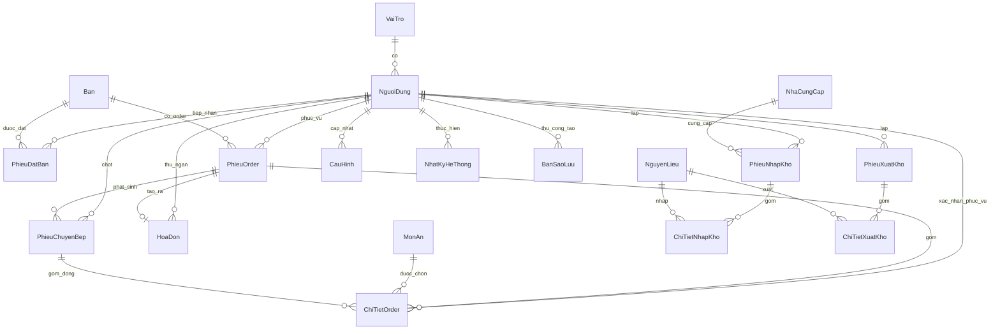

**HỆ THỐNG QUẢN LÝ NHÀ HÀNG**
**ĐẶC TẢ THIẾT KẾ CHI TIẾT**

> Tài liệu này là "blueprint" cho quy trình triển khai. Mọi quyết định nghiệp vụ tham chiếu về `DESCRIPTION.md` (đặc tả sơ khai). Mọi tên gọi (bảng, cột, endpoint, hàm xử lý) viết bằng **tiếng Việt không dấu**.

# 1. TỔNG QUAN KIẾN TRÚC {#tổng-quan-kiến-trúc}

## 1.1. Sơ đồ kiến trúc

```
┌──────────────────────────────────────────────────────────────────────┐
│  CLIENT — Trình duyệt (Chrome/Edge) trên máy bàn của từng vai trò    │
│  ─ Admin, Phục vụ, Bếp, Thu ngân, Kho                                │
│  ─ HTML5 + CSS3 + JavaScript thuần (vanilla)                         │
│  ─ Máy in nhiệt 80mm gắn vào máy Bếp (in B_BM1)                      │
│  ─ Máy in nhiệt 80mm + A4 gắn vào máy Thu ngân (in TN_BM3)           │
└──────────────────────────────────────────────────────────────────────┘
                              │  HTTPS — REST/JSON
                              │  Authorization: Bearer <JWT>
                              ▼
┌──────────────────────────────────────────────────────────────────────┐
│  BACKEND — Node.js + Express                                         │
│  ─ Tầng route (Express Router) ──────────────► §4 API                │
│  ─ Tầng controller — validate, kiểm tra quyền (middleware JWT)       │
│  ─ Tầng service — logic nghiệp vụ ──────────► §5 Pseudocode          │
│  ─ Tầng repository — truy vấn SQL (driver mssql)                     │
│  ─ Job scheduler (node-cron) cho sao lưu tự động                     │
└──────────────────────────────────────────────────────────────────────┘
                              │  TCP/IP (mssql driver)
                              ▼
┌──────────────────────────────────────────────────────────────────────┐
│  CSDL — Microsoft SQL Server 2019+                                   │
│  ─ 18 bảng (§2)                                                      │
│  ─ Bản sao lưu .bak ghi vào thư mục cấu hình trên máy chủ            │
└──────────────────────────────────────────────────────────────────────┘
```

**Mô hình triển khai:** chạy trên 1 máy chủ trong mạng LAN của nhà hàng (đơn server, đơn DB). Toàn bộ client là PC/laptop trong cùng mạng LAN, kết nối qua HTTPS dùng cert tự ký.

## 1.2. Quy ước đặt tên

| Hạng mục | Quy ước | Ví dụ |
|---|---|---|
| Bảng CSDL | PascalCase tiếng Việt không dấu | `NguoiDung`, `PhieuDatBan`, `ChiTietOrder` |
| Cột CSDL | snake_case tiếng Việt không dấu | `ten_dang_nhap`, `tong_thanh_toan` |
| Khóa chính | `ma_<viết_tắt_thực_thể>` | `ma_nguoi_dung`, `ma_dat_ban`, `ma_order` |
| Khóa ngoại | Cùng tên với khóa chính được tham chiếu | `ma_ban` ở `PhieuDatBan` trỏ về `Ban.ma_ban` |
| Trường thời gian | `thoi_gian_<sự_kiện>` | `thoi_gian_tao`, `thoi_gian_check_in`, `thoi_gian_xong` |
| Trường boolean | `dang_<trạng_thái>` | `dang_su_dung`, `dang_ap_dung_vat` |
| Trường enum/trạng thái | `NVARCHAR(20)` + CHECK constraint, giá trị PascalCase TV không dấu | `'Trong'`, `'DaDat'`, `'CoKhach'` |
| API endpoint | kebab-case tiếng Việt không dấu, dưới prefix `/api/v1` | `/api/v1/dat-ban`, `/api/v1/thanh-toan` |
| Trường JSON request/response | snake_case TV không dấu, đồng nhất với cột DB | `{"ten_khach": "Nguyen Van A"}` |
| Hàm xử lý (pseudocode) | PascalCase TV không dấu | `XuLyDatBan(...)`, `KiemTraTrungBooking(...)` |
| Biến cục bộ (pseudocode) | camelCase TV không dấu | `danhSachBanTrong`, `tongTienMon` |

## 1.3. Quy ước trạng thái và mã liệt kê

| Đối tượng | Mã trạng thái | Ý nghĩa |
|---|---|---|
| **Bàn** (`Ban.trang_thai`) | `Trong` | Không có khách, không có đặt sắp tới |
|  | `DaDat` | Đang giữ chỗ cho phiếu đặt thuộc khung giờ hiện tại |
|  | `CoKhach` | Đang phục vụ khách |
| **Phiếu đặt bàn** (`PhieuDatBan.trang_thai`) | `DaDat` | Đã ghi nhận, chưa check-in |
|  | `DaNhanBan` | Khách đã đến và check-in |
|  | `DaHuy` | Hủy (tự động quá hạn hoặc thủ công) |
| **Dòng món trong order** (`ChiTietOrder.trang_thai`) | `ChuaChot` | Phục vụ vừa ghi nhận, chưa gửi bếp |
|  | `ChoCheBien` | Đã chuyển bếp/pha chế, chờ chế biến |
|  | `DangCheBien` | Bếp đang làm |
|  | `DaXong` | Bếp đã xong, chờ phục vụ |
|  | `DaPhucVu` | Phục vụ đã đem ra bàn |
|  | `DaHuy` | Đã hủy |
| **Phiếu order** (`PhieuOrder.trang_thai`) | `DangPhucVu` | Còn món chưa thanh toán |
|  | `DaThanhToan` | Đã thanh toán toàn bộ |
| **Hình thức thanh toán** (`HoaDon.hinh_thuc_tt`) | `TienMat`, `ChuyenKhoan` | — |
| **Tài khoản** (`NguoiDung.trang_thai`) | `HoatDong`, `DaKhoa` | — |
| **Vai trò** (`VaiTro.ma_vai_tro`) | `Admin`, `PhucVu`, `Bep`, `ThuNgan`, `Kho` | 5 vai trò |
| **Loại món** (`MonAn.loai_mon`) | `MonAn`, `DoUong` | Phân luồng Bếp / Quầy pha chế |
| **Bộ phận nhận** (chuyển bếp, xuất kho) | `Bep`, `QuayPhaChe` | — |
| **Trạng thái món** (`MonAn.trang_thai`) | `ConHang`, `HetHang` | — |
| **Loại sao lưu** (`BanSaoLuu.loai`) | `TuDong`, `ThuCong` | — |
| **Kết quả sao lưu** (`BanSaoLuu.ket_qua`) | `ThanhCong`, `ThatBai` | — |

# 2. THIẾT KẾ CƠ SỞ DỮ LIỆU {#thiết-kế-cơ-sở-dữ-liệu}

## 2.1. Sơ đồ ERD



## 2.2. Danh sách bảng (tổng quan)

| # | Tên bảng | Vai trò chính | DFD tham chiếu |
|---|---|---|---|
| 1 | `VaiTro` | Danh mục 5 vai trò người dùng | §7.5.3, §7.6.1 |
| 2 | `NguoiDung` | Tài khoản nhân viên | §7.5.3, §7.6.1 |
| 3 | `NhatKyHeThong` | Log audit thao tác quan trọng | Mọi DFD ghi log |
| 4 | `CauHinh` | Tham số cấu hình hệ thống (VAT, giờ HĐ…) | §7.5.4 |
| 5 | `Ban` | Danh sách bàn ăn | §7.1.x, §7.5.2 |
| 6 | `PhieuDatBan` | Phiếu đặt bàn | §7.1.1, §7.1.5 |
| 7 | `MonAn` | Thực đơn | §7.1.2, §7.5.1 |
| 8 | `PhieuOrder` | Phiếu order theo bàn | §7.1.2, §7.2.1 |
| 9 | `ChiTietOrder` | Các dòng món trong order | §7.1.2, §7.1.4, §7.3.x |
| 10 | `PhieuChuyenBep` | Phiếu chuyển bếp / quầy pha chế | §7.1.3 |
| 11 | `HoaDon` | Hóa đơn thanh toán | §7.2.1, §7.2.2, §7.2.3 |
| 12 | `NhaCungCap` | Nhà cung cấp NVL | §7.4.1 |
| 13 | `NguyenLieu` | Danh mục NVL + tồn kho hiện tại | §7.4.x |
| 14 | `PhieuNhapKho` | Phiếu nhập kho (header) | §7.4.1, §7.4.4 |
| 15 | `ChiTietNhapKho` | Các dòng NVL trong phiếu nhập | §7.4.1, §7.4.4 |
| 16 | `PhieuXuatKho` | Phiếu xuất kho (header) | §7.4.3, §7.4.5 |
| 17 | `ChiTietXuatKho` | Các dòng NVL trong phiếu xuất | §7.4.3, §7.4.5 |
| 18 | `BanSaoLuu` | Metadata bản sao lưu | §7.6.2 |

## 2.3. Chi tiết từng bảng

### 2.3.1. `VaiTro`

| Tên trường | Kiểu dữ liệu | Ràng buộc | Mô tả |
|---|---|---|---|
| `ma_vai_tro` | NVARCHAR(10) | **PK** | Mã vai trò: `Admin` / `PhucVu` / `Bep` / `ThuNgan` / `Kho` |
| `ten_vai_tro` | NVARCHAR(50) | NOT NULL | Tên hiển thị (Vd: "Quản lý") |
| `mo_ta` | NVARCHAR(200) | NULL | Mô tả vai trò |

**Ghi chú:** Bảng tĩnh, 5 dòng, seed sẵn (xem §2.5).

### 2.3.2. `NguoiDung`

| Tên trường | Kiểu dữ liệu | Ràng buộc | Mô tả |
|---|---|---|---|
| `ma_nguoi_dung` | INT IDENTITY(1,1) | **PK** | Mã NV tự sinh |
| `ten_dang_nhap` | NVARCHAR(50) | UNIQUE, NOT NULL | Tên đăng nhập (không dấu, không khoảng trắng) |
| `mat_khau_hash` | NVARCHAR(255) | NOT NULL | Hash bcrypt mật khẩu |
| `ho_ten` | NVARCHAR(100) | NOT NULL | Họ và tên NV |
| `ma_vai_tro` | NVARCHAR(10) | FK → `VaiTro.ma_vai_tro`, NOT NULL | Vai trò gắn |
| `trang_thai` | NVARCHAR(20) | NOT NULL, CHECK IN (`'HoatDong'`,`'DaKhoa'`), DEFAULT `'HoatDong'` | Đăng nhập được hay đã khóa |
| `so_lan_sai_lien_tiep` | TINYINT | NOT NULL, DEFAULT 0 | Tăng khi đăng nhập sai; reset khi đúng; khóa khi ≥ 5 |
| `thoi_gian_tao` | DATETIME2 | NOT NULL, DEFAULT SYSDATETIME() | Lúc tạo |
| `thoi_gian_cap_nhat` | DATETIME2 | NULL | Lúc sửa lần cuối |

**Index:** `IX_NguoiDung_ma_vai_tro (ma_vai_tro)` — phục vụ query phân quyền.

### 2.3.3. `NhatKyHeThong`

| Tên trường | Kiểu dữ liệu | Ràng buộc | Mô tả |
|---|---|---|---|
| `ma_nhat_ky` | BIGINT IDENTITY(1,1) | **PK** | |
| `ma_nguoi_dung` | INT | FK → `NguoiDung.ma_nguoi_dung`, NULL | NULL nếu do job tự động |
| `thoi_gian` | DATETIME2 | NOT NULL, DEFAULT SYSDATETIME() | |
| `loai_thao_tac` | NVARCHAR(30) | NOT NULL | `DangNhap`, `DangXuat`, `ThanhToan`, `NhapKho`, `XuatKho`, `SuaCauHinh`, `TaoTaiKhoan`, `KhoaTaiKhoan`, `MoKhoaTaiKhoan`, `SaoLuu`, `PhucHoi` |
| `doi_tuong` | NVARCHAR(50) | NULL | Vd `'HoaDon:123'`, `'NguoiDung:5'` |
| `mo_ta` | NVARCHAR(MAX) | NULL | Mô tả chi tiết |
| `dia_chi_ip` | NVARCHAR(45) | NULL | IPv4/IPv6 |
| `du_lieu_cu` | NVARCHAR(MAX) | NULL | JSON snapshot trước thao tác (khi sửa) |
| `du_lieu_moi` | NVARCHAR(MAX) | NULL | JSON snapshot sau thao tác |

**Index:** `IX_NhatKy_thoi_gian (thoi_gian DESC)`, `IX_NhatKy_loai (loai_thao_tac, thoi_gian DESC)`.

### 2.3.4. `CauHinh`

| Tên trường | Kiểu dữ liệu | Ràng buộc | Mô tả |
|---|---|---|---|
| `khoa` | NVARCHAR(50) | **PK** | Tên tham số (xem §2.5 seed) |
| `gia_tri` | NVARCHAR(200) | NOT NULL | Lưu dưới dạng chuỗi |
| `kieu_du_lieu` | NVARCHAR(20) | NOT NULL, CHECK IN (`'BOOL'`,`'INT'`,`'DECIMAL'`,`'TIME'`,`'STRING'`) | Để app cast về kiểu đúng |
| `mo_ta` | NVARCHAR(500) | NULL | |
| `thoi_gian_cap_nhat` | DATETIME2 | NOT NULL, DEFAULT SYSDATETIME() | |
| `ma_nguoi_dung` | INT | FK → `NguoiDung.ma_nguoi_dung`, NULL | Người sửa lần cuối |

### 2.3.5. `Ban`

| Tên trường | Kiểu dữ liệu | Ràng buộc | Mô tả |
|---|---|---|---|
| `ma_ban` | INT IDENTITY(1,1) | **PK** | |
| `so_ban` | NVARCHAR(10) | UNIQUE, NOT NULL | Mã hiển thị (Vd `B01`, `VIP01`) |
| `khu_vuc` | NVARCHAR(50) | NOT NULL | `Tầng 1`, `Sân vườn`, `VIP`… |
| `suc_chua` | INT | NOT NULL, CHECK (`suc_chua > 0`) | Số người tối đa |
| `trang_thai` | NVARCHAR(20) | NOT NULL, CHECK IN (`'Trong'`,`'DaDat'`,`'CoKhach'`), DEFAULT `'Trong'` | |
| `ghi_chu` | NVARCHAR(200) | NULL | |
| `dang_su_dung` | BIT | NOT NULL, DEFAULT 1 | Soft delete (0 = ngưng dùng) |

### 2.3.6. `PhieuDatBan`

| Tên trường | Kiểu dữ liệu | Ràng buộc | Mô tả |
|---|---|---|---|
| `ma_dat_ban` | INT IDENTITY(1,1) | **PK** | Đây cũng là "Mã đặt bàn" in trên PV_BM1 |
| `ma_ban` | INT | FK → `Ban.ma_ban`, NOT NULL | |
| `ten_khach` | NVARCHAR(100) | NOT NULL | |
| `so_dien_thoai` | NVARCHAR(15) | NOT NULL | |
| `so_nguoi` | INT | NOT NULL, CHECK (`so_nguoi > 0`) | Phải ≤ `Ban.suc_chua` (kiểm tra ở tầng service) |
| `thoi_gian_dat` | DATETIME2 | NOT NULL | Khung giờ khách hẹn |
| `thoi_luong_du_kien_phut` | INT | NOT NULL, DEFAULT 120 | Để kiểm tra trùng booking |
| `hinh_thuc_dat` | NVARCHAR(20) | NOT NULL, CHECK IN (`'TrucTiep'`,`'QuaDienThoai'`) | |
| `ghi_chu` | NVARCHAR(500) | NULL | |
| `nv_tiep_nhan` | INT | FK → `NguoiDung.ma_nguoi_dung`, NOT NULL | |
| `trang_thai` | NVARCHAR(20) | NOT NULL, CHECK IN (`'DaDat'`,`'DaNhanBan'`,`'DaHuy'`), DEFAULT `'DaDat'` | |
| `thoi_gian_tao` | DATETIME2 | NOT NULL, DEFAULT SYSDATETIME() | |
| `thoi_gian_check_in` | DATETIME2 | NULL | Lúc check-in (nếu có) |
| `thoi_gian_huy` | DATETIME2 | NULL | Lúc hủy (nếu có) |
| `ly_do_huy` | NVARCHAR(200) | NULL | `TuDongQuaHan` / `KhachHuy` / `NhaHangHuy` |

**Index:** `IX_PhieuDatBan_ban_thoigian (ma_ban, thoi_gian_dat)` — phục vụ truy vấn trùng booking.

### 2.3.7. `MonAn`

| Tên trường | Kiểu dữ liệu | Ràng buộc | Mô tả |
|---|---|---|---|
| `ma_mon` | INT IDENTITY(1,1) | **PK** | |
| `ten_mon` | NVARCHAR(100) | UNIQUE, NOT NULL | |
| `loai_mon` | NVARCHAR(10) | NOT NULL, CHECK IN (`'MonAn'`,`'DoUong'`) | Phân luồng Bếp / Quầy pha chế |
| `don_gia` | DECIMAL(15,0) | NOT NULL, CHECK (`don_gia >= 0`) | VND (không phần thập phân) |
| `trang_thai` | NVARCHAR(10) | NOT NULL, CHECK IN (`'ConHang'`,`'HetHang'`), DEFAULT `'ConHang'` | |
| `mo_ta` | NVARCHAR(500) | NULL | |
| `dang_su_dung` | BIT | NOT NULL, DEFAULT 1 | Soft delete |

### 2.3.8. `PhieuOrder`

| Tên trường | Kiểu dữ liệu | Ràng buộc | Mô tả |
|---|---|---|---|
| `ma_order` | INT IDENTITY(1,1) | **PK** | |
| `ma_ban` | INT | FK → `Ban.ma_ban`, NOT NULL | |
| `nv_phuc_vu` | INT | FK → `NguoiDung.ma_nguoi_dung`, NOT NULL | NV mở order |
| `thoi_gian_tao` | DATETIME2 | NOT NULL, DEFAULT SYSDATETIME() | |
| `trang_thai` | NVARCHAR(20) | NOT NULL, CHECK IN (`'DangPhucVu'`,`'DaThanhToan'`,`'DaHuy'`), DEFAULT `'DangPhucVu'` | |
| `tong_tam_tinh` | DECIMAL(15,0) | NOT NULL, DEFAULT 0 | Cập nhật khi thêm/sửa/hủy dòng |

**Index:** `IX_PhieuOrder_ban_trangthai (ma_ban, trang_thai)` — query order đang phục vụ của bàn.

### 2.3.9. `ChiTietOrder`

| Tên trường | Kiểu dữ liệu | Ràng buộc | Mô tả |
|---|---|---|---|
| `ma_chi_tiet` | BIGINT IDENTITY(1,1) | **PK** | |
| `ma_order` | INT | FK → `PhieuOrder.ma_order`, NOT NULL | |
| `ma_mon` | INT | FK → `MonAn.ma_mon`, NOT NULL | |
| `so_luong` | INT | NOT NULL, CHECK (`so_luong > 0`) | |
| `don_gia` | DECIMAL(15,0) | NOT NULL | **Snapshot** giá tại thời điểm gọi |
| `thanh_tien` | DECIMAL(15,0) | NOT NULL, AS (`so_luong * don_gia`) PERSISTED | Cột tính, lưu vật lý |
| `ghi_chu` | NVARCHAR(200) | NULL | |
| `trang_thai` | NVARCHAR(20) | NOT NULL, CHECK IN (`'ChuaChot'`,`'ChoCheBien'`,`'DangCheBien'`,`'DaXong'`,`'DaPhucVu'`,`'DaHuy'`), DEFAULT `'ChuaChot'` | |
| `ma_phieu_chuyen` | INT | FK → `PhieuChuyenBep.ma_phieu_chuyen`, NULL | Set khi chốt sang bếp |
| `thoi_gian_tao` | DATETIME2 | NOT NULL, DEFAULT SYSDATETIME() | |
| `thoi_gian_chot` | DATETIME2 | NULL | Lúc chuyển `ChuaChot` → `ChoCheBien` |
| `thoi_gian_xong` | DATETIME2 | NULL | Lúc chuyển → `DaXong` |
| `thoi_gian_phuc_vu` | DATETIME2 | NULL | Lúc chuyển → `DaPhucVu` |
| `nv_phuc_vu_xac_nhan` | INT | FK → `NguoiDung.ma_nguoi_dung`, NULL | NV xác nhận đã đem ra bàn |

**Index:**
- `IX_ChiTietOrder_order (ma_order)`
- `IX_ChiTietOrder_trangthai_chot (trang_thai, thoi_gian_chot)` — FIFO Bếp (§7.3.x)
- `IX_ChiTietOrder_phieuchuyen (ma_phieu_chuyen)`

### 2.3.10. `PhieuChuyenBep`

| Tên trường | Kiểu dữ liệu | Ràng buộc | Mô tả |
|---|---|---|---|
| `ma_phieu_chuyen` | INT IDENTITY(1,1) | **PK** | |
| `ma_order` | INT | FK → `PhieuOrder.ma_order`, NOT NULL | |
| `bo_phan_nhan` | NVARCHAR(20) | NOT NULL, CHECK IN (`'Bep'`,`'QuayPhaChe'`) | |
| `nv_phuc_vu` | INT | FK → `NguoiDung.ma_nguoi_dung`, NOT NULL | Người chốt order |
| `thoi_gian_tao` | DATETIME2 | NOT NULL, DEFAULT SYSDATETIME() | |
| `ghi_chu` | NVARCHAR(200) | NULL | |

**Ghi chú:** Mỗi lần chốt order có thể sinh tối đa 2 phiếu (1 Bếp + 1 Quầy pha chế) tùy món có. Chi tiết từng dòng món thuộc phiếu được tra qua `ChiTietOrder.ma_phieu_chuyen`.

### 2.3.11. `HoaDon`

| Tên trường | Kiểu dữ liệu | Ràng buộc | Mô tả |
|---|---|---|---|
| `ma_hoa_don` | INT IDENTITY(1,1) | **PK** | |
| `so_hoa_don` | NVARCHAR(20) | UNIQUE, NOT NULL | Vd `HD20260529-00001` (sinh ở tầng service) |
| `ma_order` | INT | FK → `PhieuOrder.ma_order`, UNIQUE, NOT NULL | 1 order ↔ 1 hóa đơn |
| `so_ban_snapshot` | NVARCHAR(10) | NOT NULL | Snapshot `Ban.so_ban` lúc thanh toán |
| `nv_thu_ngan` | INT | FK → `NguoiDung.ma_nguoi_dung`, NOT NULL | |
| `tong_tien_mon` | DECIMAL(15,0) | NOT NULL | ∑(SL × đơn giá) |
| `ap_dung_vat` | BIT | NOT NULL, DEFAULT 0 | Snapshot lúc lập |
| `ty_le_vat` | DECIMAL(5,4) | NOT NULL, DEFAULT 0 | Vd `0.1000` = 10%. Snapshot |
| `tien_vat` | DECIMAL(15,0) | NOT NULL, DEFAULT 0 | ROUND(`tong_tien_mon * ty_le_vat`, 0) |
| `tong_thanh_toan` | DECIMAL(15,0) | NOT NULL | `tong_tien_mon + tien_vat` |
| `hinh_thuc_tt` | NVARCHAR(20) | NOT NULL, CHECK IN (`'TienMat'`,`'ChuyenKhoan'`) | |
| `tien_khach_dua` | DECIMAL(15,0) | NULL | NULL khi `ChuyenKhoan` |
| `tien_thua` | DECIMAL(15,0) | NOT NULL, DEFAULT 0 | 0 khi `ChuyenKhoan` |
| `ma_giao_dich` | NVARCHAR(100) | NULL | Mã/đường dẫn ảnh giao dịch CK (tùy chọn) |
| `thoi_gian_tao` | DATETIME2 | NOT NULL, DEFAULT SYSDATETIME() | |
| `so_lan_in` | INT | NOT NULL, DEFAULT 0 | Tăng mỗi lần in (lần 1 = in gốc, ≥ 2 đánh dấu "BẢN SAO") |

**Index:** `IX_HoaDon_thoigian (thoi_gian_tao DESC)` — báo cáo doanh thu.

### 2.3.12. `NhaCungCap`

| Tên trường | Kiểu dữ liệu | Ràng buộc | Mô tả |
|---|---|---|---|
| `ma_ncc` | INT IDENTITY(1,1) | **PK** | |
| `ten_ncc` | NVARCHAR(150) | UNIQUE, NOT NULL | |
| `so_dien_thoai` | NVARCHAR(15) | NULL | |
| `dia_chi` | NVARCHAR(300) | NULL | |
| `dang_su_dung` | BIT | NOT NULL, DEFAULT 1 | |

### 2.3.13. `NguyenLieu`

| Tên trường | Kiểu dữ liệu | Ràng buộc | Mô tả |
|---|---|---|---|
| `ma_nvl` | INT IDENTITY(1,1) | **PK** | |
| `ten_nvl` | NVARCHAR(100) | UNIQUE, NOT NULL | |
| `don_vi_tinh` | NVARCHAR(20) | NOT NULL | `kg`, `lit`, `goi`, `chai`… |
| `ton_hien_tai` | DECIMAL(15,3) | NOT NULL, DEFAULT 0, CHECK (`ton_hien_tai >= 0`) | Tồn real-time, cập nhật trong transaction nhập/xuất |
| `dinh_muc_toi_thieu` | DECIMAL(15,3) | NOT NULL, DEFAULT 0 | Cảnh báo khi `ton_hien_tai ≤` |
| `thoi_gian_cap_nhat_ton` | DATETIME2 | NULL | Lần tồn thay đổi gần nhất |
| `dang_su_dung` | BIT | NOT NULL, DEFAULT 1 | |

### 2.3.14. `PhieuNhapKho`

| Tên trường | Kiểu dữ liệu | Ràng buộc | Mô tả |
|---|---|---|---|
| `ma_phieu_nhap` | INT IDENTITY(1,1) | **PK** | |
| `so_phieu` | NVARCHAR(20) | UNIQUE, NOT NULL | Vd `PN20260529-001` |
| `ma_ncc` | INT | FK → `NhaCungCap.ma_ncc`, NOT NULL | |
| `nv_lap` | INT | FK → `NguoiDung.ma_nguoi_dung`, NOT NULL | |
| `ngay_nhap` | DATE | NOT NULL | |
| `tong_gia_tri` | DECIMAL(15,0) | NOT NULL | ∑(SL × đơn giá) |
| `ghi_chu` | NVARCHAR(500) | NULL | |
| `thoi_gian_tao` | DATETIME2 | NOT NULL, DEFAULT SYSDATETIME() | |

**Index:** `IX_PhieuNhapKho_ngay (ngay_nhap)` — báo cáo nhập kho.

### 2.3.15. `ChiTietNhapKho`

| Tên trường | Kiểu dữ liệu | Ràng buộc | Mô tả |
|---|---|---|---|
| `ma_chi_tiet` | BIGINT IDENTITY(1,1) | **PK** | |
| `ma_phieu_nhap` | INT | FK → `PhieuNhapKho.ma_phieu_nhap`, NOT NULL, ON DELETE CASCADE | |
| `ma_nvl` | INT | FK → `NguyenLieu.ma_nvl`, NOT NULL | |
| `so_luong` | DECIMAL(15,3) | NOT NULL, CHECK (`so_luong > 0`) | |
| `don_gia` | DECIMAL(15,0) | NOT NULL, CHECK (`don_gia > 0`) | |
| `thanh_tien` | DECIMAL(15,0) | NOT NULL, AS (`so_luong * don_gia`) PERSISTED | |
| `ghi_chu` | NVARCHAR(200) | NULL | |

### 2.3.16. `PhieuXuatKho`

| Tên trường | Kiểu dữ liệu | Ràng buộc | Mô tả |
|---|---|---|---|
| `ma_phieu_xuat` | INT IDENTITY(1,1) | **PK** | |
| `so_phieu` | NVARCHAR(20) | UNIQUE, NOT NULL | Vd `PX20260529-001` |
| `bo_phan_nhan` | NVARCHAR(20) | NOT NULL, CHECK IN (`'Bep'`,`'QuayPhaChe'`) | |
| `nv_lap` | INT | FK → `NguoiDung.ma_nguoi_dung`, NOT NULL | |
| `ngay_xuat` | DATE | NOT NULL | |
| `tong_gia_tri` | DECIMAL(15,0) | NOT NULL | |
| `ghi_chu` | NVARCHAR(500) | NULL | |
| `thoi_gian_tao` | DATETIME2 | NOT NULL, DEFAULT SYSDATETIME() | |

**Index:** `IX_PhieuXuatKho_ngay (ngay_xuat)`.

### 2.3.17. `ChiTietXuatKho`

| Tên trường | Kiểu dữ liệu | Ràng buộc | Mô tả |
|---|---|---|---|
| `ma_chi_tiet` | BIGINT IDENTITY(1,1) | **PK** | |
| `ma_phieu_xuat` | INT | FK → `PhieuXuatKho.ma_phieu_xuat`, NOT NULL, ON DELETE CASCADE | |
| `ma_nvl` | INT | FK → `NguyenLieu.ma_nvl`, NOT NULL | |
| `so_luong` | DECIMAL(15,3) | NOT NULL, CHECK (`so_luong > 0`) | |
| `don_gia` | DECIMAL(15,0) | NOT NULL, CHECK (`don_gia > 0`) | |
| `thanh_tien` | DECIMAL(15,0) | NOT NULL, AS (`so_luong * don_gia`) PERSISTED | |
| `ghi_chu` | NVARCHAR(200) | NULL | |

### 2.3.18. `BanSaoLuu`

| Tên trường | Kiểu dữ liệu | Ràng buộc | Mô tả |
|---|---|---|---|
| `ma_ban_sao_luu` | INT IDENTITY(1,1) | **PK** | |
| `ten_file` | NVARCHAR(255) | UNIQUE, NOT NULL | Vd `cnpm-20260529-2330.bak` |
| `duong_dan` | NVARCHAR(500) | NOT NULL | Đường dẫn tuyệt đối trên server |
| `kich_thuoc_byte` | BIGINT | NOT NULL | |
| `loai` | NVARCHAR(10) | NOT NULL, CHECK IN (`'TuDong'`,`'ThuCong'`) | |
| `ma_nguoi_dung` | INT | FK → `NguoiDung.ma_nguoi_dung`, NULL | NULL nếu `TuDong` |
| `thoi_gian_tao` | DATETIME2 | NOT NULL, DEFAULT SYSDATETIME() | |
| `ket_qua` | NVARCHAR(20) | NOT NULL, CHECK IN (`'ThanhCong'`,`'ThatBai'`) | |
| `ghi_chu` | NVARCHAR(500) | NULL | Mô tả lỗi nếu thất bại |

## 2.4. Ràng buộc cấp ứng dụng (không thể bằng CHECK đơn lẻ)

| # | Ràng buộc | Vị trí áp dụng | Xử lý |
|---|---|---|---|
| 1 | `PhieuDatBan.so_nguoi ≤ Ban.suc_chua` | Service `XuLyDatBan` | Kiểm tra trước INSERT |
| 2 | Không trùng booking trong khung [`thoi_gian_dat`, `thoi_gian_dat + thoi_luong_du_kien_phut`] trên cùng `ma_ban` (xét phiếu `DaDat` và `DaNhanBan`) | Service `XuLyDatBan` | SQL EXISTS check trong transaction |
| 3 | Chỉ tạo `PhieuOrder` mới khi `Ban.trang_thai IN ('Trong','CoKhach')` | Service `XuLyGhiNhanGoiMon` | Kiểm tra trước INSERT |
| 4 | `ChiTietXuatKho.so_luong ≤ NguyenLieu.ton_hien_tai` tại thời điểm lưu | Service `XuLyLapPhieuXuatKho` | Transaction + lock dòng `NguyenLieu` |
| 5 | Chỉ cho thanh toán `PhieuOrder` khi mọi `ChiTietOrder.trang_thai IN ('DaPhucVu','DaHuy')` | Service `XuLyThanhToan` | SQL check trước INSERT `HoaDon` |
| 6 | Chuyển trạng thái `ChiTietOrder` phải tuần tự (`ChoCheBien → DangCheBien → DaXong → DaPhucVu`), không bỏ bước | Service `XuLyCapNhatTrangThaiMon` | State machine ở tầng service |
| 7 | Cập nhật `NguyenLieu.ton_hien_tai` và INSERT `Phieu*Kho`/`ChiTiet*Kho` trong CÙNG transaction | Service nhập/xuất | `BEGIN TRAN` … `COMMIT` |
| 8 | Khóa tài khoản khi `so_lan_sai_lien_tiep ≥ 5` | Service `XuLyDangNhap` | Sau mỗi lần sai |

## 2.5. Dữ liệu seed mẫu (khởi tạo CSDL)

```sql
-- 1. VaiTro (cố định)
INSERT INTO VaiTro (ma_vai_tro, ten_vai_tro, mo_ta) VALUES
('Admin',   N'Quản lý',       N'Quản lý toàn hệ thống'),
('PhucVu',  N'Phục vụ',       N'Tiếp nhận đặt bàn, gọi món, phục vụ'),
('Bep',     N'Bộ phận Bếp',   N'Chế biến món ăn / đồ uống'),
('ThuNgan', N'Thu ngân',      N'Thanh toán, xuất hóa đơn'),
('Kho',     N'Bộ phận Kho',   N'Nhập / xuất / báo cáo kho');

-- 2. CauHinh (giá trị mặc định)
INSERT INTO CauHinh (khoa, gia_tri, kieu_du_lieu, mo_ta) VALUES
(N'vat_bat_tat',            '1',     'BOOL',    N'Bật/tắt áp dụng VAT'),
(N'vat_ty_le',              '0.1',   'DECIMAL', N'Tỷ lệ VAT (10%)'),
(N'time_huy_dat_ban_phut',  '15',    'INT',     N'Phút chờ trước khi tự hủy phiếu đặt'),
(N'gio_mo',                 '08:00', 'TIME',    N'Giờ mở cửa'),
(N'gio_dong',               '22:00', 'TIME',    N'Giờ đóng cửa'),
(N'phien_phut',             '30',    'INT',     N'Thời gian phiên đăng nhập (phút)'),
(N'top_n_bao_cao',          '10',    'INT',     N'Top N món bán chạy trong báo cáo tổng hợp'),
(N'lich_sao_luu',           '23:30', 'TIME',    N'Giờ sao lưu tự động hằng ngày'),
(N'so_ban_sao_luu_giu_lai', '30',    'INT',     N'Số bản sao lưu cũ giữ lại trước khi xóa');

-- 3. NguoiDung (mật khẩu mặc định = 'matkhau123', đã hash bcrypt cost 10)
INSERT INTO NguoiDung (ten_dang_nhap, mat_khau_hash, ho_ten, ma_vai_tro) VALUES
('admin',    '$2b$10$EXAMPLEHASHADMIN........................', N'Quản trị viên', 'Admin'),
('phucvu1',  '$2b$10$EXAMPLEHASHPHUCVU.......................', N'Nguyễn Văn A',   'PhucVu'),
('bep1',     '$2b$10$EXAMPLEHASHBEP..........................', N'Trần Thị B',     'Bep'),
('thungan1', '$2b$10$EXAMPLEHASHTHUNGAN......................', N'Lê Văn C',       'ThuNgan'),
('kho1',     '$2b$10$EXAMPLEHASHKHO..........................', N'Phạm Thị D',     'Kho');

-- 4. Ban
INSERT INTO Ban (so_ban, khu_vuc, suc_chua) VALUES
(N'B01',   N'Tầng 1',     4),
(N'B02',   N'Tầng 1',     6),
(N'B03',   N'Tầng 2',     4),
(N'B04',   N'Tầng 2',     6),
(N'SV01',  N'Sân vườn',   8),
(N'VIP01', N'Phòng VIP', 10);

-- 5. MonAn
INSERT INTO MonAn (ten_mon, loai_mon, don_gia, mo_ta) VALUES
(N'Phở bò',          'MonAn',  60000, N'Phở bò tái nạm'),
(N'Bún chả',         'MonAn',  55000, N'Bún chả Hà Nội'),
(N'Cơm gà xối mỡ',   'MonAn',  50000, N''),
(N'Lẩu thái',        'MonAn', 250000, N'Phục vụ 4 người'),
(N'Trà đá',          'DoUong',  5000, N''),
(N'Cà phê đen đá',   'DoUong', 25000, N''),
(N'Nước cam tươi',   'DoUong', 30000, N''),
(N'Bia Heineken',    'DoUong', 35000, N'Chai 330ml');

-- 6. NhaCungCap
INSERT INTO NhaCungCap (ten_ncc, so_dien_thoai, dia_chi) VALUES
(N'Cty Thực phẩm An Bình',  N'0901234567', N'Quận 1, TP.HCM'),
(N'Đồ uống Sài Gòn',         N'0907654321', N'Quận 3, TP.HCM');

-- 7. NguyenLieu
INSERT INTO NguyenLieu (ten_nvl, don_vi_tinh, ton_hien_tai, dinh_muc_toi_thieu) VALUES
(N'Thịt bò',     N'kg',  20.0, 5.0),
(N'Bún tươi',    N'kg',  15.0, 3.0),
(N'Gạo tẻ',      N'kg', 100.0, 20.0),
(N'Cà phê hạt',  N'kg',  10.0, 2.0),
(N'Bia Heineken',N'thùng', 5.0, 1.0);
```

---

> **Kết thúc Đợt D1.** Đợt D2 (API) sẽ tham chiếu các tên bảng/cột trong tài liệu này. Sau khi bạn review xong D1, tôi sẽ tiếp tục.
