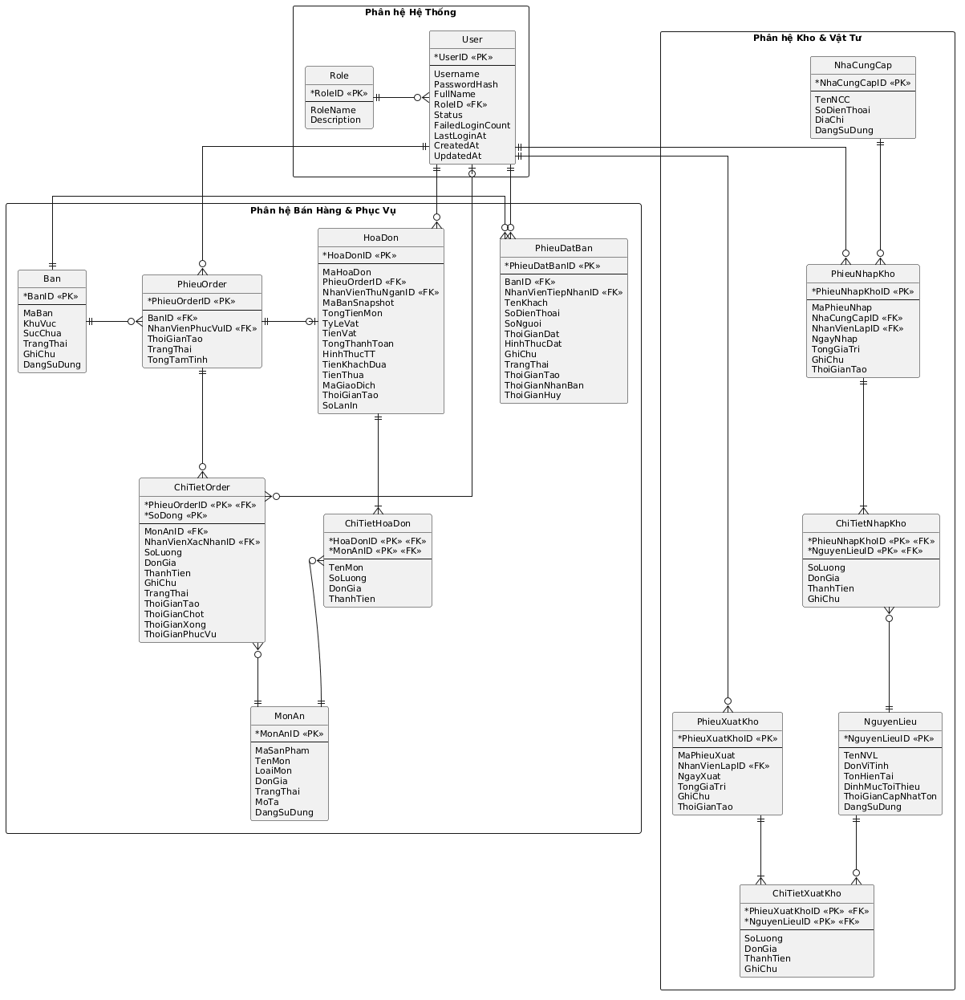
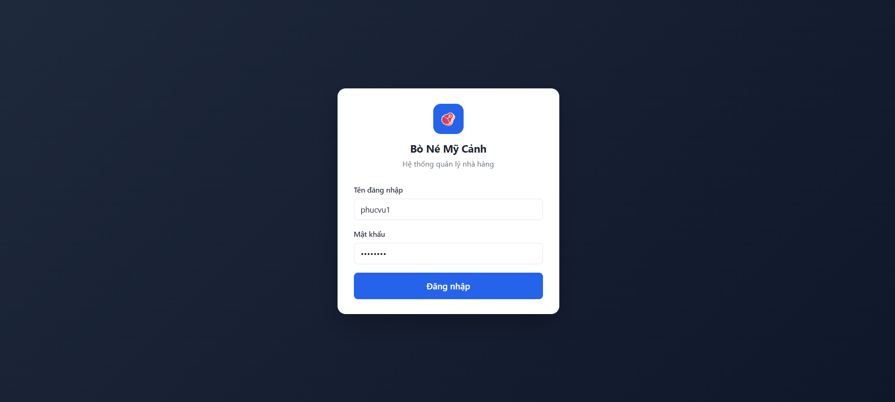
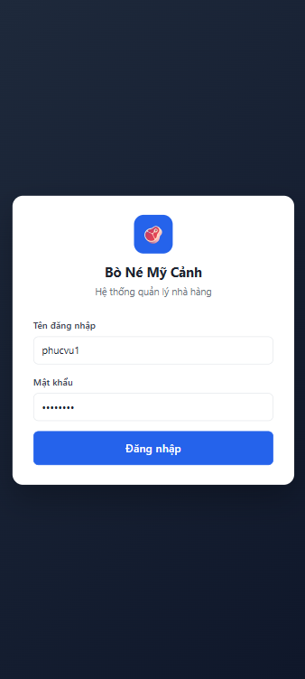

**HỆ THỐNG QUẢN LÝ NHÀ HÀNG**
**ĐẶC TẢ THIẾT KẾ CHI TIẾT**

> Tài liệu này là "blueprint" cho quy trình triển khai. Mọi quyết định nghiệp vụ tham chiếu về `DESCRIPTION.md` (đặc tả sơ khai). Mọi tên gọi (bảng, cột, endpoint, hàm xử lý) viết bằng **tiếng Việt không dấu**.

# 1. TỔNG QUAN KIẾN TRÚC {#tổng-quan-kiến-trúc}

## 1.1. Sơ đồ kiến trúc

```
┌──────────────────────────────────────────────────────────────────────┐
│  CLIENT — Trình duyệt (Chrome/Edge) trên máy bàn của từng vai trò    │
│  ─ Admin, Phục vụ, Bếp, Thu ngân, Kho                                │
│  ─ HTML5 + CSS3 + JavaScript thuần (vanilla)                         │
│  ─ Máy in nhiệt 80mm gắn vào máy Bếp (in PV_BM3, B_BM1)              │
│  ─ Máy in nhiệt 80mm + A4 gắn vào máy Thu ngân (in TN_BM3)           │
└──────────────────────────────────────────────────────────────────────┘
                              │  HTTPS — REST/JSON
                              │  Authorization: Bearer <JWT>
                              ▼
┌──────────────────────────────────────────────────────────────────────┐
│  BACKEND — Node.js + Express                                         │
│  ─ Tầng route (Express Router) ──────────────► §4 API                │
│  ─ Tầng controller — validate + middleware JWT/role                  │
│  ─ Tầng service — logic nghiệp vụ ──────────► §5 Pseudocode          │
│  ─ Tầng repository — truy vấn SQL (driver mssql)                     │
│  ─ Hằng số hệ thống: tệp config/constants.js (VAT, giờ HĐ, ...)      │
└──────────────────────────────────────────────────────────────────────┘
                              │  TCP/IP (mssql driver)
                              ▼
┌──────────────────────────────────────────────────────────────────────┐
│  CSDL — Microsoft SQL Server 2019+                                   │
│  ─ 13 bảng (§2)                                                      │
└──────────────────────────────────────────────────────────────────────┘
```

**Mô hình triển khai:** chạy trên 1 máy chủ trong mạng LAN của nhà hàng. Toàn bộ client là PC/laptop trong cùng mạng LAN. Sao lưu CSDL nằm ngoài phạm vi ứng dụng (việc của DBA, dùng tính năng backup của SQL Server).

## 1.2. Quy ước đặt tên

| Hạng mục | Quy ước | Ví dụ |
|---|---|---|
| Bảng CSDL | PascalCase tiếng Việt không dấu | `Ban`, `PhieuDatBan`, `ChiTietOrder` |
| Cột CSDL | **PascalCase** tiếng Việt không dấu | `TenKhach`, `TongThanhToan`, `ThoiGianTao` |
| Khóa chính (surrogate) | `<Bảng>ID`, **INT IDENTITY** | `HoaDonID`, `MonAnID`, `BanID` |
| Mã nghiệp vụ (người dùng đọc) | `Ma<…>`, **VARCHAR** (ASCII) | `MaHoaDon`, `MaSanPham`, `MaPhieuNhap`, `MaBan` |
| Khóa ngoại | **Cùng tên với PK tham chiếu** (`<Bảng>ID`) | `BanID` ở `PhieuOrder` → `Ban.BanID` |
| FK trỏ `User` (ngữ nghĩa) | `NhanVien<VaiTrò>ID` | `NhanVienPhucVuID`, `NhanVienThuNganID`, `NhanVienLapID` |
| Trường thời gian | `ThoiGian<SựKiện>` | `ThoiGianTao`, `ThoiGianXong` |
| Trường boolean | `Dang<TrạngThái>` | `DangSuDung` |
| Kiểu chuỗi | **VARCHAR** cho ASCII (mã, enum, username); **NVARCHAR** cho text tiếng Việt (tên, ghi chú) | `MaBan VARCHAR(10)`, `TenMon NVARCHAR(100)` |
| Trường enum/trạng thái | `VARCHAR(20)` + CHECK, giá trị PascalCase ASCII | `'Trong'`, `'DaDat'`, `'CoKhach'` |
| API endpoint | kebab-case không dấu, prefix `/api/v1` | `/api/v1/dat-ban`, `/api/v1/thanh-toan` |
| Trường JSON request/response | **PascalCase, đồng nhất cột DB** | `{"TenKhach": "Nguyen Van A"}` |
| Hàm xử lý (pseudocode) | PascalCase TV không dấu | `XuLyDatBan(...)`, `XuLyThanhToan(...)` |
| Biến cục bộ (pseudocode) | camelCase TV không dấu | `danhSachBanTrong`, `tongTienMon` |

**Khóa chính & mã nghiệp vụ:** mọi bảng có khóa chính surrogate **INT IDENTITY** tên `<Bảng>ID` (vd `HoaDonID`). Mã mà con người đọc/in (mã sản phẩm, số hóa đơn, số phiếu) là cột **VARCHAR riêng** tên `Ma…` — tách bạch với khóa kỹ thuật.

**Ngoại lệ — thực thể hệ thống `User`/`Role` dùng tiếng Anh** (cột vẫn PascalCase): `User`(`UserID`, `Username`, `PasswordHash`, `FullName`, `RoleID`, `Status`, `FailedLoginCount`, `LastLoginAt`, `CreatedAt`, `UpdatedAt`); `Role`(`RoleID`, `RoleName`, `Description`).
- `Role.RoleID` là **VARCHAR(10)** mang giá trị mã cố định (`Admin`/`PhucVu`/`Bep`/`ThuNgan`/`Kho`) — ngoại lệ kiểu (VARCHAR thay vì INT) vì là bảng tra cứu mã tự nhiên; `User.RoleID` FK → `Role.RoleID`.
- **Giá trị enum** giữ ASCII không dấu (`HoatDong`/`DaKhoa`, vai trò như trên).
- **FK trỏ User trong bảng nghiệp vụ** đặt tên ngữ nghĩa `NhanVien…ID` (`NhanVienTiepNhanID`, `NhanVienPhucVuID`, `NhanVienXacNhanID`, `NhanVienThuNganID`, `NhanVienLapID`), đều INT FK → `User.UserID`.

**Bảng chi tiết (`ChiTiet*`) — không có khóa surrogate riêng, dùng PK ghép:**
- `ChiTietHoaDon` → PK `(HoaDonID, MonAnID)`; `ChiTietNhapKho` → `(PhieuNhapKhoID, NguyenLieuID)`; `ChiTietXuatKho` → `(PhieuXuatKhoID, NguyenLieuID)`.
- `ChiTietOrder` không phải junction thuần (cùng món có thể có nhiều dòng, trạng thái riêng từng dòng) → PK ghép `(PhieuOrderID, SoDong)` với `SoDong` = số thứ tự dòng trong order.

## 1.3. Quy ước trạng thái và mã liệt kê

| Đối tượng | Mã trạng thái | Ý nghĩa |
|---|---|---|
| **Bàn** (`Ban.TrangThai`) | `Trong` / `DaDat` / `CoKhach` | Trống / Có phiếu đặt chưa nhận / Đang phục vụ |
| **Phiếu đặt bàn** (`PhieuDatBan.TrangThai`) | `DaDat` / `DaNhanBan` / `DaHuy` | Đã ghi nhận / Khách đến / Hủy |
| **Dòng món** (`ChiTietOrder.TrangThai`) | `ChuaChot` / `ChoCheBien` / `DangCheBien` / `DaXong` / `DaPhucVu` / `DaHuy` | — |
| **Phiếu order** (`PhieuOrder.TrangThai`) | `DangPhucVu` / `DaThanhToan` / `DaHuy` | — |
| **Hình thức thanh toán** (`HoaDon.HinhThucTT`) | `TienMat` / `ChuyenKhoan` | — |
| **Tài khoản** (`User.Status`) | `HoatDong` / `DaKhoa` | — |
| **Vai trò** (`Role.RoleID`) | `Admin` / `PhucVu` / `Bep` / `ThuNgan` / `Kho` | — |
| **Loại món** (`MonAn.LoaiMon`) | `MonAn` / `DoUong` | Phân loại menu + báo cáo. Món ăn → chế biến ở Bếp; Đồ uống → phục vụ trực tiếp (không qua Bếp). Quán nhỏ chỉ có **1 bộ phận chế biến: Bếp** |
| **Trạng thái món** (`MonAn.TrangThai`) | `ConHang` / `HetHang` | — |

## 1.4. Phân chia module (chia việc theo nhóm)

Hệ thống chia thành **8 module gần như độc lập**. Mỗi module có ranh giới rõ ràng về bảng/endpoint/màn hình, cho phép các thành viên trong nhóm phụ trách độc lập từ thiết kế chi tiết đến triển khai.

| Module | Vai trò chính | Bảng sở hữu (R/W) | Bảng đọc từ module khác | Endpoint prefix |
|---|---|---|---|---|
| **M1. Xác thực + Tài khoản** | Đăng nhập/đăng xuất, quản lý tài khoản, middleware kiểm tra quyền | `Role` (R), `User` (R/W) | (không) | `/auth/*`, `/users/*` |
| **M2. Quản lý bàn** | CRUD bàn | `Ban` (R/W) | (không) | `/ban/*` |
| **M3. Thực đơn** | CRUD món | `MonAn` (R/W) | (không) | `/mon-an/*` |
| **M4. Đặt bàn** | Tạo, hủy, đánh dấu nhận bàn | `PhieuDatBan` (R/W) | `Ban` (R/W trạng thái) | `/dat-ban/*` |
| **M5. Order + Bếp** | Gọi món, chốt bếp, cập nhật trạng thái món, phục vụ ra bàn | `PhieuOrder` (R/W), `ChiTietOrder` (R/W) | `Ban` (R/W trạng thái), `MonAn` (R) | `/order/*` |
| **M6. Thanh toán** | Thanh toán, in lại hóa đơn, báo cáo doanh thu | `HoaDon` + `ChiTietHoaDon` (R/W) | `PhieuOrder` (R/W trạng thái), `ChiTietOrder` (R) | `/thanh-toan/*`, `/hoa-don/*`, `/bao-cao/doanh-thu` |
| **M7. Kho** | NCC, NVL, nhập/xuất kho, báo cáo kho | `NhaCungCap` (R/W), `NguyenLieu` (R/W), `PhieuNhapKho` + `ChiTietNhapKho` (R/W), `PhieuXuatKho` + `ChiTietXuatKho` (R/W) | (không) | `/kho/*` |
| **M8. Báo cáo tổng hợp** | Dashboard Admin | Đọc cross-module | Tất cả | `/bao-cao/tong-hop` |

**Coupling thực tế giữa module:**
- M4 ↔ M2: cập nhật `Ban.TrangThai` khi đặt bàn / nhận bàn
- M5 ↔ M2: cập nhật `Ban.TrangThai` khi mở/đóng order
- M5 ↔ M3: đọc `MonAn` để hiện thực đơn + snapshot đơn giá
- M6 ↔ M5: đọc `PhieuOrder` + `ChiTietOrder` để tính tiền + tạo `ChiTietHoaDon` (snapshot); ghi `PhieuOrder.TrangThai = 'DaThanhToan'`
- M8 đọc cross-module nhưng chỉ đọc

→ Mỗi cặp giao tiếp chỉ qua **trường FK + cột trạng thái cố định**. Hợp đồng giữa các module = §2 (schema CSDL) + §4 (API). Sau khi 2 file này được duyệt, các thành viên code song song được.

# 2. THIẾT KẾ CƠ SỞ DỮ LIỆU {#thiết-kế-cơ-sở-dữ-liệu}

## 2.1. Sơ đồ ERD

Sơ đồ ERD **toàn hệ thống** (15 bảng): thuộc tính có đánh dấu `<<PK>>`/`<<FK>>`, đường liên kết PK–FK kèm **bản số crow's foot** (`||--o{` = 1 — nhiều; `||--o|` = 1 — 0..1; `|o--o{` = 0..1 — nhiều). Mã PlantUML đặt ở **tệp riêng** để kết xuất ảnh chèn báo cáo: [`design/erd/erd.puml`](design/erd/erd.puml).



## 2.2. Danh sách bảng (tổng quan)

| # | Tên bảng | Module | Vai trò chính | DFD tham chiếu |
|---|---|---|---|---|
| 1 | `Role` | M1 | Danh mục 5 vai trò người dùng | §7.5.3, §7.6.1 |
| 2 | `User` | M1 | Tài khoản nhân viên | §7.5.3, §7.6.1 |
| 3 | `Ban` | M2 | Danh sách bàn ăn | §7.1.x, §7.5.2 |
| 4 | `MonAn` | M3 | Thực đơn | §7.1.2, §7.5.1 |
| 5 | `PhieuDatBan` | M4 | Phiếu đặt bàn | §7.1.1 |
| 6 | `PhieuOrder` | M5 | Phiếu order theo bàn | §7.1.2, §7.2.1 |
| 7 | `ChiTietOrder` | M5 | Các dòng món trong order | §7.1.2, §7.1.3, §7.1.4, §7.3.x |
| 8 | `HoaDon` | M6 | Hóa đơn thanh toán (header) | §7.2.1, §7.2.2, §7.2.3 |
| 9 | `ChiTietHoaDon` | M6 | Dòng món của hóa đơn (snapshot) | §7.2.1, §7.2.3 |
| 10 | `NhaCungCap` | M7 | Nhà cung cấp NVL | §7.4.1 |
| 11 | `NguyenLieu` | M7 | Danh mục NVL + tồn kho hiện tại | §7.4.x |
| 12 | `PhieuNhapKho` | M7 | Phiếu nhập kho (header) | §7.4.1, §7.4.4 |
| 13 | `ChiTietNhapKho` | M7 | Dòng NVL trong phiếu nhập | §7.4.1, §7.4.4 |
| 14 | `PhieuXuatKho` | M7 | Phiếu xuất kho (header) | §7.4.3, §7.4.5 |
| 15 | `ChiTietXuatKho` | M7 | Dòng NVL trong phiếu xuất | §7.4.3, §7.4.5 |

(15 bảng. Mỗi cặp header–chi tiết: `HoaDon`/`ChiTietHoaDon`, `PhieuNhapKho`/`ChiTietNhapKho`, `PhieuXuatKho`/`ChiTietXuatKho`, `PhieuOrder`/`ChiTietOrder`. Các bảng `ChiTiet*` dùng PK ghép, không có khóa surrogate riêng — xem §1.2.)

## 2.3. Chi tiết từng bảng

### 2.3.1. `Role` (thực thể hệ thống — tên tiếng Anh)

| Tên trường | Kiểu dữ liệu | Ràng buộc | Mô tả |
|---|---|---|---|
| `RoleID` | VARCHAR(10) | **PK** | `Admin` / `PhucVu` / `Bep` / `ThuNgan` / `Kho` (mã tự nhiên, ASCII) |
| `RoleName` | NVARCHAR(50) | NOT NULL | Tên hiển thị (Vd "Quản lý") |
| `Description` | NVARCHAR(200) | NULL | Mô tả vai trò |

Bảng tĩnh, 5 dòng, seed sẵn. PK là mã chuỗi (ngoại lệ kiểu, xem §1.2).

### 2.3.2. `User` (thực thể hệ thống — tên tiếng Anh)

| Tên trường | Kiểu dữ liệu | Ràng buộc | Mô tả |
|---|---|---|---|
| `UserID` | INT IDENTITY(1,1) | **PK** | Mã NV tự sinh |
| `Username` | VARCHAR(50) | UNIQUE, NOT NULL | Tên đăng nhập (ASCII, không khoảng trắng) |
| `PasswordHash` | VARCHAR(255) | NOT NULL | Hash bcrypt (ASCII) |
| `FullName` | NVARCHAR(100) | NOT NULL | Họ và tên NV |
| `RoleID` | VARCHAR(10) | FK → `Role.RoleID`, NOT NULL | Vai trò gắn |
| `Status` | VARCHAR(20) | NOT NULL, CHECK IN (`'HoatDong'`,`'DaKhoa'`), DEFAULT `'HoatDong'` | |
| `FailedLoginCount` | TINYINT | NOT NULL, DEFAULT 0 | Tăng khi sai; reset khi đúng; ≥ 5 → khóa |
| `LastLoginAt` | DATETIME2 | NULL | Lúc đăng nhập thành công gần nhất |
| `CreatedAt` | DATETIME2 | NOT NULL, DEFAULT SYSDATETIME() | |
| `UpdatedAt` | DATETIME2 | NULL | |

**Index:** `IX_User_Role (RoleID)`.

> `User` là từ khóa SQL Server → trong câu lệnh SQL phải bao `[User]` (xem seed §2.5).

### 2.3.3. `Ban`

| Tên trường | Kiểu dữ liệu | Ràng buộc | Mô tả |
|---|---|---|---|
| `BanID` | INT IDENTITY(1,1) | **PK** | |
| `MaBan` | VARCHAR(10) | UNIQUE, NOT NULL | Mã hiển thị (Vd `B01`) |
| `KhuVuc` | NVARCHAR(50) | NOT NULL | `Tầng 1`, `Sân vườn`… |
| `SucChua` | INT | NOT NULL, CHECK (`SucChua > 0`) | Số người tối đa |
| `TrangThai` | VARCHAR(20) | NOT NULL, CHECK IN (`'Trong'`,`'DaDat'`,`'CoKhach'`), DEFAULT `'Trong'` | |
| `GhiChu` | NVARCHAR(200) | NULL | |
| `DangSuDung` | BIT | NOT NULL, DEFAULT 1 | Soft delete |

### 2.3.4. `MonAn`

| Tên trường | Kiểu dữ liệu | Ràng buộc | Mô tả |
|---|---|---|---|
| `MonAnID` | INT IDENTITY(1,1) | **PK** | Khóa kỹ thuật tự sinh |
| `MaSanPham` | VARCHAR(20) | UNIQUE, NOT NULL | Mã món theo sổ sách nhà hàng (vd `SP000221`) |
| `TenMon` | NVARCHAR(100) | UNIQUE, NOT NULL | |
| `LoaiMon` | VARCHAR(10) | NOT NULL, CHECK IN (`'MonAn'`,`'DoUong'`) | Phân loại menu. Món ăn → qua Bếp; Đồ uống → phục vụ trực tiếp (không qua Bếp) |
| `DonGia` | DECIMAL(15,0) | NOT NULL, CHECK (`DonGia >= 0`) | VND (không phần thập phân) |
| `TrangThai` | VARCHAR(10) | NOT NULL, CHECK IN (`'ConHang'`,`'HetHang'`), DEFAULT `'ConHang'` | |
| `MoTa` | NVARCHAR(500) | NULL | |
| `DangSuDung` | BIT | NOT NULL, DEFAULT 1 | Soft delete |

### 2.3.5. `PhieuDatBan`

| Tên trường | Kiểu dữ liệu | Ràng buộc | Mô tả |
|---|---|---|---|
| `PhieuDatBanID` | INT IDENTITY(1,1) | **PK** | Cũng là "Mã đặt bàn" in trên PV_BM1 |
| `BanID` | INT | FK → `Ban.BanID`, NOT NULL | |
| `TenKhach` | NVARCHAR(100) | NOT NULL | |
| `SoDienThoai` | VARCHAR(15) | NOT NULL | |
| `SoNguoi` | INT | NOT NULL, CHECK (`SoNguoi > 0`) | Kiểm tra ≤ `Ban.SucChua` ở service |
| `ThoiGianDat` | DATETIME2 | NOT NULL | Khung giờ khách hẹn |
| `HinhThucDat` | VARCHAR(20) | NOT NULL, CHECK IN (`'TrucTiep'`,`'QuaDienThoai'`) | |
| `GhiChu` | NVARCHAR(500) | NULL | |
| `NhanVienTiepNhanID` | INT | FK → `User.UserID`, NOT NULL | |
| `TrangThai` | VARCHAR(20) | NOT NULL, CHECK IN (`'DaDat'`,`'DaNhanBan'`,`'DaHuy'`), DEFAULT `'DaDat'` | |
| `ThoiGianTao` | DATETIME2 | NOT NULL, DEFAULT SYSDATETIME() | |
| `ThoiGianNhanBan` | DATETIME2 | NULL | Lúc Phục vụ bấm "Đã nhận bàn" |
| `ThoiGianHuy` | DATETIME2 | NULL | |

**Index:** `IX_PhieuDatBan_Ban_ThoiGian (BanID, ThoiGianDat)`.

### 2.3.6. `PhieuOrder`

| Tên trường | Kiểu dữ liệu | Ràng buộc | Mô tả |
|---|---|---|---|
| `PhieuOrderID` | INT IDENTITY(1,1) | **PK** | |
| `BanID` | INT | FK → `Ban.BanID`, NOT NULL | |
| `NhanVienPhucVuID` | INT | FK → `User.UserID`, NOT NULL | NV mở order |
| `ThoiGianTao` | DATETIME2 | NOT NULL, DEFAULT SYSDATETIME() | |
| `TrangThai` | VARCHAR(20) | NOT NULL, CHECK IN (`'DangPhucVu'`,`'DaThanhToan'`,`'DaHuy'`), DEFAULT `'DangPhucVu'` | |
| `TongTamTinh` | DECIMAL(15,0) | NOT NULL, DEFAULT 0 | Cập nhật khi thêm/sửa/hủy dòng |

**Index:** `IX_PhieuOrder_Ban_TrangThai (BanID, TrangThai)`.

### 2.3.7. `ChiTietOrder`

| Tên trường | Kiểu dữ liệu | Ràng buộc | Mô tả |
|---|---|---|---|
| `PhieuOrderID` | INT | **PK (phần 1)**, FK → `PhieuOrder.PhieuOrderID`, ON DELETE CASCADE | |
| `SoDong` | INT | **PK (phần 2)** | Số thứ tự dòng trong order (1, 2, 3…) |
| `MonAnID` | INT | FK → `MonAn.MonAnID`, NOT NULL | |
| `SoLuong` | INT | NOT NULL, CHECK (`SoLuong > 0`) | |
| `DonGia` | DECIMAL(15,0) | NOT NULL | **Snapshot** giá tại thời điểm gọi |
| `ThanhTien` | DECIMAL(15,0) | NOT NULL, AS (`SoLuong * DonGia`) PERSISTED | Cột tính, lưu vật lý |
| `GhiChu` | NVARCHAR(200) | NULL | |
| `TrangThai` | VARCHAR(20) | NOT NULL, CHECK IN (`'ChuaChot'`,`'ChoCheBien'`,`'DangCheBien'`,`'DaXong'`,`'DaPhucVu'`,`'DaHuy'`), DEFAULT `'ChuaChot'` | |
| `ThoiGianTao` | DATETIME2 | NOT NULL, DEFAULT SYSDATETIME() | |
| `ThoiGianChot` | DATETIME2 | NULL | Lúc chuyển `ChuaChot` → `ChoCheBien` (chốt sang bếp) |
| `ThoiGianXong` | DATETIME2 | NULL | Lúc chuyển → `DaXong` |
| `ThoiGianPhucVu` | DATETIME2 | NULL | Lúc chuyển → `DaPhucVu` |
| `NhanVienXacNhanID` | INT | FK → `User.UserID`, NULL | NV xác nhận đã đem ra bàn |

**PK ghép `(PhieuOrderID, SoDong)`** — không có khóa surrogate riêng (§1.2). `SoDong` cấp phát tăng dần trong từng order (cho phép cùng một món có nhiều dòng, mỗi dòng trạng thái/ghi chú riêng).

**Index:** `IX_ChiTietOrder_TrangThai_Chot (TrangThai, ThoiGianChot)` — FIFO Bếp.

**Ghi chú:** Không có bảng `PhieuChuyenBep` riêng. "Phiếu chuyển bếp" PV_BM3 là document sinh trên-bay từ (chỉ món ăn — đồ uống không qua Bếp):
```sql
SELECT ct.*, m.TenMon FROM ChiTietOrder ct JOIN MonAn m ON ct.MonAnID = m.MonAnID
WHERE ct.PhieuOrderID = @PhieuOrderID AND ct.TrangThai = 'ChoCheBien'
  AND m.LoaiMon = 'MonAn'
ORDER BY ct.ThoiGianChot;
```

### 2.3.8. `HoaDon`

| Tên trường | Kiểu dữ liệu | Ràng buộc | Mô tả |
|---|---|---|---|
| `HoaDonID` | INT IDENTITY(1,1) | **PK** | Khóa kỹ thuật |
| `MaHoaDon` | VARCHAR(20) | UNIQUE, NOT NULL | Số hóa đơn, vd `HD20260529-00001` (sinh ở service) |
| `PhieuOrderID` | INT | FK → `PhieuOrder.PhieuOrderID`, UNIQUE, NOT NULL | 1 order ↔ 1 hóa đơn |
| `MaBanSnapshot` | VARCHAR(10) | NOT NULL | Snapshot `Ban.MaBan` |
| `NhanVienThuNganID` | INT | FK → `User.UserID`, NOT NULL | |
| `TongTienMon` | DECIMAL(15,0) | NOT NULL | ∑(SL × đơn giá) |
| `TyLeVat` | DECIMAL(5,4) | NOT NULL, DEFAULT 0.1 | Snapshot (mặc định 0.1 = 10%) |
| `TienVat` | DECIMAL(15,0) | NOT NULL, DEFAULT 0 | ROUND(`TongTienMon * TyLeVat`, 0) |
| `TongThanhToan` | DECIMAL(15,0) | NOT NULL | `TongTienMon + TienVat` |
| `HinhThucTT` | VARCHAR(20) | NOT NULL, CHECK IN (`'TienMat'`,`'ChuyenKhoan'`) | |
| `TienKhachDua` | DECIMAL(15,0) | NULL | NULL khi `ChuyenKhoan` |
| `TienThua` | DECIMAL(15,0) | NOT NULL, DEFAULT 0 | 0 khi `ChuyenKhoan` |
| `MaGiaoDich` | VARCHAR(100) | NULL | Mã/đường dẫn ảnh giao dịch CK (tùy chọn) |
| `ThoiGianTao` | DATETIME2 | NOT NULL, DEFAULT SYSDATETIME() | |
| `SoLanIn` | INT | NOT NULL, DEFAULT 0 | ≥ 2 → đánh dấu "BẢN SAO" trên bản in |

**Index:** `IX_HoaDon_ThoiGian (ThoiGianTao DESC)`.

### 2.3.9. `ChiTietHoaDon`

Dòng món của hóa đơn — **snapshot** lúc thanh toán để hóa đơn bất biến (không phụ thuộc `MonAn`/`ChiTietOrder` thay đổi về sau). Gộp các dòng `ChiTietOrder` không hủy theo món.

| Tên trường | Kiểu dữ liệu | Ràng buộc | Mô tả |
|---|---|---|---|
| `HoaDonID` | INT | **PK (phần 1)**, FK → `HoaDon.HoaDonID`, ON DELETE CASCADE | |
| `MonAnID` | INT | **PK (phần 2)**, FK → `MonAn.MonAnID` | |
| `TenMon` | NVARCHAR(100) | NOT NULL | Snapshot tên món lúc lập HĐ |
| `SoLuong` | INT | NOT NULL, CHECK (`SoLuong > 0`) | Tổng SL món này trong order (đã gộp) |
| `DonGia` | DECIMAL(15,0) | NOT NULL | Snapshot đơn giá |
| `ThanhTien` | DECIMAL(15,0) | NOT NULL, AS (`SoLuong * DonGia`) PERSISTED | |

**PK ghép `(HoaDonID, MonAnID)`** — mỗi món 1 dòng/hóa đơn (đã gộp số lượng).

### 2.3.10. `NhaCungCap`

| Tên trường | Kiểu dữ liệu | Ràng buộc | Mô tả |
|---|---|---|---|
| `NhaCungCapID` | INT IDENTITY(1,1) | **PK** | |
| `TenNCC` | NVARCHAR(150) | UNIQUE, NOT NULL | |
| `SoDienThoai` | VARCHAR(15) | NULL | |
| `DiaChi` | NVARCHAR(300) | NULL | |
| `DangSuDung` | BIT | NOT NULL, DEFAULT 1 | |

### 2.3.11. `NguyenLieu`

| Tên trường | Kiểu dữ liệu | Ràng buộc | Mô tả |
|---|---|---|---|
| `NguyenLieuID` | INT IDENTITY(1,1) | **PK** | |
| `TenNVL` | NVARCHAR(100) | UNIQUE, NOT NULL | |
| `DonViTinh` | NVARCHAR(20) | NOT NULL | `kg`, `quả`, `ổ`, `phần`… |
| `TonHienTai` | DECIMAL(15,3) | NOT NULL, DEFAULT 0, CHECK (`TonHienTai >= 0`) | Tồn real-time, cập nhật trong transaction nhập/xuất |
| `DinhMucToiThieu` | DECIMAL(15,3) | NOT NULL, DEFAULT 0, CHECK (`DinhMucToiThieu >= 0`) | Ngưỡng cảnh báo tồn thấp theo từng NVL (K_QĐ1; dùng ở §7.4.3, §7.5.4 / QL_BM4-C) |
| `ThoiGianCapNhatTon` | DATETIME2 | NULL | Lần tồn thay đổi gần nhất |
| `DangSuDung` | BIT | NOT NULL, DEFAULT 1 | |

### 2.3.12. `PhieuNhapKho`

| Tên trường | Kiểu dữ liệu | Ràng buộc | Mô tả |
|---|---|---|---|
| `PhieuNhapKhoID` | INT IDENTITY(1,1) | **PK** | |
| `MaPhieuNhap` | VARCHAR(20) | UNIQUE, NOT NULL | Vd `PN20260529-001` |
| `NhaCungCapID` | INT | FK → `NhaCungCap.NhaCungCapID`, NOT NULL | |
| `NhanVienLapID` | INT | FK → `User.UserID`, NOT NULL | |
| `NgayNhap` | DATE | NOT NULL | |
| `TongGiaTri` | DECIMAL(15,0) | NOT NULL | ∑(SL × đơn giá) |
| `GhiChu` | NVARCHAR(500) | NULL | |
| `ThoiGianTao` | DATETIME2 | NOT NULL, DEFAULT SYSDATETIME() | |

**Index:** `IX_PhieuNhapKho_Ngay (NgayNhap)`.

### 2.3.13. `ChiTietNhapKho`

| Tên trường | Kiểu dữ liệu | Ràng buộc | Mô tả |
|---|---|---|---|
| `PhieuNhapKhoID` | INT | **PK (phần 1)**, FK → `PhieuNhapKho.PhieuNhapKhoID`, ON DELETE CASCADE | |
| `NguyenLieuID` | INT | **PK (phần 2)**, FK → `NguyenLieu.NguyenLieuID` | |
| `SoLuong` | DECIMAL(15,3) | NOT NULL, CHECK (`SoLuong > 0`) | |
| `DonGia` | DECIMAL(15,0) | NOT NULL, CHECK (`DonGia > 0`) | |
| `ThanhTien` | DECIMAL(15,0) | NOT NULL, AS (`SoLuong * DonGia`) PERSISTED | |
| `GhiChu` | NVARCHAR(200) | NULL | |

**PK ghép `(PhieuNhapKhoID, NguyenLieuID)`** — mỗi NVL 1 dòng/phiếu.

### 2.3.14. `PhieuXuatKho`

| Tên trường | Kiểu dữ liệu | Ràng buộc | Mô tả |
|---|---|---|---|
| `PhieuXuatKhoID` | INT IDENTITY(1,1) | **PK** | |
| `MaPhieuXuat` | VARCHAR(20) | UNIQUE, NOT NULL | Vd `PX20260529-001` |
| `NhanVienLapID` | INT | FK → `User.UserID`, NOT NULL | |
| `NgayXuat` | DATE | NOT NULL | |
| `TongGiaTri` | DECIMAL(15,0) | NOT NULL | |
| `GhiChu` | NVARCHAR(500) | NULL | |
| `ThoiGianTao` | DATETIME2 | NOT NULL, DEFAULT SYSDATETIME() | |

**Index:** `IX_PhieuXuatKho_Ngay (NgayXuat)`.

### 2.3.15. `ChiTietXuatKho`

| Tên trường | Kiểu dữ liệu | Ràng buộc | Mô tả |
|---|---|---|---|
| `PhieuXuatKhoID` | INT | **PK (phần 1)**, FK → `PhieuXuatKho.PhieuXuatKhoID`, ON DELETE CASCADE | |
| `NguyenLieuID` | INT | **PK (phần 2)**, FK → `NguyenLieu.NguyenLieuID` | |
| `SoLuong` | DECIMAL(15,3) | NOT NULL, CHECK (`SoLuong > 0`) | |
| `DonGia` | DECIMAL(15,0) | NOT NULL, CHECK (`DonGia > 0`) | |
| `ThanhTien` | DECIMAL(15,0) | NOT NULL, AS (`SoLuong * DonGia`) PERSISTED | |
| `GhiChu` | NVARCHAR(200) | NULL | |

**PK ghép `(PhieuXuatKhoID, NguyenLieuID)`** — mỗi NVL 1 dòng/phiếu.

## 2.4. Ràng buộc cấp ứng dụng

| # | Ràng buộc | Module | Cách xử lý |
|---|---|---|---|
| 1 | `PhieuDatBan.SoNguoi ≤ Ban.SucChua` | M4 | Kiểm tra trước INSERT |
| 2 | Chỉ tạo `PhieuOrder` mới khi `Ban.TrangThai IN ('Trong','CoKhach')`. Nếu `DaDat` → yêu cầu Phục vụ bấm "Đã nhận bàn" trước | M5 | Kiểm tra trước INSERT |
| 3 | `ChiTietXuatKho.SoLuong ≤ NguyenLieu.TonHienTai` tại thời điểm lưu | M7 | Transaction + check trước UPDATE tồn |
| 4 | Chỉ cho thanh toán `PhieuOrder` khi mọi `ChiTietOrder.TrangThai IN ('DaPhucVu','DaHuy')` | M6 | SQL check trước INSERT `HoaDon` |
| 5 | Chuyển trạng thái `ChiTietOrder` tuần tự (`ChoCheBien → DangCheBien → DaXong → DaPhucVu`), không bỏ bước | M5 | State machine ở tầng service |
| 6 | Cập nhật `NguyenLieu.TonHienTai` và INSERT phiếu kho trong CÙNG transaction | M7 | `BEGIN TRAN` … `COMMIT` |
| 7 | Khóa tài khoản khi `User.FailedLoginCount ≥ 5` | M1 | Sau mỗi lần sai |
| 8 | Đặt bàn / nhận bàn / thanh toán: đồng bộ `Ban.TrangThai` trong cùng transaction với phiếu | M2 (cross-call) | Hàm dùng chung |

## 2.5. Dữ liệu seed mẫu

```sql
-- 1. Role (cố định)
INSERT INTO Role (RoleID, RoleName, Description) VALUES
('Admin',   N'Quản lý',       N'Quản lý toàn hệ thống'),
('PhucVu',  N'Phục vụ',       N'Tiếp nhận đặt bàn, gọi món, phục vụ'),
('Bep',     N'Bộ phận Bếp',   N'Chế biến món ăn / đồ uống'),
('ThuNgan', N'Thu ngân',      N'Thanh toán, xuất hóa đơn'),
('Kho',     N'Bộ phận Kho',   N'Nhập / xuất / báo cáo kho');

-- 2. User (mật khẩu mặc định = 'matkhau123', đã hash bcrypt cost 10)
INSERT INTO [User] (Username, PasswordHash, FullName, RoleID) VALUES
('admin',    '$2b$10$EXAMPLEHASHADMIN........................', N'Quản trị viên', 'Admin'),
('phucvu1',  '$2b$10$EXAMPLEHASHPHUCVU.......................', N'Nguyễn Văn A',   'PhucVu'),
('bep1',     '$2b$10$EXAMPLEHASHBEP..........................', N'Trần Thị B',     'Bep'),
('thungan1', '$2b$10$EXAMPLEHASHTHUNGAN......................', N'Lê Văn C',       'ThuNgan'),
('kho1',     '$2b$10$EXAMPLEHASHKHO..........................', N'Phạm Thị D',     'Kho');

-- 3. Ban
INSERT INTO Ban (MaBan, KhuVuc, SucChua) VALUES
('B01',   N'Tầng 1',     4),
('B02',   N'Tầng 1',     6),
('B03',   N'Tầng 2',     4),
('B04',   N'Tầng 2',     6),
('SV01',  N'Sân vườn',   8),
('VIP01', N'Phòng VIP', 10);

-- 4. MonAn — menu thật của Bò Né Mỹ Cảnh
INSERT INTO MonAn (MaSanPham, TenMon, LoaiMon, DonGia) VALUES
-- Món ăn (→ Bếp)
('SP000221', N'NÉ MC',                    'MonAn',  95000),
('SP000205', N'BÍT TẾT MC',               'MonAn', 140000),
('SP000251', N'CƠM BLL',                  'MonAn', 160000),
('SP000211', N'BÍT TẾT ĐẶC BIỆT',         'MonAn', 228000),
('SP000230', N'NÉ SỐT PATE',              'MonAn', 100000),
('SP000237', N'NÉ TRỨNG',                 'MonAn',  93000),
('SP000219', N'BÍT TẾT + TRỨNG',          'MonAn', 155000),
('SP000231', N'NÉ + PATE',                'MonAn', 119000),
('SP000269', N'MÌ Ý',                     'MonAn', 105000),
('SP000229', N'NÉ SỐT PATE KHÔNG TRỨNG',  'MonAn',  98000),
('SP000290', N'BÒ KHO',                   'MonAn',  95000),
('SP000391', N'NÉ NHỎ + X.XÍCH',          'MonAn',  94000),
('SP000234', N'NÉ KHÔNG XÍU MẠI',         'MonAn',  90000),
('SP000297', N'PHỞ MC',                   'MonAn',  65000),
('SP000303', N'KHOAI TÂY',                'MonAn',  45000),
('SP000352', N'BÁNH MÌ',                  'MonAn',   6000),
('SP000353', N'TRỨNG',                    'MonAn',  15000),
-- Đồ uống (phục vụ trực tiếp, không qua Bếp)
('SP000324', N'RAU MÁ',                   'DoUong',  20000),
('SP000325', N'ĐẬU NÀNH',                 'DoUong',  20000),
('SP000337', N'CAM LON',                  'DoUong',  17000),
('SP000335', N'KHOÁNG LẠT',               'DoUong',  17000),
('SP000330', N'SUỐI',                     'DoUong',  11000),
('SP000342', N'TRÀ ĐÁ',                   'DoUong',   3000);

-- 5. NhaCungCap & NguyenLieu (NVL thật của Bò Né Mỹ Cảnh — chọn nhóm tiêu biểu cho M7 demo)
INSERT INTO NhaCungCap (TenNCC, SoDienThoai, DiaChi) VALUES
(N'Cơ sở cung cấp thịt bò',  N'0901234567', N'TP.HCM'),
(N'Đại lý thực phẩm - đồ khô', N'0907654321', N'TP.HCM');

INSERT INTO NguyenLieu (TenNVL, DonViTinh, TonHienTai, DinhMucToiThieu) VALUES
(N'Miếng bò né',     N'kg',    30.0,  5.0),
(N'Miếng bò bít tết', N'kg',   25.0,  5.0),
(N'Pa tê',           N'kg',    10.0,  2.0),
(N'Xíu mại',         N'phần', 100.0, 20.0),
(N'Xúc xích',        N'kg',     8.0,  2.0),
(N'Bò kho',          N'kg',    12.0,  3.0),
(N'Trứng',           N'quả',  200.0, 30.0),
(N'Bánh mì',         N'ổ',    100.0, 20.0),
(N'Bánh phở',        N'kg',    10.0,  2.0),
(N'Khoai tây',       N'kg',    15.0,  3.0),
(N'Cà chua',         N'kg',    10.0,  2.0),
(N'Hành phi',        N'kg',     3.0,  0.5);
```

## 2.6. Hằng số hệ thống (tệp `config/constants.js`)

Thay cho bảng `CauHinh` đã loại bỏ:

```javascript
module.exports = {
  // Thông tin nhà hàng (in trên hóa đơn TN_BM3 — thay cho bảng CauHinh đã cắt)
  NHA_HANG: {
    ten: 'Bò Né Mỹ Cảnh',
    dia_chi: '... (điền địa chỉ thật)',
    so_dien_thoai: '... (điền SĐT thật)',
    ma_so_thue: '... (nếu có)',
  },

  // Thanh toán
  VAT_TY_LE: 0.10,            // 10%

  // Phiên đăng nhập
  PHIEN_DANG_NHAP_PHUT: 30,   // JWT hết hạn sau 30 phút không dùng
  SO_LAN_SAI_TOI_DA: 5,       // Khóa tài khoản sau 5 lần sai

  // Giờ hoạt động (kiểm tra khi đặt bàn / gọi món)
  GIO_MO: '08:00',
  GIO_DONG: '22:00',

  // Báo cáo
  TOP_N_BAO_CAO: 10,          // Số món bán chạy trong dashboard
};
```

---

> **Kết thúc §2 (CSDL).** Schema **15 bảng** (gồm `ChiTietHoaDon`) chia 8 module gần như độc lập; PK `<Bảng>ID`, `ChiTiet*` dùng PK ghép.

# 3. THIẾT KẾ GIAO DIỆN {#thiết-kế-giao-diện}

Giao diện phác họa bằng **HTML/CSS thuần** — mỗi màn 1 tệp trong `design/ui/`, dùng chung [`design/ui/style.css`](design/ui/style.css). Vừa là mockup cho báo cáo (render trình duyệt → chụp ảnh chèn vào), vừa tái dùng khi triển khai (bố cục khớp thiết kế). Đặc điểm: tối giản, **responsive cho điện thoại** (nhân viên phục vụ dùng mobile — sidebar thu thành thanh tab cố định đáy, bố cục về 1 cột).

Mỗi màn ánh xạ 1 biểu mẫu (BM) + DFD + endpoint API tương ứng (ghi trong comment đầu tệp HTML). Bao gồm **toàn bộ màn hình**: chung, Phục vụ, Bếp, Thu ngân (D3a) và Kho, Quản lý (D3b).

> 📷 **Cách chèn báo cáo:** mở từng tệp `.html` bằng trình duyệt (thu hẹp cửa sổ để xem bản mobile), chụp màn hình rồi chèn vào vị trí 📷 tương ứng bên dưới.

## 3.1. Màn dùng chung

| BM | Màn hình | Tệp | DFD |
|---|---|---|---|
| SYS_BM1 | Đăng nhập | [`dang-nhap.html`](design/ui/dang-nhap.html) | §7.6.1 |

<div>
    
    
</div>

## 3.2. Bộ phận Phục vụ

| BM | Màn hình | Tệp | DFD |
|---|---|---|---|
| PV_BM1 | Tiếp nhận đặt bàn | [`pv-dat-ban.html`](design/ui/pv-dat-ban.html) | §7.1.1 |
| PV_BM2 | Ghi nhận gọi món / Order | [`pv-goi-mon.html`](design/ui/pv-goi-mon.html) | §7.1.2, §7.1.3 |
| PV_BM4 | Phục vụ món ra bàn | [`pv-phuc-vu.html`](design/ui/pv-phuc-vu.html) | §7.1.4 |
| PV_BM3 | Phiếu chuyển bếp | [`pv-phieu-bep.html`](design/ui/pv-phieu-bep.html) | §7.1.3 |

> 📷 **\[CHÈN ẢNH: 4 màn Phục vụ]**

## 3.3. Bộ phận Bếp

| BM | Màn hình | Tệp | DFD |
|---|---|---|---|
| B_BM2 | Màn hình bếp (cập nhật trạng thái món) | [`bep-kitchen-display.html`](design/ui/bep-kitchen-display.html) | §7.3.2 |
| B_BM1 | Phiếu order bếp (in) | [`bep-phieu-order.html`](design/ui/bep-phieu-order.html) | §7.3.1 |

> 📷 **\[CHÈN ẢNH: 2 màn Bếp]**

## 3.4. Bộ phận Thu ngân

| BM | Màn hình | Tệp | DFD |
|---|---|---|---|
| TN_BM2 | Màn hình thanh toán | [`tn-thanh-toan.html`](design/ui/tn-thanh-toan.html) | §7.2.1 |
| TN_BM3 | Hóa đơn (in / in lại) | [`tn-hoa-don.html`](design/ui/tn-hoa-don.html) | §7.2.3 |
| TN_BM1 | Báo cáo doanh thu | [`tn-bao-cao-doanh-thu.html`](design/ui/tn-bao-cao-doanh-thu.html) | §7.2.2 |

> 📷 **\[CHÈN ẢNH: 3 màn Thu ngân]**

## 3.5. Bộ phận Kho

| BM | Màn hình | Tệp | DFD |
|---|---|---|---|
| K_BM1 | Lập phiếu nhập kho | [`kho-nhap.html`](design/ui/kho-nhap.html) | §7.4.1 |
| K_BM2 | Lập phiếu xuất kho | [`kho-xuat.html`](design/ui/kho-xuat.html) | §7.4.3 |
| K_BM3 | Báo cáo tồn kho | [`kho-bc-ton.html`](design/ui/kho-bc-ton.html) | §7.4.2 |
| K_BM4 | Báo cáo nhập kho | [`kho-bc-nhap.html`](design/ui/kho-bc-nhap.html) | §7.4.4 |
| K_BM5 | Báo cáo xuất kho | [`kho-bc-xuat.html`](design/ui/kho-bc-xuat.html) | §7.4.5 |

> 📷 **\[CHÈN ẢNH: 5 màn Kho]**

## 3.6. Quản lý (Admin)

| BM | Màn hình | Tệp | DFD |
|---|---|---|---|
| QL_BM1 | Quản lý thực đơn | [`ql-thuc-don.html`](design/ui/ql-thuc-don.html) | §7.5.1 |
| QL_BM2 | Quản lý bàn | [`ql-ban.html`](design/ui/ql-ban.html) | §7.5.2 |
| QL_BM3 | Quản lý tài khoản | [`ql-tai-khoan.html`](design/ui/ql-tai-khoan.html) | §7.5.3 |
| QL_BM4 | Báo cáo tổng hợp (Dashboard) | [`ql-dashboard.html`](design/ui/ql-dashboard.html) | §7.5.4 |

> 📷 **\[CHÈN ẢNH: 4 màn Quản lý]**

# 4. THIẾT KẾ API {#thiết-kế-api}

> Mỗi endpoint ghi rõ **vai trò** được phép và **DFD tham chiếu** (§7 trong `DESCRIPTION.md`) để chứng minh không phát sinh chức năng ngoài đặc tả. Trường JSON theo quy ước PascalCase (§4.0).

## 4.0. Quy ước chung cho mọi API

**Prefix:** mọi endpoint nằm dưới `/api/v1`. Ví dụ `/api/v1/auth/login`. Bên dưới viết tắt bỏ prefix.

**Xác thực:** trừ `POST /auth/login`, mọi endpoint yêu cầu header `Authorization: Bearer <JWT>`. Middleware `authenticate` giải mã token, kiểm tra `User.status = 'HoatDong'` mỗi request (cơ chế thu hồi sớm, xem §7.6.1 ghi chú). Middleware `authorize(...roles)` chặn vai trò không hợp lệ. (Hai middleware này thuộc thực thể hệ thống nên đặt tên tiếng Anh; các hàm nghiệp vụ vẫn PascalCase TV như `CapNhatTrangThaiBan`.)

**Định dạng response (envelope thống nhất):**
```jsonc
// Thành công
{ "success": true, "data": <object | array>, "message": "Mô tả ngắn (tùy chọn)" }
// Thất bại
{ "success": false, "error": { "code": "MA_LOI", "message": "Mô tả lỗi cho người dùng" } }
```

**Mã HTTP dùng trong hệ thống:**

| Mã | Khi nào |
|---|---|
| `200 OK` | Đọc / cập nhật thành công |
| `201 Created` | Tạo mới thành công (trả bản ghi vừa tạo) |
| `400 Bad Request` | Sai/thiếu dữ liệu đầu vào, vi phạm quy định nghiệp vụ (vd số người > sức chứa) |
| `401 Unauthorized` | Thiếu/sai/hết hạn JWT |
| `403 Forbidden` | Vai trò không có quyền với chức năng |
| `404 Not Found` | Không tìm thấy bản ghi |
| `409 Conflict` | Trùng dữ liệu duy nhất (vd tên đăng nhập, số bàn) hoặc xung đột trạng thái (vd thanh toán bàn chưa phục vụ xong) |

**Mã lỗi nghiệp vụ (`error.code`)** dùng chung:

| `code` | Ý nghĩa |
|---|---|
| `VALIDATION` | Dữ liệu đầu vào không hợp lệ |
| `NOT_FOUND` | Không tìm thấy |
| `DUPLICATE` | Trùng trường duy nhất |
| `CONFLICT_STATE` | Sai trạng thái cho thao tác |
| `UNAUTHORIZED` / `FORBIDDEN` | Lỗi xác thực / phân quyền |
| `RULE_VIOLATION` | Vi phạm quy định nghiệp vụ (PV_QĐ1, TN_QĐ1, B_QĐ1, K_QĐ1, QL_QĐ1) |

**Danh sách:** các endpoint `GET` trả danh sách trả thẳng mảng trong `data`, **không phân trang** (quy mô 1 nhà hàng, đủ dùng). Lọc qua query string.

**Trường JSON:** **PascalCase**, trùng tên cột DB (vd `TenKhach`, `TongThanhToan`); thực thể `User`/`Role` dùng tên tiếng Anh (`Username`, `RoleID`). Query string cũng PascalCase. Thời gian trả ISO-8601.

---

## 4.1. Module M1 — Xác thực + Tài khoản

Base: `/auth/*`, `/users/*`. Bảng: `User` (R/W), `Role` (R). DFD: §7.6.1 (đăng nhập), §7.5.3 (quản lý tài khoản). Đây là thực thể hệ thống → endpoint, trường JSON dùng **tiếng Anh** (giá trị enum vai trò/trạng thái giữ TV).

### 4.1.1. Đăng nhập / Đăng xuất (DFD §7.6.1)

| Method | Endpoint | Vai trò | Mô tả |
|---|---|---|---|
| POST | `/auth/login` | Công khai | Đăng nhập, trả JWT |
| GET | `/auth/me` | Mọi vai trò | Lấy thông tin user hiện tại từ token |
| POST | `/auth/logout` | Mọi vai trò | Vô hiệu phía client (xóa token). Server stateless, chỉ trả 200 |

**`POST /auth/login`** — Request:
```json
{ "Username": "phucvu1", "Password": "matkhau123" }
```
Xử lý (theo §7.6.1 Bước 2–6): tìm user theo `Username`; nếu không tồn tại / `Status='DaKhoa'` → `401`. So khớp bcrypt; sai → `FailedLoginCount++`, nếu ≥ `SO_LAN_SAI_TOI_DA` thì khóa, trả `401`. Đúng → reset số lần sai, cập nhật `LastLoginAt`, ký JWT (payload `UserID`, `RoleID`; hạn `now + PHIEN_DANG_NHAP_PHUT` phút).

Response `200`:
```json
{ "success": true, "data": {
  "token": "<JWT>",
  "user": { "UserID": 2, "FullName": "Nguyễn Văn A", "Username": "phucvu1", "RoleID": "PhucVu" }
}}
```
Lỗi: sai tài khoản/mật khẩu → `401 UNAUTHORIZED` ("Tên đăng nhập hoặc mật khẩu không đúng"); bị khóa → `401 UNAUTHORIZED` ("Tài khoản đã bị khóa, liên hệ Admin").

### 4.1.2. Quản lý tài khoản — Admin (DFD §7.5.3, QL_BM3)

Tất cả yêu cầu vai trò **Admin**. Tuân QL_QĐ1.

| Method | Endpoint | Mô tả |
|---|---|---|
| GET | `/users` | Danh sách tài khoản. Query lọc: `?RoleID=&Status=&q=` (`q` tìm theo họ tên/tên đăng nhập) |
| GET | `/users/:id` | Chi tiết 1 tài khoản (không trả `PasswordHash`) |
| POST | `/users` | Tạo tài khoản mới |
| PUT | `/users/:id` | Sửa họ tên / vai trò |
| PATCH | `/users/:id/lock` | Khóa (`Status='DaKhoa'`) |
| PATCH | `/users/:id/unlock` | Mở khóa (`Status='HoatDong'`, reset `FailedLoginCount=0`) |
| PATCH | `/users/:id/reset-password` | Đặt lại mật khẩu |

**`POST /users`** — Request:
```json
{ "Username": "phucvu2", "Password": "matkhau123", "FullName": "Trần Văn E", "RoleID": "PhucVu" }
```
Kiểm tra (QL_QĐ1, §7.5.3 Bước 4): `Username` không trùng (→ `409 DUPLICATE`); `Password` ≥ 8 ký tự, có cả chữ và số (→ `400 RULE_VIOLATION`); `RoleID` ∈ 5 vai trò. Băm bcrypt cost 10 trước khi lưu. Trả `201` bản ghi (ẩn hash).

**`PATCH /users/:id/lock`** — chặn Admin tự khóa chính mình (`id === token.UserID` → `400 RULE_VIOLATION`).

**`PATCH /users/:id/reset-password`** — Request `{ "NewPassword": "..." }`, cùng quy tắc độ mạnh; băm và lưu, reset `FailedLoginCount=0`.

> Không có endpoint tự đổi mật khẩu cho vai trò khác (ngoài phạm vi — chỉ Admin quản lý theo §7.5.3). Không có chức năng "Quên mật khẩu" tự động (nút trong SYS_BM1 chỉ hiển thị hướng dẫn liên hệ Admin).

---

## 4.2. Module M2 — Quản lý bàn

Base: `/ban/*`. Bảng: `Ban` (R/W). DFD: §7.5.2 (QL_BM2). CRUD do **Admin**; danh sách bàn được **Phục vụ/Thu ngân đọc** (chọn bàn khi đặt/gọi món/thanh toán).

| Method | Endpoint | Vai trò | Mô tả |
|---|---|---|---|
| GET | `/ban` | Admin, PhucVu, ThuNgan | Danh sách bàn `DangSuDung=1`. Query: `?TrangThai=&KhuVuc=` |
| GET | `/ban/:id` | Admin, PhucVu, ThuNgan | Chi tiết bàn |
| POST | `/ban` | Admin | Thêm bàn |
| PUT | `/ban/:id` | Admin | Sửa số bàn / khu vực / sức chứa / ghi chú |
| DELETE | `/ban/:id` | Admin | Xóa mềm (`DangSuDung=0`) |

**`POST /ban`** — Request `{ "MaBan": "B07", "KhuVuc": "Tầng 2", "SucChua": 4, "GhiChu": "" }`. Kiểm tra (§7.5.2 Bước 4): `MaBan` không trùng (→ `409`); `SucChua > 0`. Trạng thái khởi tạo `'Trong'`.

**`DELETE /ban/:id`** — chỉ cho xóa khi `TrangThai='Trong'` (§7.5.2 Bước 4: bàn đang `DaDat`/`CoKhach` → `409 CONFLICT_STATE`). Xóa mềm để giữ toàn vẹn FK với phiếu cũ.

> `Ban.TrangThai` **không** đổi qua endpoint M2; nó do M4 (đặt/nhận bàn) và M5/M6 (mở order/thanh toán) đổi qua hàm dùng chung `CapNhatTrangThaiBan` (pseudocode ở §5). M2 chỉ quản trị danh mục bàn.

---

## 4.3. Module M3 — Thực đơn

Base: `/mon-an/*`. Bảng: `MonAn` (R/W). DFD: §7.5.1 (QL_BM1). CRUD do **Admin**; danh sách món được **Phục vụ đọc** (màn gọi món).

| Method | Endpoint | Vai trò | Mô tả |
|---|---|---|---|
| GET | `/mon-an` | Admin, PhucVu | Danh sách món `DangSuDung=1`. Query: `?LoaiMon=&TrangThai=&q=` |
| GET | `/mon-an/:id` | Admin, PhucVu | Chi tiết món |
| POST | `/mon-an` | Admin | Thêm món |
| PUT | `/mon-an/:id` | Admin | Sửa tên / loại / đơn giá / mô tả |
| PATCH | `/mon-an/:id/trang-thai` | Admin | Đổi `ConHang`↔`HetHang` |
| DELETE | `/mon-an/:id` | Admin | Xóa mềm (`DangSuDung=0`) |

**`POST /mon-an`** — Request `{ "MaSanPham": "SP000400", "TenMon": "Gỏi cuốn", "LoaiMon": "MonAn", "DonGia": 40000, "MoTa": "" }`. Kiểm tra (§7.5.1 Bước 4): `MaSanPham` và `TenMon` không trùng (→ `409 DUPLICATE`); `DonGia >= 0`; `LoaiMon ∈ ('MonAn','DoUong')`. Trạng thái khởi tạo `'ConHang'`.

**`PATCH /mon-an/:id/trang-thai`** — Request `{ "TrangThai": "HetHang" }`. Phục vụ khi gọi món chỉ thấy món `ConHang` (lọc ở M5).

> Đơn giá sửa ở đây **không hồi tố** order cũ — M5 đã snapshot `DonGia` vào `ChiTietOrder` (xem §2 quyết định kỹ thuật). Đổi giá chỉ ảnh hưởng order tạo về sau.

---

## 4.4. Module M4 — Đặt bàn

Base: `/dat-ban/*`. Bảng: `PhieuDatBan` (R/W), `Ban` (R + đổi trạng thái). DFD: §7.1.1 (tiếp nhận đặt bàn, PV_BM1) + ghi chú "nhận bàn" (§7.1.1, §7.1.2). Vai trò **PhucVu** (Admin xem được).

| Method | Endpoint | Vai trò | Mô tả |
|---|---|---|---|
| GET | `/dat-ban` | PhucVu, Admin | Danh sách phiếu đặt. Query: `?TrangThai=&Ngay=&q=` (SĐT/tên/mã đặt) |
| GET | `/dat-ban/:id` | PhucVu, Admin | Chi tiết phiếu đặt (theo PV_BM1) |
| POST | `/dat-ban` | PhucVu | Tiếp nhận đặt bàn mới |
| POST | `/dat-ban/:id/nhan-ban` | PhucVu | Đánh dấu khách đến (check-in thủ công) |
| POST | `/dat-ban/:id/huy` | PhucVu | Hủy phiếu đặt |

**`POST /dat-ban`** (DFD §7.1.1 Bước 3–7) — Request:
```json
{ "BanID": 3, "TenKhach": "Nguyễn Văn A", "SoDienThoai": "0901234567",
  "SoNguoi": 4, "ThoiGianDat": "2026-05-29T18:30:00", "HinhThucDat": "QuaDienThoai", "GhiChu": "" }
```
Kiểm tra (PV_QĐ1): bàn tồn tại & `TrangThai='Trong'` (→ `409 CONFLICT_STATE` nếu `DaDat`/`CoKhach`); `SoNguoi > 0` và `≤ Ban.SucChua` (→ `400 RULE_VIOLATION`); `ThoiGianDat` trong `[GIO_MO, GIO_DONG]` (→ `400 RULE_VIOLATION`); `HinhThucDat ∈ ('TrucTiep','QuaDienThoai')`. **Transaction**: INSERT `PhieuDatBan` (`TrangThai='DaDat'`, `NhanVienTiepNhanID` = user token) + `Ban.TrangThai='DaDat'`. Trả `201` kèm `PhieuDatBanID` (chính là "Mã đặt bàn" trên PV_BM1).

**`POST /dat-ban/:id/nhan-ban`** (ghi chú §7.1.1 — khách đến) — không cần body. Điều kiện: phiếu `TrangThai='DaDat'` (→ `409` nếu khác). **Transaction**: `PhieuDatBan.TrangThai='DaNhanBan'` + `ThoiGianNhanBan=now` + `Ban.TrangThai='CoKhach'`. Sau bước này Phục vụ mới gọi món được (M5 yêu cầu bàn `Trong`/`CoKhach`).

**`POST /dat-ban/:id/huy`** — điều kiện phiếu `TrangThai='DaDat'`. **Transaction**: `PhieuDatBan.TrangThai='DaHuy'` + `ThoiGianHuy=now` + trả `Ban.TrangThai='Trong'`. Không hủy phiếu `DaNhanBan` (khách đã tới — đã chuyển sang luồng order).

> Đồng bộ `Ban.TrangThai` luôn nằm **cùng transaction** với thay đổi phiếu (ràng buộc §2.4 #8), qua hàm dùng chung `CapNhatTrangThaiBan`. Không có hủy tự động sau 15 phút (yêu cầu Tiến hóa §6 — ngoài phạm vi).

---

> **Kết thúc D2a (M1–M4).**

## 4.5. Module M5 — Order + Bếp

Base: `/order/*`. Bảng: `PhieuOrder` (R/W), `ChiTietOrder` (R/W); đọc `MonAn` (snapshot đơn giá), đổi trạng thái `Ban`. DFD: §7.1.2 (gọi món), §7.1.3 (chốt bếp), §7.1.4 (phục vụ), §7.3.1 (Bếp nhận phiếu), §7.3.2 (cập nhật trạng thái món).

**Vòng đời dòng món** (ràng buộc §2.4 #5, B_QĐ1):
- **Món ăn** (`LoaiMon='MonAn'`): `ChuaChot` → `ChoCheBien` → `DangCheBien` → `DaXong` → `DaPhucVu`.
- **Đồ uống** (`LoaiMon='DoUong'`): **bỏ qua Bếp** — khi chốt nhảy thẳng `ChuaChot` → `DaPhucVu` (quán nhỏ không có quầy pha chế, phục vụ tự lấy).
- Nhánh phụ (mọi loại): → `DaHuy`.

`TongTamTinh` của order = `SUM(ThanhTien)` các dòng `TrangThai <> 'DaHuy'`, tính lại sau mỗi lần thêm/sửa/xóa/hủy dòng. Mỗi dòng định danh bởi `(PhieuOrderID, SoDong)`.

### 4.5.1. Ghi nhận gọi món — PhucVu (DFD §7.1.2, PV_BM2)

| Method | Endpoint | Vai trò | Mô tả |
|---|---|---|---|
| GET | `/order` | PhucVu, ThuNgan | DS order. Query `?TrangThai=&BanID=` |
| GET | `/order/:PhieuOrderID` | PhucVu, ThuNgan, Bep | Chi tiết order + các dòng món |
| GET | `/order/dang-phuc-vu/:BanID` | PhucVu, ThuNgan | Order `DangPhucVu` hiện tại của 1 bàn (tiện màn gọi món / thanh toán) |
| POST | `/order` | PhucVu | Mở order mới cho bàn + dòng món đầu |
| POST | `/order/:PhieuOrderID/dong` | PhucVu | Thêm dòng món vào order `DangPhucVu` |
| PUT | `/order/:PhieuOrderID/dong/:SoDong` | PhucVu | Sửa SL/ghi chú — chỉ khi dòng `ChuaChot` |
| DELETE | `/order/:PhieuOrderID/dong/:SoDong` | PhucVu | Xóa dòng — chỉ khi `ChuaChot` (chưa gửi bếp) |

**`POST /order`** — Request:
```json
{ "BanID": 1, "ChiTiet": [ { "MonAnID": 1, "SoLuong": 2, "GhiChu": "ốp la" }, { "MonAnID": 22, "SoLuong": 2, "GhiChu": "" } ] }
```
Xử lý (§7.1.2 Bước 4–9): kiểm `Ban.TrangThai ∈ ('Trong','CoKhach')` — nếu `'DaDat'` → `409 CONFLICT_STATE` ("Bàn đang giữ chỗ — vui lòng nhận bàn trước"); mỗi món tồn tại, `TrangThai='ConHang'`, `SoLuong>0` (vi phạm → `400 RULE_VIOLATION`). Nếu bàn đã có order `DangPhucVu` → trả `409` (dùng `POST /order/:PhieuOrderID/dong` thay thế). **Transaction**: INSERT `PhieuOrder` (`DangPhucVu`, `NhanVienPhucVuID`=token) + INSERT các `ChiTietOrder` (`SoDong` cấp tăng dần, `TrangThai='ChuaChot'`, **snapshot `DonGia` từ `MonAn`**) + nếu bàn `'Trong'` → `Ban.TrangThai='CoKhach'` + cập nhật `TongTamTinh`. Trả `201` order kèm dòng món.

**`POST /order/:PhieuOrderID/dong`** — thêm dòng vào order đang phục vụ; cùng kiểm tra món như trên; dòng mới `SoDong` kế tiếp, `ChuaChot`, snapshot đơn giá; cập nhật `TongTamTinh`.

> Sửa/xóa dòng chỉ cho phép khi `ChuaChot` (chưa chuyển bếp). Dòng đã chốt muốn bỏ → dùng "hủy món" §4.5.4.

### 4.5.2. Chốt order xuống bếp — PhucVu (DFD §7.1.3, PV_BM3)

| Method | Endpoint | Vai trò | Mô tả |
|---|---|---|---|
| POST | `/order/:PhieuOrderID/chot` | PhucVu | Chốt: món ăn → `ChoCheBien`; đồ uống → `DaPhucVu` |
| GET | `/order/:PhieuOrderID/phieu-bep` | PhucVu | Phiếu chuyển bếp (PV_BM3) sinh trên-bay |

**`POST /order/:PhieuOrderID/chot`** (§7.1.3 Bước 2–5): lấy các dòng `ChuaChot` của order; nếu không có → `409`. **Transaction**, phân theo `MonAn.LoaiMon`:
- `MonAn` → `TrangThai='ChoCheBien'` + `ThoiGianChot=now` (vào hàng chờ Bếp).
- `DoUong` → `TrangThai='DaPhucVu'` + `ThoiGianChot=now` + `ThoiGianPhucVu=now` + `NhanVienXacNhanID`=token (bỏ qua Bếp; phục vụ tự lấy).

Trả số dòng vào Bếp + số đồ uống đã phục vụ.

**`GET /order/:PhieuOrderID/phieu-bep`** — trả data PV_BM3 (lọc `ChiTietOrder` của order, `TrangThai='ChoCheBien'` — chỉ món ăn, ORDER BY `ThoiGianChot`). Client tự gửi lệnh in (D5 tùy chọn). Đây là **tra cứu thuần** — không ghi CSDL.

### 4.5.3. Bếp nhận phiếu & cập nhật trạng thái món — Bep (DFD §7.3.1, §7.3.2; B_BM1, B_BM2)

| Method | Endpoint | Vai trò | Mô tả |
|---|---|---|---|
| GET | `/order/bep/hang-cho` | Bep | DS dòng món ăn `ChoCheBien`/`DangCheBien` theo FIFO `ThoiGianChot` (B_BM2) |
| PATCH | `/order/:PhieuOrderID/dong/:SoDong/trang-thai` | Bep | Chuyển trạng thái chế biến tuần tự |

**`GET /order/bep/hang-cho`** (§7.3.1) — tra cứu thuần (D4 = không có). Trả các dòng kèm `(PhieuOrderID, SoDong)`, `MaBan`, tên món, SL, ghi chú, `ThoiGianChot`, `TrangThai`. Chỉ gồm món ăn (`LoaiMon='MonAn'`) vì đồ uống không qua Bếp. Là nguồn cho cả màn "nhận phiếu" (B_BM1) lẫn kitchen display (B_BM2). Client poll mỗi 5–10s.

**`PATCH /order/:PhieuOrderID/dong/:SoDong/trang-thai`** (§7.3.2, B_QĐ1) — Request `{ "TrangThai": "DangCheBien" }` hoặc `{ "TrangThai": "DaXong" }`. Kiểm **state machine tuần tự**: chỉ cho `ChoCheBien→DangCheBien` hoặc `DangCheBien→DaXong` (bỏ bước → `409 CONFLICT_STATE`). Khi `DaXong` → ghi `ThoiGianXong=now` (Phục vụ thấy ở §4.5.4 nhờ polling — "thông báo tự động" theo cơ chế poll, không Socket.IO).

### 4.5.4. Phục vụ món ra bàn & hủy món — PhucVu (DFD §7.1.4, PV_BM4)

| Method | Endpoint | Vai trò | Mô tả |
|---|---|---|---|
| GET | `/order/phuc-vu/san-sang` | PhucVu | DS dòng món `DaXong` chưa phục vụ (PV_BM4). Poll 5–10s |
| PATCH | `/order/:PhieuOrderID/dong/:SoDong/phuc-vu` | PhucVu | `DaXong` → `DaPhucVu` |
| PATCH | `/order/:PhieuOrderID/dong/:SoDong/huy` | PhucVu | Hủy dòng món → `DaHuy` |
| POST | `/order/:PhieuOrderID/huy` | PhucVu, Admin | Hủy cả order (khi chưa dòng nào chốt) → `DaHuy`, trả bàn `Trong` |

**`PATCH /order/:PhieuOrderID/dong/:SoDong/phuc-vu`** (§7.1.4 Bước 4–5): kiểm dòng đang `DaXong` (tránh cập nhật trùng → `409`). Ghi `TrangThai='DaPhucVu'`, `ThoiGianPhucVu=now`, `NhanVienXacNhanID`=token.

**`PATCH /order/:PhieuOrderID/dong/:SoDong/huy`** — chuyển dòng → `DaHuy` (phục vụ TN_QĐ1: thanh toán cần mọi dòng `DaPhucVu`/`DaHuy`). Chỉ cho hủy khi **chưa `DaPhucVu`** (món đã ra bàn không hủy được). Cập nhật `TongTamTinh`. *(Endpoint này không từ DFD riêng — thêm tối thiểu để trạng thái `DaHuy` đã chốt trong schema khả dụng và TN_QĐ1 thực thi được.)*

**`POST /order/:PhieuOrderID/huy`** — hủy nhầm/khách bỏ về khi **mọi dòng còn `ChuaChot`** (chưa gửi bếp). **Transaction**: `PhieuOrder.TrangThai='DaHuy'`, các dòng → `DaHuy`, `Ban.TrangThai='Trong'`.

---

## 4.6. Module M6 — Thanh toán

Base: `/thanh-toan/*`, `/hoa-don/*`, `/bao-cao/doanh-thu`. Bảng: `HoaDon` + `ChiTietHoaDon` (R/W); đọc `PhieuOrder`+`ChiTietOrder`, ghi `PhieuOrder.TrangThai='DaThanhToan'`, đổi `Ban.TrangThai='Trong'`. DFD: §7.2.1 (thanh toán), §7.2.2 (báo cáo doanh thu), §7.2.3 (in lại HĐ). Vai trò **ThuNgan** (Admin xem báo cáo/HĐ).

### 4.6.1. Xử lý thanh toán (DFD §7.2.1, TN_QĐ1, TN_BM2/TN_BM3)

| Method | Endpoint | Vai trò | Mô tả |
|---|---|---|---|
| GET | `/thanh-toan/xem-truoc/:PhieuOrderID` | ThuNgan | Tính trước hóa đơn (TN_BM2), kiểm TN_QĐ1 |
| POST | `/thanh-toan` | ThuNgan | Thực hiện thanh toán (transaction) |

**`GET /thanh-toan/xem-truoc/:PhieuOrderID`** (§7.2.1 Bước 2–6): đọc order + dòng món. Kiểm **TN_QĐ1**: mọi dòng `∈ ('DaPhucVu','DaHuy')` — nếu còn dòng khác → `409 CONFLICT_STATE` ("Còn món chưa phục vụ xong"). Tính: `TongTienMon = SUM(ThanhTien)` dòng `<>'DaHuy'`; `TyLeVat = VAT_TY_LE`; `TienVat = ROUND(TongTienMon * TyLeVat, 0)`; `TongThanhToan = TongTienMon + TienVat`. Trả các con số + danh sách món (chưa ghi gì).

**`POST /thanh-toan`** — Request:
```json
{ "PhieuOrderID": 10, "HinhThucTT": "TienMat", "TienKhachDua": 500000, "MaGiaoDich": null }
```
Xử lý (§7.2.1 Bước 8–11): kiểm lại TN_QĐ1 + order `DangPhucVu` (chống thanh toán 2 lần → `409`). Phân nhánh:
- **`TienMat`**: bắt buộc `TienKhachDua ≥ TongThanhToan` (thiếu → `400 RULE_VIOLATION`); `TienThua = TienKhachDua − TongThanhToan`.
- **`ChuyenKhoan`**: `TienKhachDua=NULL`, `TienThua=0`, `MaGiaoDich` tùy chọn.

Sinh `MaHoaDon = 'HD' + yyyymmdd + '-' + STT5` (STT theo ngày). **Transaction**: INSERT `HoaDon` (snapshot `MaBanSnapshot`, `TyLeVat`, `NhanVienThuNganID`=token, `SoLanIn=0`) + **INSERT `ChiTietHoaDon`** (gộp các dòng `ChiTietOrder` không hủy theo `MonAnID`: snapshot `TenMon`, `SoLuong` tổng, `DonGia`) + `PhieuOrder.TrangThai='DaThanhToan'` + `Ban.TrangThai='Trong'`. Trả `201` hóa đơn. (In hóa đơn = gọi tiếp §4.6.2.)

### 4.6.2. Xuất / in lại hóa đơn (DFD §7.2.3, TN_BM3)

| Method | Endpoint | Vai trò | Mô tả |
|---|---|---|---|
| GET | `/hoa-don` | ThuNgan, Admin | DS hóa đơn. Query `?TuNgay=&DenNgay=&MaHoaDon=&MaBan=` |
| GET | `/hoa-don/:id` | ThuNgan, Admin | Chi tiết HĐ (TN_BM3): HĐ + `ChiTietHoaDon` (snapshot) + thông tin nhà hàng từ `constants.NHA_HANG` |
| POST | `/hoa-don/:id/in` | ThuNgan | Ghi nhận in: `SoLanIn++`; trả cờ `BanSao = (SoLanIn ≥ 2)` |

**`POST /hoa-don/:id/in`** (§7.2.3 Bước 5–7): tăng `SoLanIn`; nếu `≥ 2` đánh dấu "BẢN SAO" trên bản in. **Không sửa nội dung HĐ gốc**. Không có bảng/endpoint audit (đã cắt — `SoLanIn` thay thế việc theo dõi in lại). Dòng món in từ `ChiTietHoaDon` (đã snapshot) nên hóa đơn bất biến dù `MonAn`/order đổi về sau.

### 4.6.3. Báo cáo doanh thu (DFD §7.2.2, TN_BM1)

| Method | Endpoint | Vai trò | Mô tả |
|---|---|---|---|
| GET | `/bao-cao/doanh-thu` | ThuNgan, Admin | TN_BM1. Query `?TuNgay=&DenNgay=` |

Kiểm `TuNgay ≤ DenNgay` (→ `400`). Trả `{ DanhSach: [ {MaHoaDon, ThoiGianTao, MaBanSnapshot, TongThanhToan, HinhThucTT} ], TongDoanhThu }` (`TongDoanhThu = SUM(TongThanhToan)` HĐ trong kỳ). Chỉ đọc.

---

## 4.7. Module M7 — Kho

Base: `/kho/*`. Bảng: `NhaCungCap`, `NguyenLieu`, `PhieuNhapKho`+`ChiTietNhapKho`, `PhieuXuatKho`+`ChiTietXuatKho` (R/W). DFD: §7.4.1 (nhập), §7.4.3 (xuất), §7.4.2/§7.4.4/§7.4.5 (báo cáo). Vai trò **Kho** (Admin xem báo cáo). Theo **K_QĐ1**: phiếu đã lưu **không sửa/xóa** (chỉ tạo phiếu điều chỉnh) → không có PUT/DELETE trên phiếu nhập/xuất.

### 4.7.1. Danh mục NCC & NVL

| Method | Endpoint | Vai trò | Mô tả |
|---|---|---|---|
| GET | `/kho/ncc` | Kho, Admin | DS nhà cung cấp `DangSuDung=1` |
| POST | `/kho/ncc` | Kho | Thêm NCC (`TenNCC` không trùng → `409`) |
| PUT | `/kho/ncc/:id` | Kho | Sửa NCC |
| DELETE | `/kho/ncc/:id` | Kho | Xóa mềm (`DangSuDung=0`) |
| GET | `/kho/nguyen-lieu` | Kho, Admin | DS NVL + `TonHienTai` + `DinhMucToiThieu`. Query `?q=` |
| POST | `/kho/nguyen-lieu` | Kho | Thêm NVL (`TenNVL`, `DonViTinh`, `DinhMucToiThieu`; `TonHienTai=0`) |
| PUT | `/kho/nguyen-lieu/:id` | Kho | Sửa tên/ĐVT/định mức (**không** sửa `TonHienTai` trực tiếp) |
| DELETE | `/kho/nguyen-lieu/:id` | Kho | Xóa mềm |

> `NguyenLieu.TonHienTai` chỉ thay đổi qua phiếu nhập/xuất (transaction). NVL mới có tồn = 0, phải lập phiếu nhập để tăng.

### 4.7.2. Lập phiếu nhập kho (DFD §7.4.1, K_QĐ1, K_BM1)

| Method | Endpoint | Vai trò | Mô tả |
|---|---|---|---|
| GET | `/kho/nhap` | Kho, Admin | DS phiếu nhập. Query `?TuNgay=&DenNgay=&NhaCungCapID=` |
| GET | `/kho/nhap/:id` | Kho, Admin | Chi tiết phiếu nhập (K_BM1) |
| POST | `/kho/nhap` | Kho | Lập phiếu nhập (transaction) |

**`POST /kho/nhap`** — Request:
```json
{ "NhaCungCapID": 1, "NgayNhap": "2026-05-29", "GhiChu": "",
  "ChiTiet": [ { "NguyenLieuID": 1, "SoLuong": 10, "DonGia": 250000, "GhiChu": "" } ] }
```
Kiểm (K_QĐ1, §7.4.1 Bước 4): `NhaCungCapID` tồn tại; mỗi dòng `NguyenLieuID` trong danh mục, `SoLuong>0`, `DonGia>0` (vi phạm → `400 RULE_VIOLATION`). `TongGiaTri = SUM(SoLuong*DonGia)`. Sinh `MaPhieuNhap = 'PN'+yyyymmdd+'-'+STT3`. **Transaction** (ràng buộc §2.4 #6): INSERT `PhieuNhapKho` (`NhanVienLapID`=token) + `ChiTietNhapKho` + mỗi NVL `TonHienTai += SoLuong`, `ThoiGianCapNhatTon=now`. Trả `201`.

### 4.7.3. Lập phiếu xuất kho (DFD §7.4.3, K_QĐ1, K_BM2)

| Method | Endpoint | Vai trò | Mô tả |
|---|---|---|---|
| GET | `/kho/xuat` | Kho, Admin | DS phiếu xuất. Query `?TuNgay=&DenNgay=` |
| GET | `/kho/xuat/:id` | Kho, Admin | Chi tiết phiếu xuất (K_BM2) |
| POST | `/kho/xuat` | Kho | Lập phiếu xuất (transaction) |

**`POST /kho/xuat`** — Request:
```json
{ "NgayXuat": "2026-05-29", "GhiChu": "Xuất cho bếp",
  "ChiTiet": [ { "NguyenLieuID": 1, "SoLuong": 3, "DonGia": 250000, "GhiChu": "" } ] }
```
Kiểm (K_QĐ1, §7.4.3 Bước 4): mỗi dòng `SoLuong>0`, `DonGia>0`, và **`SoLuong ≤ TonHienTai`** (ràng buộc §2.4 #3 — vượt tồn → `409 CONFLICT_STATE`). *(Quán 1 bếp nên bỏ trường "bộ phận nhận"; nơi nhận ghi ở `GhiChu` nếu cần.)* **Transaction**: INSERT phiếu + chi tiết + `UPDATE NguyenLieu SET TonHienTai = TonHienTai - SoLuong WHERE NguyenLieuID=? AND TonHienTai >= SoLuong` (kiểm tra lại trong UPDATE chống tranh chấp; nếu `@@ROWCOUNT=0` → rollback). Trả `201` kèm cờ cảnh báo NVL có `TonHienTai ≤ DinhMucToiThieu` (§7.4.3 Bước 8).

### 4.7.4. Báo cáo tồn / nhập / xuất (DFD §7.4.2/§7.4.4/§7.4.5; K_BM3/4/5)

| Method | Endpoint | Vai trò | Mô tả |
|---|---|---|---|
| GET | `/kho/bao-cao/ton` | Kho, Admin | K_BM3. Query `?TuNgay=&DenNgay=` |
| GET | `/kho/bao-cao/nhap` | Kho, Admin | K_BM4. Query `?TuNgay=&DenNgay=&NhaCungCapID=` |
| GET | `/kho/bao-cao/xuat` | Kho, Admin | K_BM5. Query `?TuNgay=&DenNgay=` |

**Báo cáo tồn (K_BM3)** — không lưu lịch sử tồn, nên suy ra từ `TonHienTai` + lịch sử phiếu (§7.4.2 Bước 3–4):
- `NhapTrongKy` = ∑ `ChiTietNhapKho.SoLuong` (phiếu `NgayNhap ∈ [TuNgay,DenNgay]`); `XuatTrongKy` tương tự.
- `TonCuoi` (cuối kỳ) = `TonHienTai − ∑nhập(Ngay>DenNgay) + ∑xuất(Ngay>DenNgay)`.
- `TonDau` (đầu kỳ) = `TonCuoi − NhapTrongKy + XuatTrongKy`.

**Báo cáo nhập (K_BM4)** / **xuất (K_BM5)**: tổng hợp theo NVL trong kỳ (tổng SL, tổng giá trị; K_BM4 kèm NCC), kèm tổng giá trị kỳ. Tất cả chỉ đọc; kiểm `TuNgay ≤ DenNgay`.

---

## 4.8. Module M8 — Báo cáo tổng hợp (Dashboard Admin)

Base: `/bao-cao/tong-hop`. Read-only cross-module. DFD: §7.5.4, QL_BM4. Vai trò **Admin**.

| Method | Endpoint | Vai trò | Mô tả |
|---|---|---|---|
| GET | `/bao-cao/tong-hop` | Admin | Query `?TuNgay=&DenNgay=` |

Kiểm `TuNgay ≤ DenNgay`. Trả 3 phần đúng QL_BM4 (§7.5.4 Bước 3–5):
```jsonc
{ "success": true, "data": {
  "DoanhThu": {                  // A — gộp HoaDon theo ngày
    "TheoNgay": [ { "Ngay": "2026-05-29", "SoHoaDon": 42, "Tong": 6150000, "TienMat": 4000000, "ChuyenKhoan": 2150000 } ],
    "TongDoanhThuKy": 6150000
  },
  "TopMon": [                    // B — TOP_N_BAO_CAO món bán chạy (đơn đã thanh toán, dòng <> DaHuy)
    { "MonAnID": 1, "TenMon": "NÉ MC", "SoLuongBan": 320, "DoanhThu": 30400000 }
  ],
  "CanhBaoTon": [                // C — NVL có TonHienTai <= DinhMucToiThieu
    { "NguyenLieuID": 4, "TenNVL": "Cà phê hạt", "DonViTinh": "kg", "TonHienTai": 2.0, "DinhMucToiThieu": 3.0 }
  ]
}}
```
- **A** từ `HoaDon` (`ThoiGianTao ∈ kỳ`), gộp theo `CAST(ThoiGianTao AS DATE)` và `HinhThucTT`.
- **B** JOIN `HoaDon → ChiTietHoaDon → MonAn` (HĐ trong kỳ), `SUM(SoLuong)`/`SUM(ThanhTien)` theo món, ORDER giảm dần, `TOP TOP_N_BAO_CAO`. *(Dùng `ChiTietHoaDon` snapshot — chính xác doanh số đã chốt.)*
- **C** `NguyenLieu` `DangSuDung=1` và `TonHienTai ≤ DinhMucToiThieu`.

---

> **Kết thúc §4 (API).** §4.0 quy ước + 8 module (M1–M8), mỗi endpoint gắn vai trò + DFD tham chiếu; PK `<Bảng>ID`, mã `Ma…`, FK trỏ User là `NhanVien…ID`. Bảng `ChiTiet*` định danh bằng PK ghép (`ChiTietOrder` qua `(PhieuOrderID, SoDong)`). Lưu ý: (1) cột `NguyenLieu.DinhMucToiThieu` (spec K_QĐ1/§7.5.4); (2) endpoint hủy dòng món `PATCH /order/:PhieuOrderID/dong/:SoDong/huy` thêm tối thiểu để thực thi TN_QĐ1; (3) `ChiTietHoaDon` snapshot dòng món để hóa đơn bất biến.

# 5. PSEUDOCODE NGHIỆP VỤ {#pseudocode-nghiệp-vụ}

Giả mã cho các **hàm nghiệp vụ lõi** (tầng service) — những hàm có giao dịch, máy trạng thái, hoặc quy định cần kiểm tra. Các thao tác CRUD đơn giản (thêm/sửa/xóa món, bàn, NCC, NVL, tài khoản) chỉ là *validate → repo.Insert/Update* nên không liệt kê. Mỗi hàm ghi DFD/quy định tham chiếu.

## 5.0. Quy ước giả mã

- Hàm **PascalCase tiếng Việt**, biến **camelCase tiếng Việt** (§1.2).
- `repo.X(...)` = tầng repository (truy vấn SQL); `nguoiDung` = thông tin lấy từ JWT (`UserID`, `RoleID`).
- `Hằng.X` = hằng số trong `config/constants.js`.
- `NÉM_LỖI(<mã_HTTP>, '<CODE>', '<thông điệp>')` → controller bắt và trả envelope lỗi (§4.0). Sau khi ném, hàm dừng.
- `GIAO_DỊCH { ... }` = `BEGIN TRAN … COMMIT`; nếu có lỗi/`NÉM_LỖI` bên trong → tự `ROLLBACK` (atomic, yêu cầu chất lượng §6.9).
- `Bây_giờ()` = thời điểm hiện tại; `LàmTròn(x)` = làm tròn 0 chữ số thập phân.

## 5.1. Hàm dùng chung — Cập nhật trạng thái bàn

```
HÀM CapNhatTrangThaiBan(banID, trangThaiMoi):
    // Gọi BÊN TRONG giao dịch của module gọi (M4/M5/M6) — ràng buộc §2.4 #8
    repo.CapNhat('Ban', banID, { TrangThai: trangThaiMoi })
```

## 5.2. M1 — Đăng nhập (DFD §7.6.1, QL_QĐ1)

```
HÀM DangNhap(tenDangNhap, matKhau):
    u ← repo.TimUserTheoUsername(tenDangNhap)
    NẾU u = null HOẶC u.Status = 'DaKhoa' THÌ
        NÉM_LỖI(401, 'UNAUTHORIZED', 'Tài khoản không tồn tại / đã bị khóa')
    HẾT_NẾU

    NẾU KHÔNG Bcrypt.So(matKhau, u.PasswordHash) THÌ          // sai mật khẩu
        u.FailedLoginCount ← u.FailedLoginCount + 1
        NẾU u.FailedLoginCount ≥ Hằng.SO_LAN_SAI_TOI_DA THÌ
            u.Status ← 'DaKhoa'
        HẾT_NẾU
        repo.Luu(u)
        NÉM_LỖI(401, 'UNAUTHORIZED', 'Tên đăng nhập hoặc mật khẩu không đúng')
    HẾT_NẾU

    // đúng mật khẩu
    u.FailedLoginCount ← 0
    u.LastLoginAt ← Bây_giờ()
    repo.Luu(u)
    token ← KýJWT({ UserID: u.UserID, RoleID: u.RoleID },
                  hetHan = Bây_giờ() + Hằng.PHIEN_DANG_NHAP_PHUT phút)
    TRẢ_VỀ { token, user: { UserID, FullName, Username, RoleID } }
```

## 5.3. M4 — Đặt bàn (DFD §7.1.1, PV_QĐ1)

```
HÀM XuLyDatBan(dl):   // dl: BanID, TenKhach, SoDienThoai, SoNguoi, ThoiGianDat, HinhThucDat, GhiChu
    ban ← repo.LayBan(dl.BanID)
    NẾU ban = null THÌ NÉM_LỖI(404, 'NOT_FOUND', 'Không tìm thấy bàn') HẾT_NẾU
    NẾU ban.TrangThai ≠ 'Trong' THÌ
        NÉM_LỖI(409, 'CONFLICT_STATE', 'Bàn không ở trạng thái Trống')      // PV_QĐ1
    HẾT_NẾU
    NẾU dl.SoNguoi ≤ 0 HOẶC dl.SoNguoi > ban.SucChua THÌ
        NÉM_LỖI(400, 'RULE_VIOLATION', 'Số người vượt sức chứa')
    HẾT_NẾU
    NẾU KHÔNG TrongGioHoatDong(dl.ThoiGianDat) THÌ                         // [GIO_MO, GIO_DONG]
        NÉM_LỖI(400, 'RULE_VIOLATION', 'Thời gian đặt ngoài giờ hoạt động')
    HẾT_NẾU

    GIAO_DỊCH {
        phieu ← repo.Them('PhieuDatBan', { …dl, NhanVienTiepNhanID: nguoiDung.UserID, TrangThai: 'DaDat' })
        CapNhatTrangThaiBan(dl.BanID, 'DaDat')                             // §2.4 #8
    }
    TRẢ_VỀ phieu

HÀM NhanBan(phieuDatBanID):      // khách đến (check-in thủ công, §7.1.1 ghi chú)
    phieu ← repo.LayPhieuDatBan(phieuDatBanID)
    NẾU phieu = null THÌ NÉM_LỖI(404, 'NOT_FOUND', '...') HẾT_NẾU
    NẾU phieu.TrangThai ≠ 'DaDat' THÌ NÉM_LỖI(409, 'CONFLICT_STATE', '...') HẾT_NẾU
    GIAO_DỊCH {
        repo.CapNhat('PhieuDatBan', phieuDatBanID, { TrangThai: 'DaNhanBan', ThoiGianNhanBan: Bây_giờ() })
        CapNhatTrangThaiBan(phieu.BanID, 'CoKhach')
    }

HÀM HuyDatBan(phieuDatBanID):
    phieu ← repo.LayPhieuDatBan(phieuDatBanID)
    NẾU phieu = null THÌ NÉM_LỖI(404, 'NOT_FOUND', '...') HẾT_NẾU
    NẾU phieu.TrangThai ≠ 'DaDat' THÌ NÉM_LỖI(409, 'CONFLICT_STATE', 'Chỉ hủy phiếu Đã đặt') HẾT_NẾU
    GIAO_DỊCH {
        repo.CapNhat('PhieuDatBan', phieuDatBanID, { TrangThai: 'DaHuy', ThoiGianHuy: Bây_giờ() })
        CapNhatTrangThaiBan(phieu.BanID, 'Trong')
    }
```

## 5.4. M5 — Order + Bếp

```
HÀM TinhTongTamTinh(phieuOrderID):
    TRẢ_VỀ repo.Tong('ChiTietOrder.ThanhTien', phieuOrderID, TrangThai ≠ 'DaHuy')

// Ghi nhận gọi món — mở order mới (DFD §7.1.2)
HÀM MoOrder(banID, danhSachMon):   // mỗi phần tử: { MonAnID, SoLuong, GhiChu }
    ban ← repo.LayBan(banID)
    NẾU ban = null THÌ NÉM_LỖI(404, 'NOT_FOUND', 'Không tìm thấy bàn') HẾT_NẾU
    NẾU ban.TrangThai KHÔNG_THUỘC ('Trong', 'CoKhach') THÌ
        NÉM_LỖI(409, 'CONFLICT_STATE', 'Bàn đang giữ chỗ — vui lòng nhận bàn trước')   // §7.1.2 B4
    HẾT_NẾU
    NẾU repo.CoOrderDangPhucVu(banID) THÌ
        NÉM_LỖI(409, 'CONFLICT_STATE', 'Bàn đã có order — dùng Thêm món')
    HẾT_NẾU
    KiemTraDanhSachMon(danhSachMon)        // mỗi món tồn tại, TrangThai 'ConHang', SoLuong > 0; sai → 400 RULE_VIOLATION

    GIAO_DỊCH {
        order ← repo.Them('PhieuOrder', { BanID: banID, NhanVienPhucVuID: nguoiDung.UserID,
                                          TrangThai: 'DangPhucVu', TongTamTinh: 0 })
        soDong ← 0
        VỚI MỖI m TRONG danhSachMon LÀM
            mon ← repo.LayMon(m.MonAnID)
            soDong ← soDong + 1
            repo.Them('ChiTietOrder', { PhieuOrderID: order.PhieuOrderID, SoDong: soDong, MonAnID: m.MonAnID,
                                        SoLuong: m.SoLuong, DonGia: mon.DonGia,   // SNAPSHOT đơn giá
                                        GhiChu: m.GhiChu, TrangThai: 'ChuaChot' })
        HẾT_VỚI
        NẾU ban.TrangThai = 'Trong' THÌ CapNhatTrangThaiBan(banID, 'CoKhach') HẾT_NẾU   // walk-in
        repo.CapNhat('PhieuOrder', order.PhieuOrderID, { TongTamTinh: TinhTongTamTinh(order.PhieuOrderID) })
    }
    TRẢ_VỀ order
    // ThemDongMon(phieuOrderID, danhSachMon): tương tự nhưng bỏ bước tạo PhieuOrder;
    //   SoDong tiếp tục từ MAX(SoDong) hiện có của order.

// Chốt order xuống bếp (DFD §7.1.3) — đồ uống bỏ qua Bếp
HÀM ChotOrder(phieuOrderID):
    order ← repo.LayOrder(phieuOrderID)
    NẾU order = null THÌ NÉM_LỖI(404, 'NOT_FOUND', '...') HẾT_NẾU
    NẾU order.TrangThai ≠ 'DangPhucVu' THÌ NÉM_LỖI(409, 'CONFLICT_STATE', '...') HẾT_NẾU
    dsChuaChot ← repo.LayChiTiet(phieuOrderID, TrangThai = 'ChuaChot')
    NẾU dsChuaChot rỗng THÌ NÉM_LỖI(409, 'CONFLICT_STATE', 'Không có món để chốt') HẾT_NẾU

    soBep ← 0 ; soDoUong ← 0
    GIAO_DỊCH {
        VỚI MỖI d TRONG dsChuaChot LÀM
            mon ← repo.LayMon(d.MonAnID)
            NẾU mon.LoaiMon = 'MonAn' THÌ                                   // → Bếp
                repo.CapNhat('ChiTietOrder', (d.PhieuOrderID, d.SoDong), { TrangThai: 'ChoCheBien', ThoiGianChot: Bây_giờ() })
                soBep ← soBep + 1
            NGƯỢC_LẠI                                                       // 'DoUong' → phục vụ trực tiếp
                repo.CapNhat('ChiTietOrder', (d.PhieuOrderID, d.SoDong), { TrangThai: 'DaPhucVu',
                             ThoiGianChot: Bây_giờ(), ThoiGianPhucVu: Bây_giờ(),
                             NhanVienXacNhanID: nguoiDung.UserID })
                soDoUong ← soDoUong + 1
            HẾT_NẾU
        HẾT_VỚI
    }
    TRẢ_VỀ { SoMonVaoBep: soBep, SoDoUongDaPhucVu: soDoUong }

// Bếp cập nhật trạng thái món (DFD §7.3.2, B_QĐ1 — tuần tự, không bỏ bước)
HÀM CapNhatTrangThaiMon(phieuOrderID, soDong, trangThaiMoi):
    d ← repo.LayChiTiet(phieuOrderID, soDong)
    NẾU d = null THÌ NÉM_LỖI(404, 'NOT_FOUND', '...') HẾT_NẾU
    chuyenHopLe ← (d.TrangThai = 'ChoCheBien'  VÀ trangThaiMoi = 'DangCheBien') HOẶC
                  (d.TrangThai = 'DangCheBien' VÀ trangThaiMoi = 'DaXong')
    NẾU KHÔNG chuyenHopLe THÌ
        NÉM_LỖI(409, 'CONFLICT_STATE', 'Sai thứ tự trạng thái món')        // B_QĐ1
    HẾT_NẾU
    thayDoi ← { TrangThai: trangThaiMoi }
    NẾU trangThaiMoi = 'DaXong' THÌ thayDoi.ThoiGianXong ← Bây_giờ() HẾT_NẾU
    repo.CapNhat('ChiTietOrder', (phieuOrderID, soDong), thayDoi)
    // Phục vụ nhận biết qua polling GET /order/phuc-vu/san-sang (không Socket.IO)

// Phục vụ món ra bàn (DFD §7.1.4)
HÀM PhucVuMon(phieuOrderID, soDong):
    d ← repo.LayChiTiet(phieuOrderID, soDong)
    NẾU d = null THÌ NÉM_LỖI(404, 'NOT_FOUND', '...') HẾT_NẾU
    NẾU d.TrangThai ≠ 'DaXong' THÌ NÉM_LỖI(409, 'CONFLICT_STATE', 'Món chưa xong / đã phục vụ') HẾT_NẾU
    repo.CapNhat('ChiTietOrder', (phieuOrderID, soDong), { TrangThai: 'DaPhucVu',
                 ThoiGianPhucVu: Bây_giờ(), NhanVienXacNhanID: nguoiDung.UserID })

// Hủy dòng món (phục vụ TN_QĐ1) — không hủy món đã ra bàn
HÀM HuyDongMon(phieuOrderID, soDong):
    d ← repo.LayChiTiet(phieuOrderID, soDong)
    NẾU d = null THÌ NÉM_LỖI(404, 'NOT_FOUND', '...') HẾT_NẾU
    NẾU d.TrangThai = 'DaPhucVu' THÌ NÉM_LỖI(409, 'CONFLICT_STATE', 'Món đã phục vụ, không thể hủy') HẾT_NẾU
    GIAO_DỊCH {
        repo.CapNhat('ChiTietOrder', (phieuOrderID, soDong), { TrangThai: 'DaHuy' })
        repo.CapNhat('PhieuOrder', phieuOrderID, { TongTamTinh: TinhTongTamTinh(phieuOrderID) })
    }
```

## 5.5. M6 — Thanh toán (DFD §7.2.1, TN_QĐ1)

```
HÀM XuLyThanhToan(dl):   // dl: PhieuOrderID, HinhThucTT, TienKhachDua, MaGiaoDich
    order ← repo.LayOrder(dl.PhieuOrderID)
    NẾU order = null THÌ NÉM_LỖI(404, 'NOT_FOUND', 'Không tìm thấy order') HẾT_NẾU
    NẾU order.TrangThai ≠ 'DangPhucVu' THÌ
        NÉM_LỖI(409, 'CONFLICT_STATE', 'Order đã thanh toán / đã hủy')      // chống thanh toán 2 lần
    HẾT_NẾU

    dong ← repo.LayChiTiet(dl.PhieuOrderID)
    NẾU TỒN_TẠI d TRONG dong SAO_CHO d.TrangThai KHÔNG_THUỘC ('DaPhucVu', 'DaHuy') THÌ
        NÉM_LỖI(409, 'RULE_VIOLATION', 'Còn món chưa phục vụ xong')         // TN_QĐ1
    HẾT_NẾU

    dongTinhTien  ← các d TRONG dong có d.TrangThai ≠ 'DaHuy'
    tongTienMon   ← TỔNG(d.ThanhTien) trên dongTinhTien
    tyLeVat       ← Hằng.VAT_TY_LE                                          // snapshot 0.1
    tienVat       ← LàmTròn(tongTienMon × tyLeVat)
    tongThanhToan ← tongTienMon + tienVat

    NẾU dl.HinhThucTT = 'TienMat' THÌ
        NẾU dl.TienKhachDua < tongThanhToan THÌ
            NÉM_LỖI(400, 'RULE_VIOLATION', 'Tiền khách đưa không đủ')
        HẾT_NẾU
        tienKhachDua ← dl.TienKhachDua
        tienThua     ← dl.TienKhachDua − tongThanhToan
    NGƯỢC_LẠI            // 'ChuyenKhoan'
        tienKhachDua ← null
        tienThua     ← 0
    HẾT_NẾU

    maHoaDon ← SinhMaHoaDon(Bây_giờ())          // 'HD' + yyyymmdd + '-' + STT5_theo_ngày
    ban ← repo.LayBan(order.BanID)
    GIAO_DỊCH {
        hd ← repo.Them('HoaDon', {
                PhieuOrderID: dl.PhieuOrderID, MaHoaDon: maHoaDon, MaBanSnapshot: ban.MaBan,
                NhanVienThuNganID: nguoiDung.UserID, TongTienMon: tongTienMon, TyLeVat: tyLeVat,
                TienVat: tienVat, TongThanhToan: tongThanhToan, HinhThucTT: dl.HinhThucTT,
                TienKhachDua: tienKhachDua, TienThua: tienThua, MaGiaoDich: dl.MaGiaoDich,
                SoLanIn: 0 })
        // Snapshot dòng món vào ChiTietHoaDon — gộp các dòng không hủy theo MonAnID
        VỚI MỖI nhom TRONG GộpTheo(dongTinhTien, MonAnID) LÀM
            mon ← repo.LayMon(nhom.MonAnID)
            repo.Them('ChiTietHoaDon', { HoaDonID: hd.HoaDonID, MonAnID: nhom.MonAnID,
                       TenMon: mon.TenMon, SoLuong: TỔNG(nhom.SoLuong), DonGia: nhom.DonGia })
        HẾT_VỚI
        repo.CapNhat('PhieuOrder', dl.PhieuOrderID, { TrangThai: 'DaThanhToan' })
        CapNhatTrangThaiBan(order.BanID, 'Trong')
    }
    TRẢ_VỀ hd

// In / in lại hóa đơn (DFD §7.2.3) — đánh dấu BẢN SAO khi in lại
HÀM InHoaDon(hoaDonID):
    hd ← repo.LayHoaDon(hoaDonID)
    NẾU hd = null THÌ NÉM_LỖI(404, 'NOT_FOUND', '...') HẾT_NẾU
    repo.CapNhat('HoaDon', hoaDonID, { SoLanIn: hd.SoLanIn + 1 })
    TRẢ_VỀ { HoaDon: hd, ChiTiet: repo.LayChiTietHoaDon(hoaDonID),       // đọc từ ChiTietHoaDon (snapshot)
             NhaHang: Hằng.NHA_HANG, BanSao: (hd.SoLanIn + 1 ≥ 2) }
```

## 5.6. M7 — Kho

```
// Lập phiếu nhập kho (DFD §7.4.1) — tăng tồn trong cùng giao dịch (§2.4 #6)
HÀM LapPhieuNhapKho(dl):   // dl: NhaCungCapID, NgayNhap, GhiChu, ChiTiet[{ NguyenLieuID, SoLuong, DonGia, GhiChu }]
    NẾU KHÔNG repo.NccTonTai(dl.NhaCungCapID) THÌ NÉM_LỖI(404, 'NOT_FOUND', 'NCC không tồn tại') HẾT_NẾU
    VỚI MỖI ct TRONG dl.ChiTiet LÀM
        NẾU KHÔNG repo.NvlTonTai(ct.NguyenLieuID) THÌ NÉM_LỖI(404, 'NOT_FOUND', 'NVL không tồn tại') HẾT_NẾU
        NẾU ct.SoLuong ≤ 0 HOẶC ct.DonGia ≤ 0 THÌ NÉM_LỖI(400, 'RULE_VIOLATION', 'SL/đơn giá phải > 0') HẾT_NẾU
    HẾT_VỚI
    tongGiaTri ← TỔNG(ct.SoLuong × ct.DonGia)
    maPhieu ← SinhMaPhieu('PN', dl.NgayNhap)

    GIAO_DỊCH {
        phieu ← repo.Them('PhieuNhapKho', { MaPhieuNhap: maPhieu, NhaCungCapID: dl.NhaCungCapID,
                          NhanVienLapID: nguoiDung.UserID, NgayNhap: dl.NgayNhap,
                          TongGiaTri: tongGiaTri, GhiChu: dl.GhiChu })
        VỚI MỖI ct TRONG dl.ChiTiet LÀM
            repo.Them('ChiTietNhapKho', { PhieuNhapKhoID: phieu.PhieuNhapKhoID, …ct })
            repo.CongTonKho(ct.NguyenLieuID, ct.SoLuong)     // TonHienTai += SoLuong; ThoiGianCapNhatTon = now
        HẾT_VỚI
    }
    TRẢ_VỀ phieu

// Lập phiếu xuất kho (DFD §7.4.3) — không xuất quá tồn (§2.4 #3), cảnh báo tồn thấp
HÀM LapPhieuXuatKho(dl):   // dl: NgayXuat, GhiChu, ChiTiet[{ NguyenLieuID, SoLuong, DonGia, GhiChu }]
    VỚI MỖI ct TRONG dl.ChiTiet LÀM
        NẾU KHÔNG repo.NvlTonTai(ct.NguyenLieuID) THÌ NÉM_LỖI(404, 'NOT_FOUND', 'NVL không tồn tại') HẾT_NẾU
        NẾU ct.SoLuong ≤ 0 HOẶC ct.DonGia ≤ 0 THÌ NÉM_LỖI(400, 'RULE_VIOLATION', 'SL/đơn giá phải > 0') HẾT_NẾU
    HẾT_VỚI
    tongGiaTri ← TỔNG(ct.SoLuong × ct.DonGia)
    maPhieu ← SinhMaPhieu('PX', dl.NgayXuat)

    GIAO_DỊCH {
        phieu ← repo.Them('PhieuXuatKho', { MaPhieuXuat: maPhieu, NhanVienLapID: nguoiDung.UserID,
                          NgayXuat: dl.NgayXuat, TongGiaTri: tongGiaTri, GhiChu: dl.GhiChu })
        VỚI MỖI ct TRONG dl.ChiTiet LÀM
            repo.Them('ChiTietXuatKho', { PhieuXuatKhoID: phieu.PhieuXuatKhoID, …ct })
            soDongCapNhat ← repo.TruTonKhoCoKiemTra(ct.NguyenLieuID, ct.SoLuong)
                     // UPDATE NguyenLieu SET TonHienTai -= SoLuong, ThoiGianCapNhatTon = now
                     //   WHERE NguyenLieuID = ? AND TonHienTai >= SoLuong ;  trả @@ROWCOUNT
            NẾU soDongCapNhat = 0 THÌ
                NÉM_LỖI(409, 'CONFLICT_STATE', 'Xuất quá tồn kho')      // tự ROLLBACK
            HẾT_NẾU
        HẾT_VỚI
    }
    canhBao ← repo.LayNvlDuoiDinhMuc(dl.ChiTiet.map(NguyenLieuID))      // TonHienTai ≤ DinhMucToiThieu
    TRẢ_VỀ { phieu, CanhBao: canhBao }

// Báo cáo tồn kho (DFD §7.4.2) — suy tồn đầu/cuối từ TonHienTai + lịch sử phiếu
HÀM BaoCaoTonKho(tuNgay, denNgay):
    NẾU tuNgay > denNgay THÌ NÉM_LỖI(400, 'VALIDATION', 'Khoảng ngày không hợp lệ') HẾT_NẾU
    ketQua ← []
    VỚI MỖI nvl TRONG repo.LayTatCaNvl(DangSuDung = 1) LÀM
        nhapKy   ← repo.TongNhap(nvl.NguyenLieuID, tuNgay, denNgay)
        xuatKy   ← repo.TongXuat(nvl.NguyenLieuID, tuNgay, denNgay)
        nhapSau  ← repo.TongNhap(nvl.NguyenLieuID, SauNgay(denNgay), ∞)
        xuatSau  ← repo.TongXuat(nvl.NguyenLieuID, SauNgay(denNgay), ∞)
        tonCuoi  ← nvl.TonHienTai − nhapSau + xuatSau
        tonDau   ← tonCuoi − nhapKy + xuatKy
        ketQua.Thêm({ TenNVL: nvl.TenNVL, DonViTinh: nvl.DonViTinh,
                      TonDau: tonDau, Nhap: nhapKy, Xuat: xuatKy, TonCuoi: tonCuoi })
    HẾT_VỚI
    TRẢ_VỀ ketQua
```

## 5.7. M8 — Báo cáo tổng hợp (DFD §7.5.4)

```
HÀM BaoCaoTongHop(tuNgay, denNgay):
    NẾU tuNgay > denNgay THÌ NÉM_LỖI(400, 'VALIDATION', 'Khoảng ngày không hợp lệ') HẾT_NẾU
    // A. Doanh thu theo ngày (gộp HoaDon trong kỳ theo ngày + hình thức TT)
    doanhThu ← repo.DoanhThuTheoNgay(tuNgay, denNgay)
    // B. Top món bán chạy: JOIN HoaDon→ChiTietHoaDon→MonAn (HĐ trong kỳ),
    //    SUM(SoLuong)/SUM(ThanhTien) theo món, giảm dần, lấy TOP_N
    topMon ← repo.TopMonBanChay(tuNgay, denNgay, Hằng.TOP_N_BAO_CAO)
    // C. Cảnh báo tồn: NVL DangSuDung và TonHienTai ≤ DinhMucToiThieu
    canhBaoTon ← repo.LayNvlDuoiDinhMuc()
    TRẢ_VỀ { DoanhThu: doanhThu, TopMon: topMon, CanhBaoTon: canhBaoTon }
```

---

> **Kết thúc §5 (Pseudocode).** Giả mã các hàm nghiệp vụ lõi (giao dịch + máy trạng thái), bám sát DFD §7 và các quy định PV_QĐ1/TN_QĐ1/B_QĐ1/K_QĐ1/QL_QĐ1. **Hoàn tất thiết kế** — `DESIGN.md`: §1 kiến trúc · §2 CSDL (15 bảng, PK `<Bảng>ID`, `ChiTiet*` PK ghép, `ChiTietHoaDon` snapshot) · §3 giao diện (link HTML) · §4 API · §5 pseudocode; kèm ERD (`design/erd/erd.puml`) và 19 mockup (`design/ui/`).
